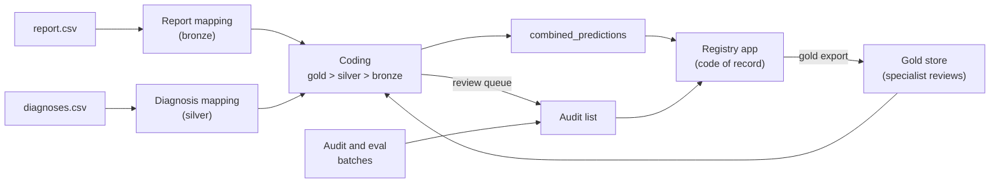

# ML Directory — Overview

A machine learning system that codes veterinary cancer cases to standardized Vet-ICD-O-canine-1
labels (term, group, ICD code) from three sources of decreasing confidence — a specialist's
**manual audit** (gold), the clinic's **diagnosis** text (silver), and the pathology **report** text
(bronze) — and records how far each code can be trusted. Start with
[concepts/icd-mapping-strategy.md](concepts/icd-mapping-strategy.md) for the full strategy.

Report mapping (`scripts/predict.py`) loads a per-section contrastive PetBERT backbone, embeds each
report as a 2304-dim concat-3 vector, and runs a 4-stage pipeline (case-presence gate → group
classifier → per-group label-presence head → keyword correction).

**Where things stand (2026-09-29)**
- Production `current/` is `gen-0-legacy` (split `legacy-80-20`, silver `silver-0-legacy`).
- Reference baseline on the eval half of `legacy-80-20` (4,456 per-code rows, scored against silver `silver-0-legacy`, so agreement with silver rather
  than accuracy): **Good 45.8%,
  Slight 16.0%** (G+S 61.76%), CO 15.3%, FP 2.6%, FN 20.4%. Why this is not the 62.1% published in
  May: [history/decisions/0005](history/decisions/0005-ml-rewrite-and-cutover.md).
- No real gold exists yet. Gold-eval, promotion and `retrain_cycle.py` wait on the specialist's first
  reviews; until then `retrain_cycle.py` stops before training.

Good / Slight / CO (completely off) / FP / FN are the evaluation verdicts, defined in [concepts/evaluation.md](concepts/evaluation.md).



The registry app loads `combined_predictions` as each case's code of record and shows the audit
list as the Audit Worklist; the specialist's reviews come back as gold, and the next combined file
carries them. File formats: [reference/handoff-contracts.md](reference/handoff-contracts.md).

---

## How the docs are organised

| Folder | Holds | Read it when |
|---|---|---|
| [concepts/](concepts/) | How each part works and why | You want to understand a component |
| [how-to/](how-to/) | Exact commands for one task | You want to do something |
| [reference/](reference/) | Lookup tables: every script and flag, every path, every file contract | You need a precise fact |
| [history/](history/README.md) | What we tried, why it won or failed, finished plans, frozen training logs | You're about to try an idea, or wonder why something is the way it is. Never for current behaviour. |

Each fact has one home doc; other docs link to it.

| Doc | What it covers |
|---|---|
| [concepts/icd-mapping-strategy.md](concepts/icd-mapping-strategy.md) | The strategy: gold > silver > bronze, split roles, the improvement cycle, what is built and what is future. **Read first.** |
| [concepts/report-mapping.md](concepts/report-mapping.md) | Bronze: sections, backbone, heads, the inference stages, training recipe, calibration. |
| [concepts/diagnosis-mapping.md](concepts/diagnosis-mapping.md) | Silver: the tiered diagnosis cascade, LLM cleanup, silver generations. |
| [concepts/manual-audit.md](concepts/manual-audit.md) | Gold: origins, the two audits, eval batches, the universal audit list, the cause pass. |
| [concepts/coding.md](concepts/coding.md) | Combining gold/silver/bronze per case; corrected annotations; the ML review queue. |
| [concepts/evaluation.md](concepts/evaluation.md) | Verdicts, silver-eval, the four gold-eval results, confidence intervals. |
| [concepts/generations.md](concepts/generations.md) | Generation layout, manifests, embedding fingerprint, splits, guards, promotion, triggers, archive. |
| [how-to/train-and-promote.md](how-to/train-and-promote.md) | Retrain a candidate, calibrate, evaluate, promote. |
| [how-to/run-inference.md](how-to/run-inference.md) | Produce report-mapping predictions. |
| [how-to/run-audit-cycle.md](how-to/run-audit-cycle.md) | Draw audit and eval batches, ingest gold, score it. |
| [how-to/sync-with-s3.md](how-to/sync-with-s3.md) | Move data, stores and model generations between machines. |
| [how-to/new-machine-setup.md](how-to/new-machine-setup.md) | Set the project up on a new computer. |
| [reference/scripts-and-flags.md](reference/scripts-and-flags.md) | Every `scripts/*.py`, subcommand and flag with its default. |
| [reference/paths.md](reference/paths.md) | Every `config.py` path and what lives there under `output/`. |
| [reference/handoff-contracts.md](reference/handoff-contracts.md) | Files exchanged with the backend and the ml-worker bundle. |
| [reference/petbert.md](reference/petbert.md), [reference/classification-systems.md](reference/classification-systems.md) | Background on PetBERT and the ICD / Vet-ICD-O coding systems. |
| [history/README.md](history/README.md) | How we got here: timeline and index of every experiment and decision. |
| [history/open-ideas.md](history/open-ideas.md) | Ideas not tried yet. |

---

## Directory map

```
ml/
  config.py             Every path (incl. ARCHIVE_ROOT, written only by generations/) and the S3 constants
  io_utils.py           The one shared CSV reader/writer
  pytest.ini            Test settings (testpaths=tests)
  requirements.txt      Python dependencies (CUDA 12.8 torch index noted inside)
  taxonomy/             labels.csv (845 terms, 52 groups); taxonomy.py; behavior.py; subtype.py
  manual_audit/         sheets.py; terms.py; diagnosis_mapping_audit.py; report_mapping_audit.py;
                        eval_batch.py; audit_list.py; gold.py; cause_pass.py
  diagnosis_mapping/    keyword_tiers.py; llm_tier.py; llm_client.py (local LLM only); cleanup.py;
                        silver.py (versioned silver generations); stats.py
  report_mapping/
    sections.py         The concat-3 section spec + report-text builder
    model/              backbone.py; heads.py; generation.py (load/save/verify a generation dir)
    training/           recipe.py; labels.py; embeddings.py; backbone.py; case_presence.py; group.py;
                        label_presence.py; oof.py; calibrate.py
    inference/          embedding_cache.py; stages.py; keyword_correction.py; predict.py
  coding/               rule.py; combine.py; corrected.py; queue.py
  evaluation/           verdicts.py; intervals.py; silver_eval.py; gold_eval.py; audit_rates.py
  generations/          manifest.py; splits.py; guards.py; triggers.py; promote.py
  handoff/              contracts.py; imports.py; exports.py; worker_format.py (shared with ml-worker)
  s3sync/               remote.py; sets.py; models.py; hooks.py; client.py; files.py; state.py
  scripts/              Thin entry points (below)
  tests/                pytest, synthetic fixtures only — never reads data/ or output/
  documentation/        These docs
  data/, output/        Private inputs and all outputs (gitignored) — see reference/paths.md
```

## Entry points (`scripts/`)

One line each; every flag is in [reference/scripts-and-flags.md](reference/scripts-and-flags.md).

| Script | Does |
|---|---|
| `map_diagnoses.py` | `run` the diagnosis cascade into a silver generation; `stats` on one. |
| `audit.py` | Draw audit and eval batches; ingest sheets, gold and cause answers. |
| `split.py` | `create` a split generation; `check` it against the leakage guards. |
| `code_cases.py` | `combine`, `corrected`, `queue`: the coding-rule outputs. |
| `train.py` | Train a candidate, one `--stage` at a time. |
| `calibrate.py` | Fit every inference threshold on the calibration partition. |
| `predict.py` | Stamped report-mapping predictions (`--embed-only` just builds the cache). |
| `evaluate.py` | `silver`, `gold`, `audit-rates`. |
| `promote.py` | The promotion recommendation; `--apply` carries it out, `--publish` then pushes `current/` to S3. |
| `generations.py` | `status` of current/candidate and the triggers; `fork` a generation onto a new split. |
| `handoff.py` | Import from and export to the backend (`--push` to sync what it wrote). |
| `sync.py` | S3 sync of data, stores and the `current/` generation (dry run unless `--apply`). |
| `retrain_cycle.py` | The local retraining lane end to end; recommends, never promotes. |

---

## Quick start

Use `ml/.venv/Scripts/python.exe` on Windows (`ml/.venv/bin/python` elsewhere). Setup:
[how-to/new-machine-setup.md](how-to/new-machine-setup.md).

**Run tests** (includes `tests/test_docs.py`, which checks these docs' links, script names and flags):
```bash
ml/.venv/Scripts/python.exe -m pytest ml -q -p no:cacheprovider
```

**Run inference** against the production generation:
```bash
ml/.venv/Scripts/python.exe ml/scripts/predict.py --generation current --local-only
```

**Run the diagnosis cascade** (not a smoke test: it creates a new silver generation, needs LM Studio running locally, and takes tens of minutes):
```bash
ml/.venv/Scripts/python.exe ml/scripts/map_diagnoses.py run --id silver-1
```

**Retrain:** see [how-to/train-and-promote.md](how-to/train-and-promote.md).
