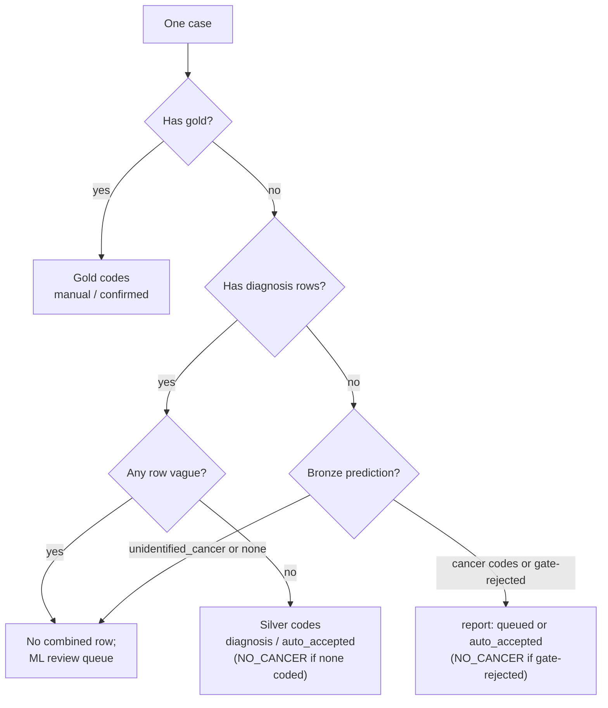

# Coding

How every case gets its final codes. This page is the single home for the vagueness table, the
combined predictions, the corrected annotations (the report mapping's training labels) and the ML
review queue. It is for anyone changing `ml/coding/` (`rule.py`, `combine.py`, `corrected.py`,
`queue.py`) or reading `combined_predictions.csv`. The entry point is `ml/scripts/code_cases.py`
(`combine`, `corrected`, `queue`).

The rule itself (gold beats silver beats bronze) is in [icd-mapping-strategy.md](icd-mapping-strategy.md).
Silver is [diagnosis-mapping.md](diagnosis-mapping.md); bronze is [report-mapping.md](report-mapping.md);
gold is [manual-audit.md](manual-audit.md).

## The vagueness table (`rule.py`)

Whether one diagnosis-mapping row is **decisive** or **vague** is read from its
`(decision_stage, method)` pair.

| `decision_stage` | `method` | Outcome |
|---|---|---|
| `no_signal` | No Match | Decisive: no cancer vocabulary |
| `tier1_exact` | Exact | Decisive |
| `tier2_fuzzy` | Fuzzy | Decisive, provisionally: pending the Diagnosis-Mapping audit's finding |
| `tier3_llm` | LLM | Decisive: the LLM answered a code |
| `tier3_llm` | No Match | Decisive non-cancer: a declined LLM answer (or one cleanup overturned), no switch thrown |
| `tier3_llm` | Uncertain | Vague: the LLM hedged (or cleanup could not confirm its answer) |
| `tier3_no_candidates` | No Match | Vague: cancer vocabulary present, the LLM was never asked |
| `tier1_exact` | No Match | Decisive non-cancer: cleanup overturned an exact match |
| `tier2_fuzzy` | No Match | Decisive non-cancer: cleanup overturned a fuzzy match |
| `tier1_exact` | Uncertain | Vague: cleanup could not confirm an exact match |
| `tier2_fuzzy` | Uncertain | Vague: cleanup could not confirm a fuzzy match |

The last four rows exist because the cleanup pass rewrites `method` without touching
`decision_stage` ([diagnosis-mapping.md](diagnosis-mapping.md)). **Any other pair raises
`UnknownDecisionError`** instead of defaulting either way, so a cascade or cleanup change this table
has not caught up with fails loudly.

Two rows are open questions: whether `tier2_fuzzy` / Fuzzy should stay decisive (marked provisional
above), and whether a declined LLM answer (`tier3_llm` / No Match) should stay decisive non-cancer or
become vague. The Diagnosis-Mapping audit ([manual-audit.md](manual-audit.md)) is meant to settle both.

**A case is vague if any of its diagnosis rows is vague** (`case_is_vague`). The whole case then goes
to the review queue, because gold is the case's complete code set.

## Combined predictions (`combine.py`)

The combined predictions are the one code set per case that the backend loads as the registry's code
of record. Precedence, per case:

1. **Any gold row, any origin:** take gold. `code_source=manual`, `review_status=confirmed`,
   `source_version` is the origin (plus the batch or export id when there is one).
2. **Else, diagnosis rows that are all decisive:** take silver. `code_source=diagnosis`,
   `review_status=auto_accepted`, `source_version` is the silver id, `source_confidence` is the
   `decision_stage`. Only rows with a code are kept, and repeated codes collapse to one; a case with
   no coded row gets a single `NO_CANCER` row.
3. **Else, diagnosis rows where any is vague:** no combined row. The case is queued
   ([below](#the-ml-review-queue-queuepy)) until gold resolves it.
4. **Else, no diagnosis rows at all:** take bronze. `code_source=report`, `source_version` is the
   bronze generation id, `source_confidence` is the prediction's confidence. A gate-rejected case
   (`rejected_by_case_presence`) becomes a single `NO_CANCER` row. `review_status` is `queued` or
   `auto_accepted` (next section). **Bronze never overrides silver**: it is used only for a case with
   zero diagnosis rows.

**Exception:** an `unidentified_cancer` bronze case (the gate passed but no label resolved) gets no
combined row. Its score is always 0.0, so it is not a confident non-cancer call and must not take
`NO_CANCER`. It lands in the review queue instead.

`NO_CANCER` is the same sentinel `manual_audit.gold` uses.

`COMBINED_PREDICTIONS_COLUMNS`: `case_id, code, term, group, code_source, source_version,
source_confidence, review_status, n_codes`. There is one row per code. `n_codes` is the case's row
count, repeated on each of its rows (1 for a `NO_CANCER` case). Written to
`config.COMBINED_PREDICTIONS_CSV`; `ml/scripts/handoff.py export-coding` ships it with the review
queue, and the file contracts are in [reference/handoff-contracts.md](../reference/handoff-contracts.md).

### The bronze review gate

The gate decides `queued` versus `auto_accepted` for a bronze-only case (`bronze_case_is_low_confidence`).
The case is `queued` when any of these holds:

- any row's method is `rejected_by_case_presence`;
- any row's confidence is below `BRONZE_LOW_CONFIDENCE_THRESHOLD` (0.23);
- the top-1 and top-2 confidence margin is below `BRONZE_LOW_MARGIN_THRESHOLD` (0.15), checked only
  when both ranks carry a nonzero confidence;
- there is no rank-1 row at all.

The three constants live together in `combine.py`. They are unvalidated and will be checked against
gold. The backend loads the combined predictions (`combined_predictions` schema v2) as its code of
record and carries ML's `review_status` per row
([handoff-contracts.md](../reference/handoff-contracts.md)).

## Corrected annotations (`corrected.py`)

The corrected annotations are the report mapping's training labels, **train partition only**. Per
case:

- **Gold-train** (`gold_train()`: origin `review_queue` or `report_mapping_audit`, on the split's
  train cases) replaces the case's silver rows entirely, whether or not the case was vague.
- A **vague case without gold-train** is excluded: its silver rows are not usable training signal and
  there is nothing to replace them with.
- A **decisive silver case without gold-train** keeps its silver rows unchanged.

Gold-eval gold and the row-level audit store are never read. Output columns: `case_id, matched_term,
matched_group, matched_code, label_source (gold or silver), silver_generation, gold_snapshot`.

The file is written to the fixed path `config.CORRECTED_ANNOTATIONS_CSV`, not a versioned directory.
It is a derived table that can be regenerated at any time, and `generations.guards` reads it from
that exact path. The write is crash-safe: the guards (`check_labels_train_only`,
`check_eval_queue_gold_not_trained`, `check_corrected_sources`) run on the in-memory frame first,
and only on success is a temp file moved into place, so a guard failure never touches the target.

`calibrate.py` cannot use this table as its labels: calibration needs rows on the calibration
partition and this table has none. `retrain_cycle.py` calibrates against the silver id instead; see
[generations.md](generations.md).

## The ML review queue (`queue.py`)

The queue lists the cases the specialist should look at, skipping any case that already has gold
(any origin). It is the fourth source on the universal audit list
([manual-audit.md](manual-audit.md)), and the gold it produces has origin `review_queue`. Three
reasons:

- `vague_silver`: the case has diagnosis rows and at least one is vague.
- `low_conf_bronze`: no diagnosis rows, and the bronze review gate flags the case. This also covers
  an `unidentified_cancer` case, which `combine.py` refuses to code.
- `no_evidence`: no gold, no diagnosis row and no bronze prediction (for example an upload whose
  report never reached `report.csv`). It always has the lowest priority (`NO_EVIDENCE_PRIORITY`,
  -1.0, below any real probability), so it never crowds out a case bronze or silver actually ran on.

**Priority** is bronze's case-presence probability, descending (bronze runs on every case, so this
applies to `vague_silver` rows too). **Ordering:** every test-partition item sorts after every
train or calibration item, priority-descending within each block. A reviewed case becomes gold, and
the eval batch excludes any case with gold from its draw pool, so draining train and calibration
first delays depleting the test-partition sampling pool.

**Coverage invariant:** every case in `split.train`, `split.calibration`, `split.test`, silver or
bronze ends up either coded (`combine.py`) or queued (here), never neither.

`REVIEW_QUEUE_COLUMNS`: `case_id, reason, priority, partition, silver_generation,
bronze_generation`. Written to `config.REVIEW_QUEUE_CSV`.

**What is live where.** The dashboard's Review Queue screen was retired on 2026-09-28 (commit
83262de), and with it the backend's own ingest-time review gate: the backend now stamps upload rows
`confirmed`, and the bronze review gate above is the only one. The dashboard Audit Worklist is the
only review surface. This ML-side queue is still live (`review_queue.csv`, the `review_queue`
gold-train origin, the fourth audit-list source), and the backend still imports
`review_queue_<run>.csv` to flag cases as awaiting review. For a queued case with no combined row only
that flag is set; any codes it already has stay.
