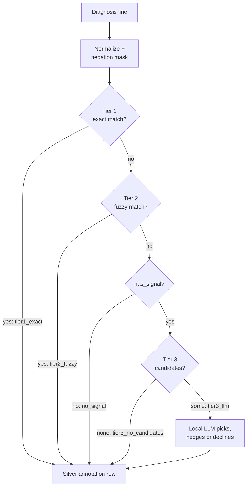

# Diagnosis mapping (silver)

How the clinic's free-text `diagnosis` line becomes a Vet-ICD-O-canine-1 `(term, group, code)`
triple. This page is the single home for the cascade, its `decision_stage` and `method` values, the
ensemble cleanup pass and silver generations. It is for anyone reading or changing
`ml/diagnosis_mapping/` (`keyword_tiers.py`, `llm_tier.py`, `llm_client.py`, `cleanup.py`,
`silver.py`, `stats.py`); the entry point is `ml/scripts/map_diagnoses.py`.

This is one of the three coding methods in [icd-mapping-strategy.md](icd-mapping-strategy.md)
("silver"). It reads only the diagnosis line, never report text (that is the report mapping,
"bronze": [report-mapping.md](report-mapping.md)).

## The cascade

`match_diagnosis` (in `silver.py`) sends each diagnosis line through the tiers in order. The first
tier that matches decides the row.



1. **Normalize and mask negation** (`keyword_tiers.py`). Lowercase; turn hyphens, underscores and
   slashes into spaces; drop commas, parentheses, semicolons and colons; `neoplasia` becomes `neoplasm`, `plasma cell tumor`
   becomes `plasmacytoma`, `metastasis` becomes `metastatic neoplasm`; expand abbreviations (`GIST`,
   `HSA`, `MCT`, `DLBCL`, `SCC` and others). A negation masker then blanks phrases such as `no
   evidence of`, `negative for`, `absence of`, `rule out`, `not consistent with` and up to six
   following tokens, plus `non-X` compounds. Tiers 1 and 2 and the signal check see the masked text;
   Tier 3 gets the original text and its prompt carries its own negation rules.
2. **Tier 1, exact match** (`tier1_exact`). A longest-first regex index built from the taxonomy: the
   full normalized term, its qualifier-stripped core form, and 2 to 3 word permutations (keywords
   shorter than 6 characters are skipped). `method=Exact`, `confidence=1.0`.
3. **Tier 2, fuzzy token overlap** (`tier2_fuzzy`). The score is the fraction of a label's core
   tokens present in the diagnosis. The match threshold is **0.85**, or **0.70 when the diagnosis
   carries an explicit behavior modifier**: `benign` (behavior digit 0), `in situ` (2) or
   `malignant`/`metastatic` (3). With a modifier the scan first keeps only labels whose code has
   that behavior digit and compares full normalized terms; if nothing clears 0.70 it falls back to
   the unfiltered 0.85 scan. `method=Fuzzy`, `confidence` is the score (0.70 to 1.0).
4. **Signal check** (`has_signal`). If neither tier matched, the masked text must still contain a
   cancer-signal token (an `-oma` or `-emia` word, or `tumor`, `leukemia`, `neoplasm`, `cancer`,
   `malignant`, `carcinoid` and similar) to go further. Without one the row is `no_signal`.
5. **Tier 3, local LLM** (`llm_tier.py`). A group token index picks the likely group (an
   `-oma`/`-emia` suffix index is the fallback). Up to 30 of that group's terms (`LLM_MAX_CANDIDATES`),
   plus any detected anatomic site, go to a local OpenAI-compatible server (LM Studio by default, via
   `llm_client.py`). The server is local only: diagnosis text never leaves the machine.
   - The model replies with a candidate term, `no match` or `uncertain`. A term is `method=LLM`
     (`confidence=1.0` for an exact string match, `0.9` for a difflib near-match of 0.8 or better).
     `no match`, or an unparsable reply, is `No Match`; a hedge is `Uncertain`.
   - A failed request (timeout, connection error) is recorded as a declined answer, the same as
     `no match`. So `tier3_llm` with `No Match` is an upper bound on real declines.
   - If no candidate list can be built the LLM is never asked (`tier3_no_candidates`).

### `decision_stage` and `method`

`decision_stage` records which gate produced the row. `method` alone is ambiguous: a `No Match` row
may mean the LLM declined, or that it was never consulted.

| `decision_stage` | Meaning | `method` values it can carry |
|---|---|---|
| `no_signal` | No cancer vocabulary; Tier 3 never reached. | No Match |
| `tier1_exact` | Keyword index matched. | Exact |
| `tier2_fuzzy` | Token overlap matched. | Fuzzy |
| `tier3_llm` | The LLM was called: matched, hedged or declined. | LLM, Uncertain, No Match |
| `tier3_no_candidates` | Cancer signal present, but the candidate list came back empty; the LLM was never asked. | No Match |

`method` values overall: `Exact`, `Fuzzy`, `LLM`, `No Match`, `Uncertain`. The cleanup pass (below)
can rewrite an `Exact`, `Fuzzy` or `LLM` row to `No Match` or `Uncertain`, so `tier1_exact` and
`tier2_fuzzy` rows can carry them too (and a `tier3_llm` `No Match` may be an overturned answer, not
a decline). [coding.md](coding.md)
maps every `(decision_stage, method)` pair to decisive or vague; that table is the single home for
the mapping.

## Ensemble cleanup

`cleanup.py::clean` verifies every confirmed positive (`method` of Exact, Fuzzy or LLM) with two
independent local LLMs, with an optional third model as tiebreaker. It runs by default; the flags
and default models are in [scripts-and-flags.md](../reference/scripts-and-flags.md). Each verifier
returns `CORRECT`, `WRONG_should_be:<term>`, `WRONG_no_cancer` or `UNCERTAIN`.

| Verifiers say | Result |
|---|---|
| Both `CORRECT` | Keep the match. |
| Both `WRONG_no_cancer` | Blank term, group and code; `method` becomes `No Match`. |
| Both `WRONG_should_be` with the same term | Replace term, group and code with that term; `method` is kept. |
| Anything else | Blank term, group and code; `method` becomes `Uncertain`. |

- A verifier whose request fails or whose reply cannot be parsed drops out of the vote; the
  remaining verdict then decides alone. A `WRONG_should_be` term that is not in the group's
  candidate list counts as `UNCERTAIN`.
- The resolution needs every verdict, tiebreaker included, to agree. A tiebreaker therefore only
  settles a row when both verifiers returned nothing parsable; a real disagreement between the two
  stays `Uncertain`.
- Cleanup never edits `decision_stage`. That is why `tier1_exact` and `tier2_fuzzy` can end up with
  `No Match` or `Uncertain`.

## Silver generations

A silver generation is a versioned, **immutable** output under `config.SILVER_DIR/<silver_id>/`:
`annotation.csv` plus `manifest.json`. The manifest holds the cascade-constants sha256 (a hash of
every regex, threshold and the taxonomy-derived keyword index), the taxonomy and input CSV hashes,
the LLM model, whether cleanup ran and which models, and the `decision_stage` counts.
`silver.run` refuses to write into an existing `<silver_id>/`; `load_silver` verifies the manifest
before reading.

`ANNOTATION_COLUMNS`: `case_id, diagnosis_number, diagnosis, matched_term, matched_group,
matched_code, matched_keyword, method, confidence, decision_stage`. The file also carries a
`silver_generation` column. It holds diagnosis text, so it stays local.

```
ml/.venv/Scripts/python.exe ml/scripts/map_diagnoses.py run --id silver-1
ml/.venv/Scripts/python.exe ml/scripts/map_diagnoses.py stats --silver silver-1
```

- `run --id <new>` runs the cascade over `config.DIAGNOSES_CSV`, then cleanup, and writes a new
  generation. Tier-3 model: `--model`, else `LLM_MODEL` from `ml/diagnosis_mapping/.env`
  (gitignored; also `LLM_HOST`, default `127.0.0.1`, and `API_PORT`, default `1234`). Cleanup
  models are independent of it.
- `--no-llm` never calls the model: every Tier-3-eligible row is recorded as a declined LLM answer
  (`tier3_llm`, `No Match`). `load_silver` refuses such a generation, and so do the coding rule and
  the Diagnosis-Mapping audit sampler, unless `allow_no_llm=True` is passed. It must not be used as
  an authoritative silver source.
- `stats` writes coverage statistics to `config.DIAGNOSIS_MAPPING_STATS_DIR/<silver_id>/`: a
  combined report (`annotation_distribution.txt`), per-analysis CSVs and PNG plots (`--no-plots`
  skips them).

Every flag is in [reference/scripts-and-flags.md](../reference/scripts-and-flags.md).

### The silver generation in use: `silver-0-legacy`

`silver-0-legacy` is the only silver generation on disk and the one production `current/` was
trained against. Its manifest records `llm_model` and `cleanup_enabled` as null, so those two
settings are unknown for it. It holds 188,774 diagnosis rows:

| `decision_stage` | Rows |
|---|---:|
| `no_signal` | 143,432 |
| `tier1_exact` | 34,784 |
| `tier3_llm` | 6,279 |
| `tier3_no_candidates` | 3,813 |
| `tier2_fuzzy` | 466 |

How much of Tier 2 and Tier 3 is right is what the Diagnosis-Mapping audit measures
([manual-audit.md](manual-audit.md)). Its rows are drawn from these strata.

## Known limitations

- `metastasis` is expanded to `metastatic neoplasm` before matching, so a metastasis diagnosis can
  resolve to the generic metastatic term even when a primary type is named.
- Only negation is masked. Hedged wording (for example a parenthetical "suspect ...") is handled
  only by the Tier-3 prompt and by cleanup, so Tier 1 and Tier 2 can still match it as a confirmed
  term.
- If the Tier-3 group token index picks the wrong group, the correct term never enters the LLM's
  candidate list. This is the `tier3_no_candidates` and wrong-group failure mode that the
  Diagnosis-Mapping audit measures.
- Tier 3 makes one local LLM call per eligible row and cleanup makes at least two per confirmed row,
  so a full-corpus run is far slower than the keyword tiers alone.
- Tier 1 is a plain regex match and does not use the behavior digit.
