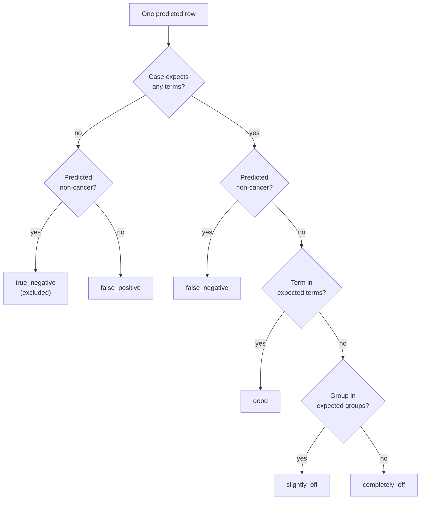

# Evaluation

How predictions are scored, from a single verdict up to the four gold-eval results with confidence
intervals. This page is the single home for verdicts, silver-eval, the four gold-eval results,
intervals and representativeness. It is for anyone reading an evaluation report or changing
`ml/evaluation/` (`verdicts.py`, `intervals.py`, `silver_eval.py`, `gold_eval.py`,
`audit_rates.py`). The entry point is `ml/scripts/evaluate.py silver|gold|audit-rates`.

**Gold-eval has never run on real gold.** No gold exists yet ([manual-audit.md](manual-audit.md)), so
`evaluate.py gold` refuses with "no gold-eval rows". The only scoring done so far is silver-eval,
which is the cheap ruler, and gold-eval runs on mock gold in tests. Mock-gold numbers are never
results.

When you report a metric, show Good and Slight separately (never only Good plus Slight), plus
completely off, false positive and false negative where they are known, with the split and the
number of rows.

## Verdicts (`verdicts.py`)

Every predicted row gets one verdict against the case's expected terms and groups:

| Verdict | Meaning |
|---|---|
| `good` | The predicted term is one of the case's expected terms |
| `slightly_off` | Right group, wrong term |
| `completely_off` | Neither term nor group matches |
| `false_positive` | The case expects no cancer; the method predicted cancer |
| `false_negative` | The case expects cancer; the method predicted `Non-Cancer` or `Uncategorized`, or has no prediction row |
| `true_negative` | Non-cancer predicted for a non-cancer case; excluded from the table and from every share |

- **Uncommon-group leniency.** Predicting `Uncommon`, or any group merged into it, for a case whose
  expected group is also in the uncommon set counts as `slightly_off`. The list comes from the
  report-mapping generation that made the predictions.
- **Missed expected terms.** Each expected term that no `good` prediction (exact term) and no
  `slightly_off` prediction (its group) covers adds one extra `false_negative` row for that case. A
  case that predicted `Non-Cancer` already has its false-negative row and gets no extra ones.
- **Shares** are per-code row shares over every row of the verdict table, so true negatives never
  enter the denominator. `GOOD_PLUS_SLIGHT` is the exact row share of `good` plus `slightly_off`,
  not a sum of two rounded numbers.

## Intervals (`intervals.py`)

- `wilson`: the Wilson score interval for a proportion.
- `kish_n_eff`: the Kish effective sample size of a set of weights, which accounts for unequal
  weights inflating variance.
- `weighted_proportion`: a stratified weighted proportion with a Wilson interval taken at the
  design-effect-adjusted n. It treats rows as independent, so for per-code metrics (a case's codes
  are correlated) use the bootstrap.
- `bootstrap` and `paired_bootstrap`: a **stratified case-cluster bootstrap**. Cases, not rows, are
  resampled with replacement within each stratum, so every row of a case moves together. Intervals
  are 95% percentile intervals. A replicate that draws only zero-row cases (for example all true
  negatives) has an undefined metric and is skipped. The default is 1000 replicates, seed 0.

## Silver-eval: the cheap ruler (`silver_eval.py`)

Silver-eval scores bronze predictions against a labels table (a silver generation id, or a labels
CSV of the same shape) on one partition of a split, `test` or `calibration`. It needs no gold, so it
is the ruler used until gold arrives. Both tables are filtered to the partition's cases first, and a
case with no label rows counts as non-cancer.

- `--half {eval,sweep}` keeps only one md5 half of the partition. The rule
  (`generations.splits.in_sweep_half`) puts an even hash in the sweep half, which `three-way-v1` uses
  as its calibration partition, and an odd hash in the eval half, its test partition. This lets the
  two-way `legacy-80-20` test partition be scored on the same cases as `three-way-v1` test.
- The uncommon-groups list comes from the report-mapping generation that produced the predictions.
  The predictions' `generation_id` must match it, or the run is refused.
- Per-group and per-term breakdowns key on the **expected** group or term: a row counts toward every
  group its case expects, and false positives (which have no expectation) are left out. Misses
  therefore stay visible.
- Each run appends one line (all verdict counts and shares, and G+S) to
  `config.SILVER_EVAL_HISTORY_CSV`.

Silver-eval measures agreement with silver, which is itself imperfect. Result 3 below is what checks
whether it tracks the real ruler.

## Gold-eval: the four results (`gold_eval.py`)

Gold-eval reads only `manual_audit.gold.gold_eval(split_id)`: origin `eval_batch` or `random_slice`,
on the split's test side. Gold-train, review-queue and audit gold never enter
([manual-audit.md](manual-audit.md)). `generations.guards.check_all` runs first and refuses on any
violation. The command is `evaluate.py gold --predictions PATH --silver SILVER --split SPLIT`;
`--misses-out` writes the misses table for the cause pass. Flags are in
[reference/scripts-and-flags.md](../reference/scripts-and-flags.md).

**Weights.** Every gold-eval case carries one weight, and every verdict row of the case takes it.

- `eval_batch` cases: `eval_batch.pooled_weights`, `N_h / sum of n_h` across the whole batch series.
  It is computed only over cases that already have gold, so a drawn but unreviewed case does not
  dilute its stratum's weight (the run reports how many there are).
- `random_slice` cases: `1 / slice_rate`, in their own `random_slice:<period>` stratum.

**The four results are always reported together, on the same cases:**

1. **Silver vs gold, by `decision_stage`.** Silver's diagnosis rows are recast as predictions, each
   with a stage label: its `decision_stage`, with `tier3_llm` split into answered, declined and
   uncertain, and any row the coding rule calls vague prefixed `vague:`. They are scored against
   gold like any prediction, without the uncommon-group leniency. Cases with no diagnosis rows are
   not scored for silver.
2. **Bronze vs gold, by confidence band.** One band per case from its top prediction: `non_cancer`
   (gate-rejected), else fixed 0.2-wide bands on confidence (`0.0-0.2` up to `0.8-1.0`), or
   `no_prediction`. The bands are fixed, not quantiles, so a band means the same across generations.
3. **Bronze vs silver, before gold correction.** Bronze scored against gold and against silver on
   the same cases, plus the paired (vs silver minus vs gold) difference for Good and for Good plus
   Slight, with a paired case-cluster bootstrap. It tests whether silver-eval tracks the real ruler.
4. **Who was right on disagreements**, by `decision_stage` and bronze band. For each case where
   silver's term set and bronze's differ, the side whose term set equals gold's is right, otherwise
   `neither`.

Every cell reports case and code counts and weighted verdict shares. For Good and for Good plus
Slight it gives both a Wilson interval on the Kish n and a stratified case-cluster bootstrap
interval. `tn_cases` counts correct abstentions separately, because the verdict table excludes them.
Every gold-eval report carries a `NON_BLIND_NOTE` whenever any case in it was reviewed
`app_non_blind`, which is true of every eval batch: accuracy may be optimistic from anchoring.

**Misses and the cause pass.** `misses()` returns `case_id, gold_code, method, source_version` for
every gold code a method did not predict exactly. That table is the input to the cause sheet
([manual-audit.md](manual-audit.md)). `cause_split()` joins the answers back by `(case_id,
gold_code, method)`, regardless of `source_version`, and reports method-error versus input-gap
shares per method.

### Representativeness

Three pass or fail criteria, reported with every gold-eval run:

- the overall bronze Good bootstrap interval has a half-width of at most 0.05;
- every major group has at least 30 gold codes. A group is major at 1% or more of the codes in
  `config.COMBINED_PREDICTIONS_CSV` (silver codes if that file does not exist yet). The report also
  lists which major groups cannot reach 30 from the test partition alone;
- at least one `random_slice` case exists.

The criteria are reported, not enforced: `promote.py` does not read them. Until all three pass, treat
gold-eval numbers as indicative.

## Diagnosis-Mapping audit rates (`audit_rates.py`)

`evaluate.py audit-rates` reports per-stratum verdict rates for the row-level Diagnosis-Mapping audit
judgements in `config.AUDIT_STORE_CSV`: `correct`, `wrong`, `no_cancer` and `uncertain`. It gives
both the raw sample rate and the weighted (population) rate with a Wilson interval on the Kish n,
because the audit over-samples small strata on purpose. The weights only reconstruct a stratum's
population once a batch is fully reviewed, so a partial batch is a comprehension check, not a
measurement. It is deliberately not wired into `verdicts.score`: a row-level sample would make the
unsampled rows of a partly covered case read as false positives. The audit itself is in
[manual-audit.md](manual-audit.md).
