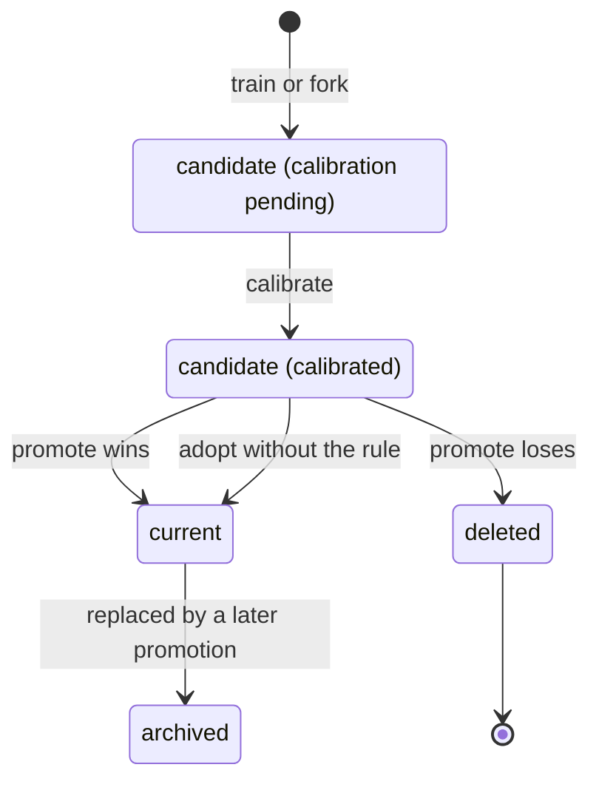
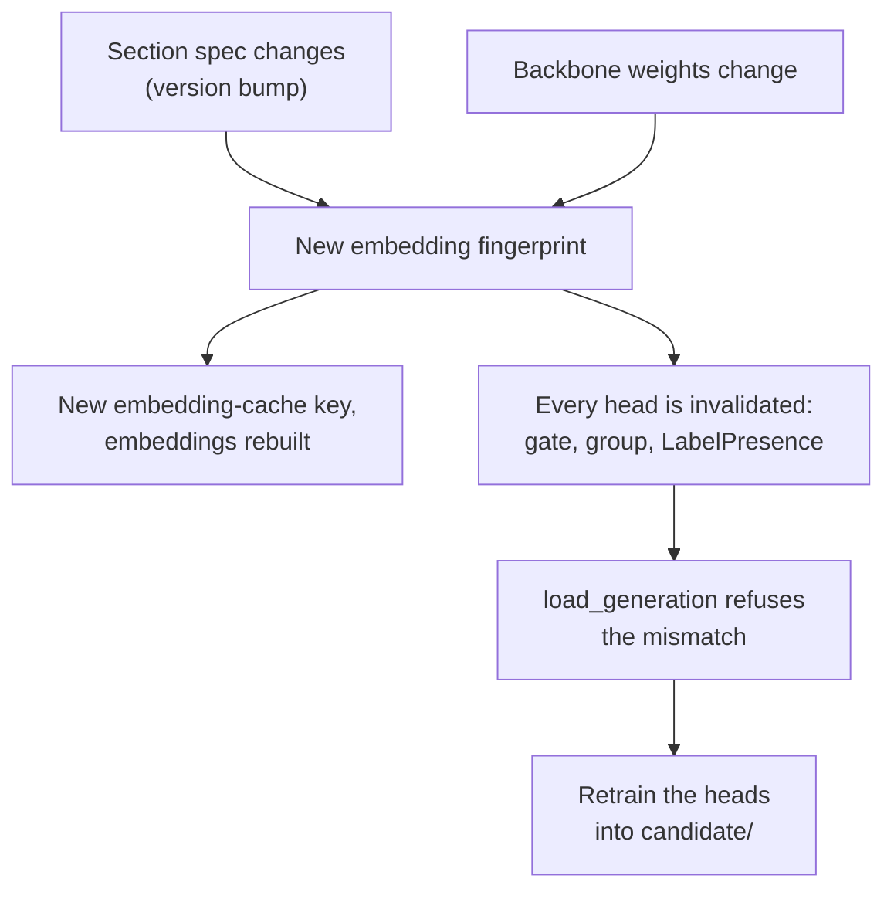

# Generations

How the ML side versions its outputs: the layout of a report-mapping generation, its manifest, the
embedding fingerprint, the data splits, the leakage guards, the promotion rule, the retraining
triggers, `retrain_cycle.py` and the archive. For the ML developer or Admin who trains and promotes
models. Package: `ml/generations/` (`manifest.py`, `splits.py`, `guards.py`, `promote.py`,
`triggers.py`), plus `report_mapping/model/generation.py`. Entry points: `scripts/split.py`,
`scripts/generations.py`, `scripts/promote.py`, `scripts/retrain_cycle.py`. Commands for each task
are in [train-and-promote.md](../how-to/train-and-promote.md); every flag is in
[scripts-and-flags.md](../reference/scripts-and-flags.md).

Production `current/` is `gen-0-legacy` (split `legacy-80-20`, silver `silver-0-legacy`). No
`candidate/` exists.

## Lifecycle



- `train.py` writes into `candidate/`, never `current/`. It stamps a placeholder manifest with
  `calibration.status: "pending"`.
- `calibrate.py` fits the thresholds on the calibration partition and flips the status to
  `calibrated`. `load_generation` refuses a generation that is not calibrated, except for
  `calibrate.py` itself and `predict.py --embed-only`.
- `promote.py` decides whether the candidate replaces `current/`. A winner takes `current/` and the
  old incumbent is archived. A loser is deleted.
- `generations.py fork` copies a generation as a new uncalibrated candidate on another split with
  the same train partition (same backbone and heads, new `generation_id`, thresholds to be refitted).
  It refuses when the train partitions differ. `calibrate.py` then refits it.
- `adopt` (in `generations/promote.py`, used by `sync.py pull-model`) swaps a verified `candidate/`
  in without the scoring rule, because the generation was already promoted on another machine. It
  archives the incumbent the same way `--apply` does. See [sync-with-s3.md](../how-to/sync-with-s3.md).

## Layout

A generation directory is also the bundle the cloud worker loads ([handoff-contracts.md](../reference/handoff-contracts.md)).
`current/` is production and `candidate/` is the one being trained or evaluated, both under
`config.REPORT_MAPPING_DIR`.

```
petbert/                                  HF backbone checkpoint dir
labels/labels.csv                         Vet-ICD-O taxonomy snapshot
checkpoints/case_presence_classifier.pt
checkpoints/group_classifier_best.pt
checkpoints/label_presence/<safe_group>.pt
checkpoints/label_presence/lp_thresholds.json
checkpoints/thresholds.json               gate / group / tail / LP-fallback
checkpoints/uncommon_groups.txt
checkpoints/calibration_diagnostics.json  written by calibrate.py
manifest.json
```

The embedding cache (`embedding_cache/<key>.npz`) is shared, sits beside `current/` and is never
bundled into a generation. Model code: [report-mapping.md](report-mapping.md).

## Manifest

Every generation directory (a split, a silver generation, `current/`, `candidate/`) has a
`manifest.json` from `manifest.py`: the caller's fields plus `created_at` (ISO UTC), `git_sha` (the
code's HEAD) and `files`, a sha256 for every file under the directory. `verify_manifest` refuses a
directory whose listed files are missing or changed, or that holds a file the manifest does not
list. `update_manifest` changes top-level fields in place (used to flip `status`) without
re-stamping `files`, `created_at` or `git_sha`.

A report-mapping manifest also records:

| Field | Content |
|---|---|
| `generation_id` | `gen-<UTC timestamp>` (for example `gen-20260927T003905Z`), minted fresh on every training write. It is also the cloud's `source_version`. |
| `parents` | `split_id`, `silver_id`, `gold_train_snapshot`, `gold_train_codes`, the labels source and, for a fork, `forked_from`. What the generation trained on. |
| `recipe`, `seed`, `device`, `library_versions` | The resolved hyperparameters and the run environment. |
| `embedding_fingerprint` | See below. |
| `status` | `candidate`, `current` or `archived`, set by promotion. |
| `calibration` | `status` (`pending` or `calibrated`), `partition`, `objective`, `values`. |

## Embedding fingerprint

Embeddings change when the text fed to PetBERT changes or when the backbone weights change. Either
invalidates every head trained on the old embeddings, so each generation records the fingerprint it
was trained against:

- `backbone_sha256`: one sha256 over the contents of the generation's `petbert/` directory (for a
  bare HuggingFace name, over the name string);
- `section_spec_version`: the version of the concat-3 section spec in `sections.py`;
- `max_length`: the inference token limit (512).

Library versions are recorded in the manifest but are not part of the fingerprint.



`load_generation` verifies the manifest (file hashes), then the recorded fingerprint against the
current code plus the generation's own bundled backbone, then the calibration status. Any failure
raises `GenerationError` rather than loading stale classifiers. The check only protects a
generation directory that is kept whole, which is why promotion moves it as one unit.

## Splits

`config.SPLITS_DIR/<split_id>/{train,calibration,test}_cases.txt` plus a manifest. A split is
immutable once written: every writer refuses to overwrite an existing `<split_id>/`. `load_split`
verifies the manifest, then reads only the partition files it lists. A partition it does not list
loads as an empty set.

- `legacy-80-20` (46,652 train, 11,661 test) has no calibration partition. `legacy-temporal`
  (56,905 train, 1,408 test) is the drift check and has none either.
- `split.py create --parent P --id ID` derives a three-way split from a two-way parent. Train is
  copied unchanged. The parent's test cases are divided by an md5 half rule
  (`int(hashlib.md5(case_id.encode()).hexdigest(), 16) % 2 == 0` goes to calibration, otherwise to
  test; `generations.splits.in_sweep_half`). `three-way-v1` (parent `legacy-80-20`) has 46,652
  train, 5,828 calibration and 5,833 test cases. It is `config.DEFAULT_SPLIT_ID`, the `--split`
  default of `train.py`, `promote.py`, `generations.py status` and `retrain_cycle.py` (the other
  scripts require `--split`).
- Roles: train fits the models, calibration fits the thresholds, test is where gold-eval lives.
  See [icd-mapping-strategy.md](icd-mapping-strategy.md).
- `split.py check --split ID` runs every applicable guard and exits 1 on any violation.

## Leakage guards

`guards.py` holds pure checks over case-id sets and dataframes plus a `Split`. Each raises
`GuardViolation` naming the count and a few example case IDs (IDs only, never text). `check_all`
loads whichever stores exist and runs every applicable guard, collecting all violations into one
error:

- partition disjointness, and a derived split covering its parent exactly;
- every gold-store row has a known origin;
- gold-eval is inside the test partition (`eval_batch` must be in test; `random_slice` is a
  violation only when it is in train or calibration);
- gold-train-origin gold on an eval-side case (calibration or test) never enters training labels;
- training labels, and the corrected annotations, contain train-partition cases only
  (`check_labels_train_only`). Trainers run it on the frame already filtered to train, never on the
  whole-universe table, which fails by design;
- calibration reads calibration-partition cases only (`check_calibration_inputs`), and
  `calibrate.py` also refuses cases the generation itself trained on;
- the audit store never feeds the corrected annotations (`check_corrected_sources`).

Gold has five origins. `GOLD_EVAL_ORIGINS` are `eval_batch` and `random_slice`. `GOLD_TRAIN_ORIGINS`
are `review_queue` and `report_mapping_audit`. `diagnosis_mapping_audit` is neither. The full
origin table is in [manual-audit.md](manual-audit.md).

Where the guards run: `split.py check`, `calibrate.py`, `evaluate.py gold` and `promote.py` always
run `check_all`. `train.py` runs it only for `--stage heads` and `--stage backbone`, before any
data is loaded. The single-head stages (`case-presence`, `group`, `label-presence`, `oof`) skip
`check_all` but still filter labels to the train partition and run the two train-only label guards.
`split.py check` cannot exercise the calibration-inputs guard; that one runs inside `calibrate.py`.

## Promotion rule

`promote.py` compares the candidate (challenger) with `current/` (incumbent). The primary metric is
the weighted per-code exact accuracy (the `good` share); G+S is secondary. Both generations are
scored on the current gold-eval, the same cases, with the incumbent re-scored every time because
gold-eval grows between runs. Each is scored with its own generation's uncommon groups. Promote
only if both hold:

1. at least one retraining trigger is met (below);
2. the lower 95% bound of the paired (challenger minus incumbent) `good`-share difference, from a
   stratified case-cluster paired bootstrap, is at least `MARGIN` (-2.0 pp).

Before comparing, it runs `check_all`, verifies the candidate (manifest, fingerprint, calibrated)
and `current/`'s manifest, and refuses if there are no gold-eval rows. Without `--apply` it only
recommends. With `--apply`:

- a winner is swapped in after the incumbent is archived (see Archive); the candidate is
  re-verified immediately before anything moves;
- a loser is deleted, and the incumbent stays in place;
- `--description` names the archive folder (default: the incumbent's `generation_id`);
- `--publish` (requires `--apply`) then publishes the new `current/` to S3, and is ignored when
  nothing was promoted. See [sync-with-s3.md](../how-to/sync-with-s3.md).

Until gold-eval is representative ([evaluation.md](evaluation.md)), the recommendation is
indicative and a person decides. No real gold exists yet, so this cannot run for real today.

## Retraining triggers

`triggers.py` reports each `Trigger` as met or not met plus the numbers behind it. The thresholds
are placeholders to settle on real data.

1. `new_silver_lineage`: the challenger's `parents.silver_id` differs from the incumbent's. Not met
   when either side is unknown.
2. `random_slice_drop`: on the latest upload period's random slice, the incumbent's weighted `good`
   share is below its share on the rest of gold-eval, and the two 95% stratified case-cluster
   bootstrap intervals do not overlap. The latest period is left out of the reference sample so the
   two are disjoint.
3. `gold_train_growth`: gold-train codes now, minus the count the incumbent trained on
   (`parents.gold_train_codes`, 0 for gen-0), is at least `GOLD_TRAIN_GROWTH` (200). A re-reviewed
   case whose code set is only replaced does not count as new.

Falling bronze-vs-silver agreement on diagnosed uploads is not a trigger; it is a drift warning.

`generations.py status --silver SID` prints `current/` and `candidate/` (generation_id, status,
calibration, silver, split, gold-train codes) and whether a challenger trained on `--silver` would
meet a trigger. Without gold-eval the random-slice trigger cannot fire.

## `retrain_cycle.py`

The local lane in one command. It recommends only and never passes `--apply`. Each step is the
existing entry point run as its own process, so GPU memory is freed between steps:

1. Refuse to start if `candidate/` exists (promote or delete it first).
2. Import gold if `--gold-csv` is given.
3. Stop unless gold-eval exists (it prints `STOP`; this is today's outcome).
4. Run `predict.py` for `current/` if its predictions are missing.
5. Stop unless a trigger fires (`--force` overrides).
6. `code_cases.py corrected` builds the training labels.
7. `train.py --stage heads` (with `--stage backbone` first when `--backbone` is given, for a cold
   start).
8. `calibrate.py --labels <silver_id>`. The corrected table covers the train partition only, so
   the calibration partition is labelled by silver. It uses cpu when the device is `auto`.
9. `predict.py` for `candidate/`.
10. `promote.py` without `--apply`.

It never runs the LLM cascade; a new silver generation is its own step (`map_diagnoses.py`, see
[diagnosis-mapping.md](diagnosis-mapping.md)).

## Archive

`config.ARCHIVE_ROOT` (`output/archive/`) is a sibling of `output/report_mapping/`. It is written
only by `generations/` and never loaded from. Promotion or `adopt` moves the incumbent there whole
(backbone, all checkpoints and manifest) as `ARCHIVE_ROOT/YYYY-MM-DD_<description>/`:

- `current/` is renamed into the archive, then `candidate/` is renamed to `current/`. Both are
  same-filesystem renames. If the second fails the first is undone, so `current/` is never left
  half-moved or empty.
- The manifest statuses are then set (`archived`, `current`).
- Embedding-cache entries the new `current/` cannot use are moved into the archive too. The cache
  key includes the fingerprint, so a stale entry is otherwise dead weight. The moved files are
  listed in the archived manifest, so an archived generation still verifies. A heads-only promotion
  shares the incumbent's backbone, so its cache entry stays.
- A losing candidate is deleted, not archived. There is no restore-from-archive step; the incumbent
  is only ever archived after a win or an `adopt`.
