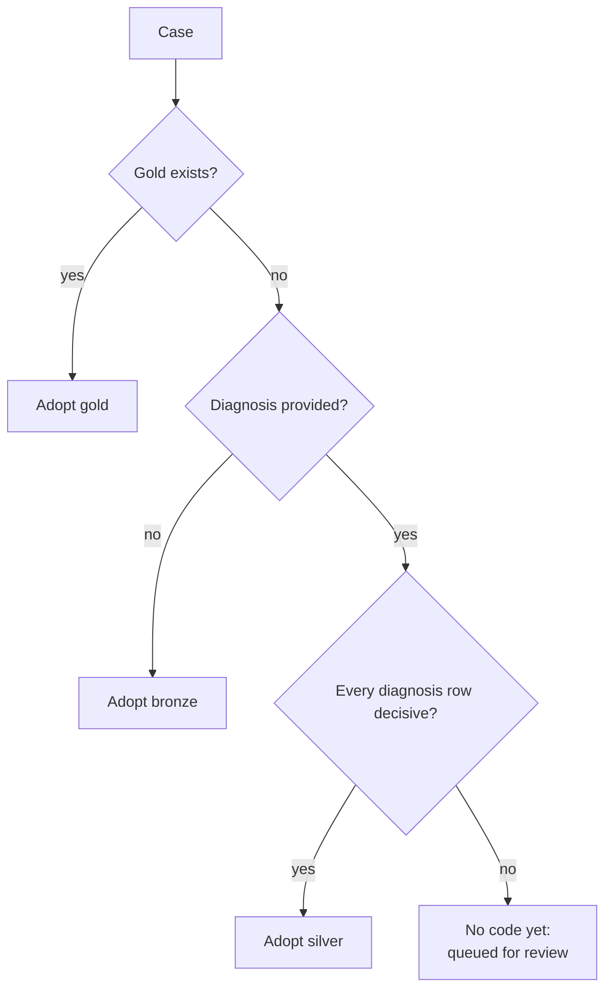
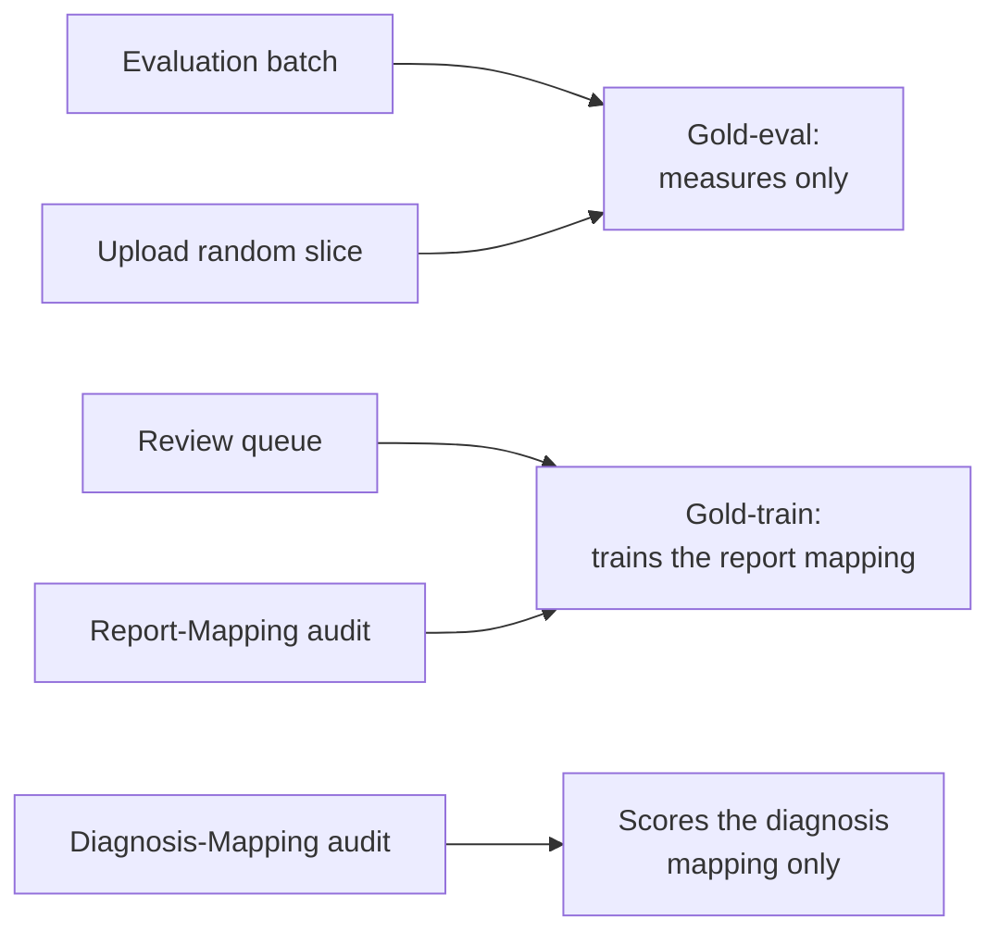
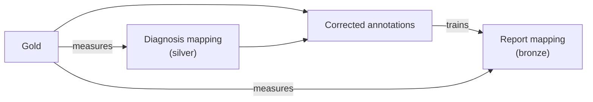
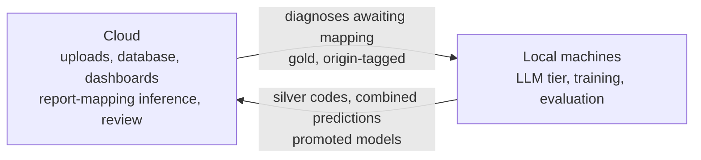
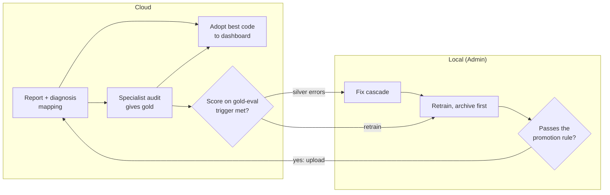
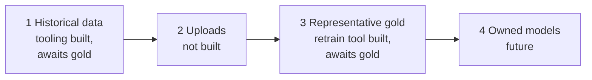

# ICD mapping strategy: three sources of evidence

The overview of the whole approach: how every case gets a Vet-ICD-O-canine-1 code, how far each
code can be trusted, how accuracy is measured and how the methods improve. Read this first; the
other concept docs hold the detail and are linked from each section. Last checked against the code
on 2026-09-29.

## Summary

The registry maps every case, historical or uploaded, to its code(s) and records how far each code
can be trusted. Codes come from three methods of decreasing confidence:

- a specialist's **manual audit** (**gold**);
- mapping the clinic's **diagnosis** text (**silver**);
- mapping the pathology **report** (**bronze**).

Each case takes the most trusted code available, and a vague diagnosis goes to the specialist
rather than to a model. Gold measures both automated methods on the same terms. Gold and silver,
combined into corrected annotations, train the report mapping. There is no funding for cloud
compute beyond inference, so the LLM and all training run on local machines, with data exchanged
between machines by file.

## Terms

| Term | Meaning |
|---|---|
| **Gold** | A code set assigned by the specialist from the case's full record. Treated as ground truth. |
| **Silver** | A code from the **diagnosis mapping**: the keyword cascade plus a local LLM. |
| **Bronze** | A code from the **report mapping**: the PetBERT 4-stage pipeline. |
| **Gold-eval** | Gold from evaluation batches and upload random slices, used only to measure accuracy. Never trained on. |
| **Gold-train** | Gold from the review queue and the Report-Mapping audit, used to train the report mapping. |
| **Corrected annotations** | Per train case: gold where it exists, silver elsewhere. The report mapping's training labels. |
| **Silver-eval** | A cheap ruler at scale: the model's predictions scored against a silver generation on a split partition, checked against gold-eval. |
| **Decisive / vague** | Whether the diagnosis mapping reached a usable answer for a diagnosis row. |
| **Adopted code** | The code the registry publishes for a case. |
| **Generation** | One versioned output of a method: a silver run, or a trained set of report-mapping models. |
| **Split** | The train, calibration and test partitions of the historical cases. |

## The three methods

| | Manual audit | Diagnosis mapping | Report mapping |
|---|---|---|---|
| **Produces** | Gold | Silver | Bronze |
| **Input** | The full case record | The clinic's free-text diagnosis | The pathology report text |
| **Code** | `manual_audit/` + the dashboard Audit Worklist | `diagnosis_mapping/` | `report_mapping/` |
| **Confidence** | Highest | High where decisive | Lowest |
| **Cost per case** | Very high | Low | Very low |
| **Runs on** | Sampled and queued cases | Every case with a diagnosis | Every case |
| **Adopted when** | Always, once it exists | Every diagnosis row is decisive | No diagnosis is provided |

Detail: [manual-audit.md](manual-audit.md), [diagnosis-mapping.md](diagnosis-mapping.md),
[report-mapping.md](report-mapping.md).

## Coding a case: gold > silver > bronze

- **Precedence is gold > silver > bronze.** Lower-precedence codes are kept alongside, never
  discarded. The report mapping runs on every case, so bronze always exists for comparison.
- **Whether a diagnosis is provided is fixed at upload.** Case IDs carry no identifying
  information, so a later diagnosis cannot be linked back to an upload.
- **A vague diagnosis queues the whole case,** because gold is the case's complete code set.
  Vagueness is read from the diagnosis mapping's `decision_stage` and `method`; `no_signal` (no
  cancer vocabulary) and a declined LLM answer (`tier3_llm` "No Match") are decisive non-cancer,
  and hedged answers and cancer vocabulary the LLM was never asked about are vague. The table is
  in [coding.md](coding.md).
- **Bronze never overrides silver.** The report mapping learns mostly from silver, so when the two
  disagree the report mapping is usually the one that is wrong. Bronze may set the order of the
  review queue and a low-confidence bronze case is queued, but a disagreement alone never sends a
  case to review.

## Measuring accuracy

**Gold is the true code set for the case.** The specialist codes from the full record, not from one
text field, so both automated methods answer the same question: did this method reach the case's
true code? There is one specialist and gold is treated as correct, so their errors are invisible to
every number here. This is an accepted risk, to revisit if a second reviewer becomes available.

**Where gold comes from decides what it may be used for:**

- **Evaluation batches** are drawn from the test partition, stratified by group, with
  `sample_weight` recorded. They are reviewed **non-blind**: the specialist works in the app, which
  shows the case's prediction, so gold-eval accuracy is reported with that caveat.
- **The upload random slice** is a random share of auto-accepted bronze codes: the only measure of
  the report mapping where its codes are actually used.
- **The review queue and the Report-Mapping audit** concentrate on cases where the labels are
  weakest. That skew helps training but would bias measurement, so this gold is never gold-eval.
- **The Diagnosis-Mapping audit** samples the cascade's hardest rows. It is neither gold-eval nor
  gold-train.

**Each predicted code gets a verdict** (`good`, `slightly_off`, `completely_off`,
`false_positive`, and `false_negative` for gold codes nothing covers). **A cause pass on misses**
asks whether the method's own input supports the gold code: yes is a method error, no is an input
gap. **Four results are reported together on the same cases** (silver vs gold, bronze vs gold,
bronze vs silver, and who was right on disagreements), and gold-eval counts as representative only
once it meets set thresholds on precision, per-group coverage and upload cases. Until then the
numbers are indicative and promotion is decided by hand. Details, intervals and the thresholds:
[evaluation.md](evaluation.md); the audits, batches and cause pass: [manual-audit.md](manual-audit.md).

## Improving the methods

**The report mapping trains on the corrected annotations.** Gold replaces a case's silver labels
entirely, since gold is the complete code set, and vague cases without gold are left out
([coding.md](coding.md)). This lets the report mapping learn from the report where the diagnosis
fell short, instead of only imitating silver. Whether gold cases deserve a higher sample weight is
tested on gold-eval, not assumed.

**Leakage guards.** Gold-eval never enters training, and threshold calibration never uses gold-eval:
it uses the calibration partition. Guards check this before training, calibration, evaluation and
promotion ([generations.md](generations.md)).

**Disagreement between silver and bronze is read by silver's strength.** Where silver is decisive,
a disagreement is a bronze error unless gold exists, and those cases become hard training
examples. Where silver is vague the case is already queued. If evaluation shows a cell where bronze
beats decisive silver often enough to matter, that cell is routed to review. Two cautions: agreement
does not prove correctness, since the report mapping inherits silver's systematic errors; and
historical training cases hide disagreement because the model has fit their labels, so analysis
there needs out-of-fold predictions.

**Generations are versioned, archived and gated.** A silver generation feeds both the registry and
the report mapping's training labels. A report-mapping generation records the silver generation and
the gold-train snapshot it trained on. A candidate is trained into `candidate/` and replaces
`current/` only if it passes the promotion rule: at least one retraining trigger is met and it is
not meaningfully worse than the incumbent on the same gold-eval. The incumbent is archived on a
win and a loser is deleted. Rule, triggers and archive: [generations.md](generations.md).

The diagnosis mapping is fixed, not retrained: when the cause pass finds silver method errors, the
ML developer fixes the cascade and re-runs it, and the new silver generation is itself a retraining
trigger for the report mapping.

## Where work runs

**The cloud stores, serves and reviews; local machines compute.** The LLM is always hosted locally,
never through a third-party API, and there is no funding to host it or to train in the cloud.

Data crosses by file exports and imports whose contracts are in
[handoff-contracts.md](../reference/handoff-contracts.md), moved between machines through the S3
sync ([sync-with-s3.md](../how-to/sync-with-s3.md)). Every gold row carries an origin tag, the only
thing that separates gold-eval from gold-train for uploads; the guards refuse an unknown origin.
Exports contain case text, so they live in gitignored data directories and are never committed.

| Who | Responsible for |
|---|---|
| Specialist (one) | Evaluation batches, audits, the review queue, the random slice, cause passes, all in the dashboard Audit Worklist |
| ML developer | Running the cascade and fixing it, evaluation, ingesting gold, `retrain_cycle.py` |
| Admin | The ML developer or any IT support maintaining the system. Runs the local lane of the cycle: fetching exports, retraining, promotion, upload |
| Backend developer | Upload format, exports and imports on the cloud side, review-app and schema changes |

## The full cycle

The whole system as one loop, once the roadmap is complete. The cloud codes cases, runs the audits
and decides when a model needs work; an Admin's local machine does that work. Branches that change
nothing (no trigger met, or a candidate that loses) are left out.

Today the LLM tier and the scoring both run locally, and candidate models are always scored
locally. The diagnosis mapping moves to the cloud only with a BERT coder (future). The retraining
trigger definitions and the promotion rule are in [generations.md](generations.md).

**The local lane is one command**, `scripts/retrain_cycle.py`, built and owned on the ML side. It
recommends only: an Admin applies the promotion with `promote.py --apply`. Today it stops at its
gold-eval check because no real gold exists yet.

## What is built and what is still future

As of 2026-09-29.

**Built**

- **Diagnosis mapping and silver generations.** The cascade, ensemble cleanup and versioned,
  immutable silver generations (production trains on `silver-0-legacy`).
- **Coding.** The vagueness table, combined predictions (with `code_source`, `source_version`,
  `source_confidence` and `review_status`), corrected annotations and the ML-side review queue
  ([coding.md](coding.md)).
- **Report-mapping generations.** Training, calibration, the embedding fingerprint, splits,
  guards, the promotion rule, triggers, archive and `retrain_cycle.py`. Production `current/` is
  `gen-0-legacy`, trained on silver only.
- **Manual audit and evaluation tooling.** Audit sampling and ingest, the eval batch, the universal
  audit list, the cause pass, silver-eval, gold-eval and the four results.
- **Backend side.** The backend imports combined predictions as the registry's code of record and
  the ML review queue to flag cases, and the dashboard Audit Worklist is the only review surface. The
  old dashboard Review Queue was retired on 2026-09-28; the ML-side review queue is still live.
- **Transport.** File handoff and S3 sync, including model publish and pull.

**Still future**

- **Any real gold.** No gold store exists yet: the first evaluation batch and the audits wait on
  the specialist. Until gold-eval exists, the promotion rule, the triggers that need it and
  `retrain_cycle.py` beyond its first check cannot run for real, and today's Good + Slightly-off
  rate is agreement with silver, not correctness. Runs on mock gold are test-only and are never
  quoted as results.
- **Settling the provisional vagueness rows,** such as whether `tier2_fuzzy` stays decisive, once
  the Diagnosis-Mapping audit has run and its findings are in. Then fixing the cascade and
  re-running it as a new silver generation.
- **Training on real corrected annotations.** The path exists but has only run on mock gold. Expected
  effect: gold-eval accuracy at least as high as a silver-only model, while agreement with silver may
  fall, which is not a regression.
- **Diagnosis mapping for uploads (Phase 2).** Uploads run bronze only: the upload format carries no
  diagnosis rows and there is no pending-silver state in the backend. The plan is to let a case
  carry diagnoses, hold it out of dashboard counts until the manual cycle completes, and shrink the
  handoff by running the LLM-free tiers in the cloud. Build it beside the existing path and switch
  over once a replay of historical cases matches.
- **Measuring the report mapping on uploads.** Send a small random slice (for example 2 to 5%) of
  auto-accepted bronze codes to review and track bronze-vs-silver agreement per upload period as a
  drift warning. The ML side (the `random_slice` origin and its trigger) exists; the sampling on
  uploads does not. Until then the temporal holdout split stands in: a large drop from the
  random-split score warns of drift.
- **Representative gold (Phase 3).** Routine retraining once gold-eval is representative. Until the
  promotion rule has been trusted over a few runs, the tool recommends and a person promotes.
- **Owned models (Phase 4).** A BERT-based diagnosis coder to replace the LLM tiers and run in the
  cloud worker (training stays local), and reducing the report mapping's dependence on silver as
  gold-train grows. Nothing here is promoted until it beats the method it replaces on gold-eval.

## Open questions

1. **Reviewer capacity.** Sets the random-slice percentage, whether the review queue needs a cap,
   and how fast gold-train grows. The historical vague queue alone runs to thousands of cases.
2. **Handoff cadence.** How often each export runs and how long a case may stay pending silver.
3. **The Admin's machine.** Which GPU machine runs the local lane, and whether IT support may hold
   the reports, silver and gold exports, all of which contain private case data.
4. **Retraining trigger thresholds.** The 200-code and confidence-interval values are placeholders
   until real gold exists.
