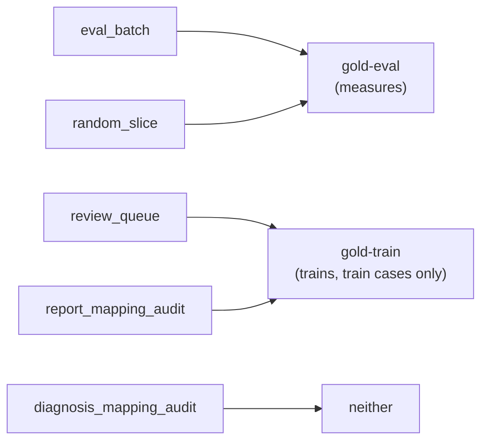
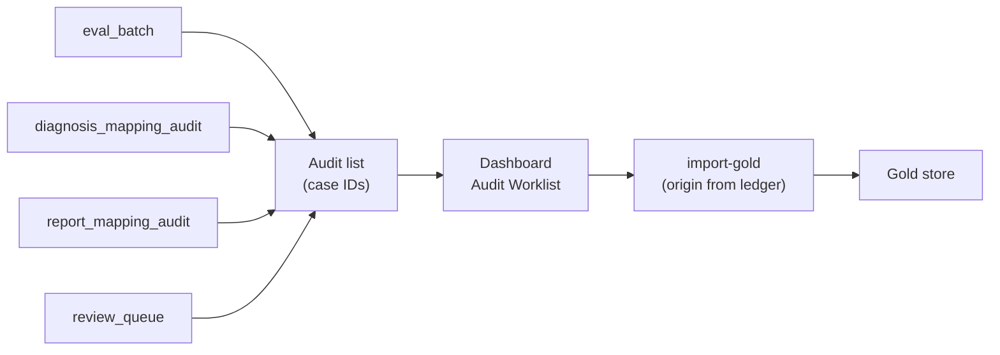

# Manual audit (gold)

How the specialist's reviews become gold, and which reviews are asked for. This page is the single
home for the five gold origins (which measure and which train), the Diagnosis-Mapping audit, the
Report-Mapping audit, the eval batch, the universal audit list and the cause pass. It is for anyone
who needs to know what a reviewed case is worth and why a case was drawn. The step-by-step commands
are in [how-to/run-audit-cycle.md](../how-to/run-audit-cycle.md).

Package: `ml/manual_audit/` (`sheets.py`, `terms.py`, `gold.py`, `diagnosis_mapping_audit.py`,
`report_mapping_audit.py`, `eval_batch.py`, `audit_list.py`, `cause_pass.py`). Entry points:
`ml/scripts/audit.py` and `ml/scripts/handoff.py export-audit-list` / `import-gold`. How gold fits
the gold, silver and bronze strategy is in [icd-mapping-strategy.md](icd-mapping-strategy.md).

## Where review happens

The dashboard **Audit Worklist** is the only review surface; the ML-side review queue is still live
as the fourth audit-list source and a gold-train origin (what was retired, and what stays, is in
[coding.md](coding.md)).

No gold exists yet: there is no `gold_store.csv`, so nothing on this page has produced a result. The
vet reviewer's return unblocks gold-eval, promotion and `retrain_cycle.py`.

## Gold

The gold store (`config.GOLD_STORE_CSV`) is case-level: one row per `(case_id, code)`, or exactly one
`NO_CANCER` row for a case with no reportable cancer. Every row carries an `origin`
(`generations.guards.GOLD_ORIGINS`). The origin is the only thing that separates gold that
**measures** (gold-eval) from gold that **trains** (gold-train).

| origin | comes from | counts as |
|---|---|---|
| `eval_batch` | an eval batch (test partition) | gold-eval |
| `random_slice` | a random slice of uploads | gold-eval |
| `review_queue` | the ML review queue | gold-train, on train cases only |
| `report_mapping_audit` | the Report-Mapping audit (train cases) | gold-train |
| `diagnosis_mapping_audit` | the Diagnosis-Mapping audit (calibration and test cases) | neither |

`diagnosis_mapping_audit` gold is neither because that sample is skewed toward the cascade's hardest
rows: it scores the diagnosis mapping, but it would bias a measure of the whole system and it is not
a fair training draw. The accessors in `gold.py` enforce the split:

- `gold_eval(split_id)`: origin in `{eval_batch, random_slice}`, restricted to the split's test
  partition. A `random_slice` case outside every historical partition (a fresh upload) also counts.
  Never trained on.
- `gold_train(split_id)`: origin in `{review_queue, report_mapping_audit}`, restricted to the split's
  **train** partition. Such a row on a calibration or test case is excluded from both pools.
- `gold_snapshot_hash(split_id)`: a stable sha256 of the current gold-train rows, stamped into a
  generation's manifest (`parents.gold_train_snapshot`).

Gold-eval feeds [evaluation.md](evaluation.md); gold-train feeds the corrected annotations in
[coding.md](coding.md).

### Ingest rules

- **Gold is collected as taxonomy terms, not codes.** 186 of the taxonomy's 534 distinct codes map to
  more than one term (always within one group), so a code alone is ambiguous, and a blank term would
  make `evaluation.verdicts.score` read a real cancer case as non-cancer. `terms.py` resolves a
  reviewer-typed term (case-insensitive; `Group: Term` for the one term that names two groups,
  "Papillary adenocarcinoma") to its code and group. A code-only row is accepted only for
  `review_queue`, and only when that code maps to exactly one term.
- **Origin is mandatory and fixed.** A case keeps the origin it was first ingested under; re-ingesting
  it under another origin is refused. Re-ingesting a case replaces all of that case's rows.
- An `eval_batch` row must already be in `config.EVAL_BATCH_LEDGER_CSV`, so a case no batch drew
  cannot become eval gold. A `random_slice` row must carry `slice_rate` in (0, 1].

### The row-level audit store

`config.AUDIT_STORE_CSV` holds row-level judgements: one verdict per `(case_id, diagnosis_number,
batch)` about a single diagnosis line. Such a judgement is not a case's complete code set, so it
**never** counts as gold and never enters the corrected annotations (`check_corrected_sources` in
`generations/guards.py` enforces this). Nothing writes to it now; `evaluate.py audit-rates` still
reads it ([evaluation.md](evaluation.md)).

## The Diagnosis-Mapping audit

Asks: when the diagnosis cascade reached Tier 2 or Tier 3, was it right, and are its declines silent
false negatives? (The cascade is in [diagnosis-mapping.md](diagnosis-mapping.md).)

Rows are drawn, stratified by cascade outcome, from the eval side (calibration and test partitions)
of a split, skipping cases in earlier batches. The quotas (`_ROW_QUOTAS`):

| stratum | question asked | share |
|---|---|---:|
| `tier3_llm_no_match` | the model refused: is there a cancer it missed? | 25% |
| `tier3_no_candidates` | no shortlist was built, so the model was never asked: a recall hole | 25% |
| `tier3_llm_answered` | the model picked a term: is it right? | 25% |
| `tier3_llm_uncertain` | the model hedged: is it genuinely unclassifiable? | 12.5% |
| `tier2_fuzzy` | partial-overlap match: the same clinical entity? | 12.5% |

Each batch writes two files under `config.DIAGNOSIS_MAPPING_AUDIT_DIR`: a key CSV (the sampled rows,
the cascade's answer and the sampling weight; it holds diagnosis text, so it stays local) and a text
file of the batch's case IDs. The specialist reviews each **whole case**, and the review comes back
as gold with origin `diagnosis_mapping_audit`. A sampled case stays pending until it has gold; key
rows already in the row-level audit store (batch 1's pilot) do not keep it pending.

The audit also answers the two open vagueness questions in [coding.md](coding.md): whether declined
LLM answers hide real cancers, and whether `tier2_fuzzy` rows are right often enough to stay
decisive. The row-level rates (`evaluate.py audit-rates`) are per stratum, raw and weighted, because
the audit deliberately over-samples small strata.

## The Report-Mapping audit

Asks: which training labels is the report model right to disagree with? It draws only from the train
partition:

- **Contradicted labels** (rule-based): train cases whose out-of-fold gate probability confidently
  contradicts their label, meaning labelled cancer with probability below 0.2, or labelled no cancer
  with probability above 0.8. The draw is split evenly between the two, strongest contradiction first
  (so each batch takes the next-strongest); a side that runs short hands its remainder to the other.
- **Random**: a seeded uniform draw from every other train case with an out-of-fold score. This is
  the baseline rate of wrong training labels that the contradicted cases are compared against.

The out-of-fold scores are the case-presence gate's, from `train.py --stage oof --oof-stage
case-presence` (5-fold, saved under `config.OOF_DIR`). Both halves skip cases in earlier batches or
already gold. Defaults: 100 contradicted and 100 random per batch. Each batch writes a ledger CSV (case ID, reason, target,
out-of-fold probability; no text) and a case-ID list under `config.REPORT_MAPPING_AUDIT_DIR`. Reviews
come back as gold with origin `report_mapping_audit`, which is gold-train: it replaces the case's
silver label in the corrected annotations.

## The eval batch (gold-eval)

The eval batch is the gold-eval sample. It draws cases from a split's **test** partition, minus the
case list of Diagnosis-Mapping audit batch 1 (198 cases; `config.DIAGNOSIS_MAPPING_AUDIT_BATCH1_TXT`
must exist) and any case already drawn or already gold. Cases are stratified by the case's silver
group, plus a `no_cancer` stratum.

**Review is not blind.** The specialist looks each case up in the registry app, which already shows
the case's predicted codes. The ledger records `review_mode=app_non_blind`, and every gold-eval
report states that accuracy may be optimistic from anchoring. The sheet itself can never carry a
prediction column: `write_case_sheet` takes only case IDs and blank fill-in column names.

**Allocation is code-targeted.** A "big" stratum (at least 1% of own-group codes) is drawn up to
`ceil(target_codes_per_group / codes_per_case)` cases (default target 30 codes per group). A stratum
that never reaches that share gets a fixed `rare_stratum_n` (default 2). `no_cancer` is fixed at
`no_cancer_target` (default 100). The frame, the silver generation and the targets are fixed from the
**first** batch of a series and never recomputed as gold accumulates; only each batch's sampling pool
shrinks. Batches are issued as a `--fraction` of what still remains per stratum. Weights for the
finished series come from `pooled_weights()` (`N_h / sum of n_h`), never from one batch's local
weight; see [evaluation.md](evaluation.md).

Drawn cases go on the universal audit list. A CSV case sheet is also written (`case_id`, a
`record_pointer` column that repeats it, and blank fill-in columns `term_1` to `term_5`,
`no_cancer`, `reviewer`, `notes`).

## The ML review queue

The queue is the fourth review source: cases with a vague silver diagnosis, low-confidence
bronze-only cases, and cases with no evidence at all. It is built by `ml/coding/queue.py` and
described in [coding.md](coding.md). Its gold comes back as `review_queue`, which trains on train
cases only. A review-queue gold row on a calibration or test case measures nothing and trains
nothing.

## The universal audit list

One worklist of every case awaiting review, for the dashboard. It is `audit_list_<list_id>.txt` in
the handoff outbox (one case ID per line, with a sha256 sidecar).

- **Order:** eval batch, Diagnosis-Mapping audit, Report-Mapping audit, review queue (in its own
  priority order). A case listed by two sources appears once, under the first.
- Cases that already have gold are left off, so each new list is the current full worklist.
  `export-audit-list --no-review-queue` leaves the review queue off.
- **The origin ledger.** The backend receives only case IDs. The origin each case must come back
  under is kept locally in `config.AUDIT_LIST_LEDGER_CSV` (`case_id, origin, list_id`; the first list
  wins, so a case never changes origin). When the backend's gold export leaves `origin` blank,
  `handoff.py import-gold` fills it from the ledger. It refuses a blank origin for a case never
  listed, and a given origin that differs from the listed one.

## The cause pass

The cause pass runs on misses only. The misses table comes from gold-eval (`case_id, gold_code,
method, source_version`, method being `silver` or `bronze`; see [evaluation.md](evaluation.md)). For
each miss the specialist answers one question: does the method's own input (the diagnosis line for
silver, the report text for bronze) actually support the gold code?

- **Yes:** a method error, fixable in that method.
- **No:** an input gap, not fixable there.

Answers go to `config.CAUSE_STORE_CSV`. They are joined back by `(case_id, gold_code, method)`
regardless of `source_version`: the question is about the method's input, which does not change
between model versions.
