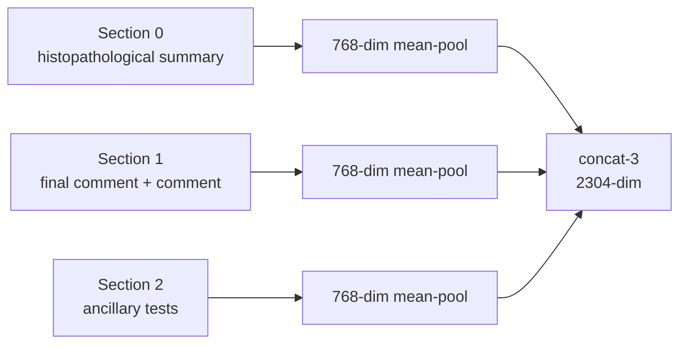

# Report mapping (bronze)

The PetBERT 4-stage pipeline that maps pathology report text to a Vet-ICD-O-canine-1 label,
independent of any diagnosis text. This is the concept doc for the ML developer: sections, model,
inference stages, the training recipe and calibration. Package: `ml/report_mapping/`
(`sections.py`, `model/`, `training/`, `inference/`). Entry points: `scripts/train.py`,
`scripts/calibrate.py`, `scripts/predict.py`. Where bronze fits in the overall approach:
[icd-mapping-strategy.md](icd-mapping-strategy.md).

Production `current/` is `gen-0-legacy`. It carries the legacy hand-picked thresholds (gate 0.80,
group 0.85, tail K=2 with gap 0.08, LabelPresence fallback 0.5). `calibrate.py` refits thresholds
for every new generation on the calibration partition.

## Sections

`sections.py` defines the one concat-3 section spec (`SECTION_SPEC_VERSION`, bumped on any change):

```
__sec_0__ = HISTOPATHOLOGICAL SUMMARY
__sec_1__ = FINAL COMMENT + "\n" + COMMENT
__sec_2__ = ANCILLARY TESTS
```

`build_section_frame` adds these three columns to a raw report frame; `section_texts` returns
per-section cleaned text lists; `merged_texts`/`merge_report_columns` produce the `[__sec_N__] text`
merged string that keyword correction and the lipoma rescue read.

Each section is embedded on its own (its own token budget) and the three 768-dim vectors are
concatenated into one 2304-dim case representation:



## Model

- `model/backbone.py` loads any HuggingFace checkpoint dir or name (`AutoModelForMaskedLM`, base
  transformer only) and mean-pools attended tokens into a 768-dim embedding per section.
  `max_length` is 512 at inference and 256 at training; both are load-bearing and kept distinct.
- `model/heads.py` holds the three trainable heads:

  | Head | Input | Output | Architecture |
  |---|---|---|---|
  | CasePresence (gate) | 2304-dim concat-3 | cancer probability | `Linear(2304→512)→ReLU→Dropout(0.3)→Linear(512→1)→sigmoid` |
  | Group | 2304-dim concat-3 (section-masked) | per-group sigmoid | `Linear(2304→512)→ReLU→Dropout(0.1)→Linear(512→n_groups)→sigmoid` |
  | LabelPresence (per group) | 2304-dim case + 768-dim label | in-group score | 3 section pairs `[sec_emb\|label_emb]` (1536-dim) → shared `Linear(1536→512)→ReLU→Dropout(0.3)→Linear(512→1)`, combined by a learned `Linear(3→1)` (`n_cols=3, col_pair_mode=True, col_combine="learned"`) |

- `model/generation.py` loads and saves a generation directory. The layout, manifest, embedding
  fingerprint and the load-time checks (manifest hashes, fingerprint, calibrated status) are in
  [generations.md](generations.md).

`--model` (on `predict.py` and `train.py`) accepts any HuggingFace checkpoint dir or HF name. For
`predict.py` it defaults to the generation's own `petbert/`; for the heads stages of `train.py`, to
`current/`'s `petbert/` (copied into `candidate/`); `train.py --stage backbone` starts from
`SAVSNET/PetBERT`.

## Inference

The four stages: (1) case-presence gate; (2) group classifier plus tail gate; (3a) per-group
LabelPresence; (3b) keyword correction. Lipoma rescue is a post-step.

`inference/embedding_cache.py` keys the cache on `sha256(report bytes + labels bytes + embedding
fingerprint)` and stores one `output/report_mapping/embedding_cache/<key>.npz` per distinct
(report, labels, backbone) combination. It is never bundled into a generation directory.

`inference/stages.py` (`categorize_cases`) runs the stages in order:


1. **Stage 1 — Gate** (`run_case_presence`): cases below `thresholds["case_presence_gate"]` do not reach the
   later stages; their group probabilities are zeroed. They are output as `Non-Cancer` with method
   `rejected_by_case_presence`.
2. **Stage 2 — Group** (`run_group`): a per-group sigmoid on the section-masked concat-3. Groups at or above
   `thresholds["group"]` advance, ranked by probability descending. For any gate-passed case with
   no group above threshold, the top group is used (argmax fallback, always on).
3. **Stage 2 (tail gate)**: keep at most the top `thresholds["tail_max_predictions"]` groups, and drop any
   group more than `thresholds["tail_max_group_prob_gap"]` below the top group's probability.
4. **Stage 3a — Per-group LabelPresence**: `score_within_group` scores every label in a surviving
   group. Labels at or above the group's threshold (`lp_thresholds.json`, else
   `thresholds["label_presence_fallback"]`) survive, with an argmax fallback inside the group. The
   merged `Uncommon` bucket (groups below the uncommon-merge threshold) has its own head; its
   survivors are ranked by LabelPresence confidence, ties by term.
5. **Stage 3b — Keyword correction**: `inference/keyword_correction.py` filters the Stage 3a pool
   by the ICD-O behavior digit (`taxonomy/behavior.py`), then by group-specific subtype rules
   (`taxonomy/subtype.py`, 7 groups).
6. **Post-step — Lipoma rescue**: appends `Lipoma, NOS` when the report matches lipoma vocabulary, does not
   mention liposarcoma, and the Lipomatous group probability is at least 0.5, even if that group
   did not clear the group threshold. It is unconditional, with no flag.

A gate-passed case that ends with no label is output as `Unidentified Group` (method
`unidentified_cancer`). A case with no report text produces no row (`empty`).

`inference/predict.py` has two paths. `predict_frame` is in-memory and used by the ml-worker: it
embeds fresh with the generation's own backbone and never uses the on-disk cache. `run_predict` is
the CLI path: it reads `config.REPORT_CSV`, gets or builds the cache, runs every stage and writes
`case_id, diagnosis_index, predicted_term, predicted_group, predicted_code, case_presence_prob,
confidence, group_prob, method, generation_id`. `--embed-only` stops after filling the cache and is
allowed on an uncalibrated candidate. The `method` values are `label_presence`, `lipoma_rescue`,
`rejected_by_case_presence` and `unidentified_cancer`. Column and file contracts:
[handoff-contracts.md](../reference/handoff-contracts.md).

## Training

`training/recipe.py` is the single source of production hyperparameters and seeding (`seed_all`
covers python, numpy, torch and CUDA). `tests/test_recipe.py` pins these values.

| Recipe | Key hyperparameters |
|---|---|
| `BACKBONE` | epochs=3, batch_size=32, lr=2e-5, temperature=0.07, max_length=256, weight_decay=0.01, warmup_frac=0.06 |
| `GATE` | epochs=20, recall_weight=0.7, pos_weight=1.0, dropout=0.3, lr=1e-3, weight_decay=1e-4 |
| `GROUP` | epochs=300, lr=5e-5, dropout=0.1, weight_decay=1e-3, max_class_weight=50, val_frac=0.2, uncommon_threshold=200, excluded_groups=("Neoplasms, NOS",) |
| `LABEL_PRESENCE` | epochs=25, negs_per_pos=5, recall_weight=0.5, dropout=0.3, weight_decay=1e-4, n_cols=3, col_pair_mode=True, col_combine="learned" |

Every recipe's `seed` defaults to `PRODUCTION_SEED = 42`. `LP_PAIR_SAMPLING_SEED` (also 42) always
seeds LabelPresence negative sampling, independent of the run's `--seed`. Groups with fewer than
`uncommon_threshold` training cases, plus "Neoplasms, NOS", are merged into `Uncommon`.

The backbone stage is contrastive (InfoNCE) on per-section `(section text, "term group")` pairs,
so the encoder is aligned with the per-section view that concat-3 inference uses. `--stage backbone`
starts from `SAVSNET/PetBERT` unless `--model` says otherwise.

Each trainer (`case_presence.py`, `group.py`, `label_presence.py`, `backbone.py`) exposes `train`
(the split-driven CLI path). `case_presence.py` and `group.py` also expose `train_on_case_ids` (the
reusable core that `oof.py`'s k-fold out-of-fold runner also calls). `labels.py` builds every stage's targets from any labels table
(`case_id, matched_term, matched_group, matched_code`) and is the one place that filters to the
split's train partition and runs the train-only leakage guards. `embeddings.py` gets or builds the
same cache `predict.py` uses, so heads-only training never re-embeds when the backbone has not
changed.

`scripts/train.py --stage {backbone,case-presence,group,label-presence,heads,oof}` writes into
`candidate/` by default (or `--out current`, or a literal directory) and copies in a backbone for
the heads-only stages. It writes a placeholder manifest with `calibration.status: "pending"`.
`--stage oof` is a diagnostic (k-fold out-of-fold gate or group predictions on train cases) and
writes no manifest. The generation lifecycle after training is in [generations.md](generations.md).

### Calibration

`training/calibrate.py` fits every threshold on one split partition (`calibration`), from cached
embeddings, never re-embedding:

1. **Per-LabelPresence thresholds.** For each head, F1 at every grid point over the (case, label)
   pairs of that head's in-scope, partition-annotated cases. Probabilities are rounded to 4 dp
   first, and the lowest threshold with the strictly highest F1 wins. The grid is 0.05 steps from
   0.05 to 0.95 (`calibrate.LP_GRID`).
2. **Gate, group and tail**, jointly, over a small fixed grid with the LabelPresence thresholds
   from step 1 held fixed. Gate and group each take `{0.50, 0.60, 0.70, 0.75, 0.80, 0.85, 0.90}`;
   tail `(K, gap)` takes `{(1,1.00), (2,0.02), (2,0.05), (2,0.08), (2,0.10), (3,0.10), (5,1.00)}`.
   The objective is the per-code G+S share of the `evaluation.verdicts` table against the labels
   table on the partition. Ties go to the higher `good` share, then the first point in grid order.
   The LabelPresence fallback threshold is 0.5.

`calibrate.py` runs `guards.check_all`, checks that no calibration case is in the generation's own
training split, and refuses a labels table that has no rows on the calibration partition (for
example the corrected annotations, which are train-only; pass a silver id instead). Its `--device`
defaults to `cpu`.

Output: `checkpoints/thresholds.json`, `checkpoints/label_presence/lp_thresholds.json` and a
`calibration_diagnostics.json` (gate P/R/F1, group top-k accuracy, per-head P/R) beside them. The
manifest's `calibration` block is written last, so a partial write never leaves loadable but wrong
thresholds in place.

## Why this design

**Why 4 stages, not one classifier.** Each stage has one job. The gate filters non-cancer reports
out before they reach a multi-class classifier that would otherwise emit something (cuts false
positives). The group classifier picks among the groups with them competing explicitly in one
sigmoid BCE loss, so a wrong-group assignment is penalized directly during training (cuts
completely-off predictions). The per-group LabelPresence head picks the specific term only within
the predicted group, so its decision boundary is sharper than a single global "is this label
present?" classifier's (converts slightly-off into good). Keyword correction narrows by ICD-O
behavior digit and group-specific subtype rules after the learned stages, as a pure-Python
post-filter with no training.

**Why concat-3.** A pathology report is structurally divided into sections. Concatenating them into
one string forces a single 512-token budget across the whole report, truncating long sections and
giving the model no way to weight one section over another. Concat-3 embeds each section
independently (each gets its own token budget) and concatenates the three vectors, preserving
per-section information the downstream heads can learn to weight.

**Why a per-section contrastive backbone.** The base PetBERT model is pretrained on UK veterinary
EHRs with masked-LM. Its weights do not by themselves pull report embeddings toward their correct
label embeddings; that geometry has to be added with supervision. The contrastive adaptation runs
InfoNCE on pairs built per section, matching the per-section view concat-3 inference consumes,
rather than training on whole-report text and then encoding sections at inference.

**Why per-group LabelPresence heads.** A single global head scoring every (case, label) pair across
the whole taxonomy has to separate "Squamous cell carcinoma" from "Adenocarcinoma" with the same
parameters that separate "Hemangioma" from "Hemangiosarcoma". One head per group lets each
specialize on its own in-group decision, while the shared section-pair architecture still lets
each head learn which section matters most for term selection.

**Why fitted thresholds and a tail gate.** Score distributions vary by group and by stage, so a
single global threshold trades recall for precision differently in different places. Per-head
thresholds and the tail gate (cap groups per case; drop tail groups far below the top group) are
fitted by `calibrate.py` on the calibration partition for every new generation.
