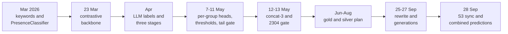

# History: how we got here

This is where the project records what it tried, why each change won or failed, and how the report-mapping pipeline arrived at today's design. Read it before repeating an idea; the current system is described in [../README.md](../README.md).

Numbers in these records come from different evaluators and splits. Before May 2026 metrics were per-label, top-k and scored against keyword or LLM labels; from May 2026 they are per-code rows on the held-out test split; since the September rewrite the reference baseline is 61.76% G+S (not the 62.1% published in May, see [decision 0005](decisions/0005-ml-rewrite-and-cutover.md)). Good and Slight are shown separately wherever the sources have them; do not compare across eras.

## The path in eight steps

1. **March 2026: keywords, cosine and one classifier.** Keyword-matched diagnoses gave labels; cosine similarity between frozen PetBERT embeddings scored labels (G+S 3.3%). A single all-label PresenceClassifier with cycles of completely-off negatives, per-column embeddings and a wider layer reached about 42% G+S on the old evaluator ([record](experiments/2026-03-03-single-presence-classifier-co-bank.md)).
2. **23 March: contrastive backbone.** InfoNCE adaptation of PetBERT on (report, label) pairs jumped G+S from 41.9% to 69.0% on the old evaluator ([record](experiments/2026-03-23-contrastive-backbone-infonce.md)).
3. **April: LLM annotation and three stages.** An LLM cascade replaced keyword labels, and a case-presence gate plus a group classifier plus keyword rules replaced the single classifier, cutting false positives (FP 27.9% to 10.9%) ([record](experiments/2026-04-29-three-stage-gate-group-keyword.md)).
4. **7 to 11 May: stage 3 and calibration.** Per-group label-presence heads turned Slight into Good (Good +15.9 pp, Slight -13.3 pp); per-head thresholds and a tail gate followed ([heads](experiments/2026-05-07-per-group-label-presence.md), [thresholds](experiments/2026-05-10-per-lp-thresholds.md), [tail gate](experiments/2026-05-11-stage-2-tail-gate.md)).
5. **12 to 13 May: concat-3.** Three per-section embeddings, a per-section contrastive backbone and a 2304-dim gate were promoted to `ml/` as G+S 62.1% (Good 46.1%, Slight 16.0%, eval half) ([concat-3](experiments/2026-05-12-concat-3-text-representation.md), [decisions 0001-0003](decisions/0001-concat-3-per-section-text-representation.md)). Training moved to CUDA on 18 May ([0007](decisions/0007-cuda-replaces-intel-xpu.md)).
6. **May to August: a run of things that did not work.** LP hard negatives, retrieve-and-rerank, backbone hard negatives, listwise global heads, demographics, NOS demotion and recency weighting all failed or were inconclusive (see the index). In parallel, the gold/silver/bronze plan (approved 17 June) reframed the goal as building a trustworthy ruler before improving the model ([plan](plans/annotation-redesign-plan.md)).
7. **25 to 27 September: rewrite and cutover.** A clean rewrite with generations, manifests and fingerprints passed parity against a frozen 61.76% reference and replaced the old tree ([0004](decisions/0004-generations-candidate-current-archive.md), [0005](decisions/0005-ml-rewrite-and-cutover.md)).
8. **27 to 28 September: integration.** The worker reads one bundle, the backend loads combined predictions and the Audit Worklist replaced the dashboard Review Queue, and S3 sync replaced Syncthing ([change requests](plans/ml-worker-change-request.md), [0006](decisions/0006-s3-sync-replaces-syncthing.md)).

## Index

Headline change is Good and Slight in percentage points against that record's own baseline (n/a where the source did not split them). Verdicts: adopted, reverted, inconclusive, superseded, accepted (decisions).

### Experiments

| Date | Title | Verdict | Headline Good / Slight | Record |
|---|---|---|---|---|
| 2026-03-03 | Single all-label PresenceClassifier with CO-bank cycles | superseded | n/a / n/a (G+S 3.3% to 33.1%, old evaluator) | [open](experiments/2026-03-03-single-presence-classifier-co-bank.md) |
| 2026-03-04 | Label embedding enrichment | reverted | -0.3 / -0.5 (Phases 6-8) and -1.6 / -4.7 (Phase 10) against the unenriched best cycles | [open](experiments/2026-03-04-label-embedding-enrichment.md) |
| 2026-03-05 | Per-column embeddings and wider hidden layer | adopted | Good 12.7%, Slight 29.2% at the end; n/a for deltas (G+S 32.0% to 41.9%) | [open](experiments/2026-03-05-per-column-embeddings-and-wider-hidden-layer.md) |
| 2026-03-21 | Per-pair architecture | reverted | -2.7 and -2.1 / -4.6 and -3.1 (G+S -7.3 and -5.2 pp) | [open](experiments/2026-03-21-per-pair-architecture.md) |
| 2026-03-23 | KNN group gating | reverted | n/a / Slight 27.5% to about 2% | [open](experiments/2026-03-23-knn-group-gating.md) |
| 2026-03-23 | Contrastive backbone (InfoNCE) | adopted | +7.7 / +19.4 (old evaluator) | [open](experiments/2026-03-23-contrastive-backbone-infonce.md) |
| 2026-03-27 | Backbone hard-negative margin (March and May) | reverted | -0.6 / +0.1 (May retry) | [open](experiments/2026-03-27-backbone-hard-neg-margin.md) |
| 2026-03-28 | Per-label score calibration | reverted | +3.4 / -13.1 (exact-match) and +0.5 / -6.0 (net-gain); G+S -9.7 and -5.5 pp | [open](experiments/2026-03-28-per-label-score-calibration.md) |
| 2026-03-28 | Group-keyword categorization (behavior digit) | adopted | +25.9 / -25.9 (top-k, old evaluator) | [open](experiments/2026-03-28-group-keyword-categorization.md) |
| 2026-04-29 | TF-IDF text selection (and fallback chain) | superseded by concat-3 | n/a / n/a | [open](experiments/2026-04-29-tfidf-text-selection.md) |
| 2026-04-29 | Three-stage gate, group, keyword | adopted | 0.0 / +10.8 (Run 8 to Run 10) | [open](experiments/2026-04-29-three-stage-gate-group-keyword.md) |
| 2026-05-04 | GroupClassifier epochs, dropout, LR | adopted | n/a (macro F1 0.3136 to 0.4475) | [open](experiments/2026-05-04-groupclassifier-epochs-dropout-lr.md) |
| 2026-05-04 | Argmax fallback, group threshold, subtype keywords | adopted | n/a / n/a (G+S +1.8 pp) | [open](experiments/2026-05-04-argmax-fallback-threshold-and-subtype-keywords.md) |
| 2026-05-06 | Focal loss and ASL | reverted | n/a (macro F1 collapsed to 0.08-0.23) | [open](experiments/2026-05-06-focal-loss-and-asl.md) |
| 2026-05-07 | Per-group LabelPresence heads | adopted | +15.9 / -13.3 | [open](experiments/2026-05-07-per-group-label-presence.md) |
| 2026-05-07 | Lower Uncommon threshold (27 and 30 groups) | reverted | n/a / n/a (G+S -1.6 pp) | [open](experiments/2026-05-07-uncommon-threshold-and-27-groups.md) |
| 2026-05-07 | End-to-end fine-tuned group classifier | reverted | -2.6 / +1.1 (LP 0.5) | [open](experiments/2026-05-07-end-to-end-finetune-group-classifier.md) |
| 2026-05-10 | LP hard negatives and regularisation (QW1, QW2) | reverted | -6.4 / +5.3 (QW1) | [open](experiments/2026-05-10-lp-hard-negatives-qw1-qw2.md) |
| 2026-05-10 | Per-LP thresholds | adopted | +10.4 / -14.2 | [open](experiments/2026-05-10-per-lp-thresholds.md) |
| 2026-05-10 | Annotation cascade patches, bake-off, cleanup | adopted (cleanup built, on by default, never completed at full scale) | n/a / n/a | [open](experiments/2026-05-10-annotation-cascade-patches-and-cleanup.md) |
| 2026-05-11 | Stage-2 tail gate | adopted | +1.2 / -0.3 | [open](experiments/2026-05-11-stage-2-tail-gate.md) |
| 2026-05-12 | concat-3 text representation | adopted | +8.8 / -3.3 (vs TF-IDF stack, eval half) | [open](experiments/2026-05-12-concat-3-text-representation.md) |
| 2026-05-12 | Per-section contrastive backbone | adopted | +4.2 / +6.7 (ungated prototype) | [open](experiments/2026-05-12-per-section-contrastive-backbone.md) |
| 2026-05-12 | 2304-dim case-presence gate | adopted | +6.7 / +19.1 (ungated to gated prototype) | [open](experiments/2026-05-12-case-presence-gate-2304.md) |
| 2026-05-13 | LP hard-neg retry and top-3 rerank | reverted | +0.3 / -1.1 (best variant) | [open](experiments/2026-05-13-lp-hard-neg-retry-and-top3-rerank.md) |
| 2026-05-19 | Retrieve-and-rerank (ml-RecSys) | reverted | -9.1 / -4.3 (K=50) | [open](experiments/2026-05-19-recsys-retrieve-and-rerank.md) |
| 2026-05-24 | Broad-vs-picker diagnostic (ml-merge) | inconclusive | n/a (broad `ml/` fell 27-54 pp G+S short) | [open](experiments/2026-05-24-broad-vs-picker-diagnostic.md) |
| 2026-05-26 | GLP listwise loss and per-group thresholds | inconclusive; thresholds reverted | +1.0 / -0.8 (best variant) | [open](experiments/2026-05-26-glp-listwise-and-per-group-thresholds.md) |
| 2026-05-27 | Slight bank and CO-bank stacking | inconclusive (not migrated) | +0.2 / +2.0 | [open](experiments/2026-05-27-slight-bank-and-cobank-stacking.md) |
| 2026-05-29 | NOS subtype demotion | reverted | -2.3 / +2.5 | [open](experiments/2026-05-29-nos-subtype-demotion.md) |
| 2026-05-29 | Demographic features | reverted | +0.1 / -0.2 | [open](experiments/2026-05-29-demographics-features.md) |
| 2026-05-29 | Recency weighting | inconclusive | +2.4 / -0.9 (H=7, 2025 holdout) | [open](experiments/2026-05-29-recency-weighting.md) |

### Decisions

| Date | Title | Status | Headline | Record |
|---|---|---|---|---|
| 2026-05-12 | 0001 concat-3 per-section text representation | accepted | see concat-3 experiment: +8.8 / -3.3 | [open](decisions/0001-concat-3-per-section-text-representation.md) |
| 2026-05-12 | 0002 Per-section contrastive backbone | accepted | +4.2 / +6.7 (prototype) | [open](decisions/0002-per-section-contrastive-backbone.md) |
| 2026-04-29 | 0003 Four-stage report mapping | accepted | see per-group heads: +15.9 / -13.3 | [open](decisions/0003-four-stage-report-mapping.md) |
| 2026-09-25 | 0004 Generations: candidate, current, archive | accepted | infrastructure | [open](decisions/0004-generations-candidate-current-archive.md) |
| 2026-09-25 | 0005 Rewrite and cutover (61.76% reference) | accepted | L3 parity -0.45 / +0.12 (G+S -0.32 pp) | [open](decisions/0005-ml-rewrite-and-cutover.md) |
| 2026-09-28 | 0006 S3 sync replaces Syncthing | accepted | infrastructure | [open](decisions/0006-s3-sync-replaces-syncthing.md) |
| 2026-05-18 | 0007 CUDA replaces Intel XPU | accepted | infrastructure | [open](decisions/0007-cuda-replaces-intel-xpu.md) |

### Still open

[open-ideas.md](open-ideas.md) lists ideas never tried, restated against today's code.

## What else is kept here

- **`plans/`**, verbatim and bannered as archived:
  - [ml-rewrite-plan.md](plans/ml-rewrite-plan.md): the approved contract for the September rewrite, its work packages, findings, the parity runbook and status. Completed.
  - [annotation-redesign-plan.md](plans/annotation-redesign-plan.md): the June gold/silver bootstrap plan, with the detailed rationale and handoff-verification history. Its binding decisions moved into [../concepts/manual-audit.md](../concepts/manual-audit.md).
  - [ml-worker-change-request.md](plans/ml-worker-change-request.md): backend change for the one-bundle worker. Implemented (commit `b03619c`).
  - [audit-list-change-request.md](plans/audit-list-change-request.md): backend change for combined predictions and the Audit Worklist. Implemented (commit `83262de` and the worklist commits `90d5334` to `6f91e9a`); item 2.6 has no evidence of completion.
  - [box-rclone-sync-proposal.md](plans/box-rclone-sync-proposal.md): the Box and rclone sync proposal. Never built; superseded by S3 sync.
- **`training-log/`**, phase-by-phase tables from the earlier architectures: [binary](training-log/training-log-binary.md) (single all-label classifier, Phases 1-22), [finetune](training-log/training-log-finetune.md) (contrastive backbone runs, keyword mode, the abandoned end-to-end group classifier), [group](training-log/training-log-group.md) (GroupClassifier experiments and Phases 27-29) and [label-presence](training-log/training-log-label-presence.md) (Phases 28-30, QW1/QW2, per-LP thresholds, the May promotion). Not updated for new runs.
- **`legacy-tree/`**, docs for the pre-rewrite `ml/` tree (`production/petbert_pipeline/`, `training/`, `annotation/llm_pipeline/`), deleted at the cutover. [README](legacy-tree/README.md) explains; code comments that still cite `training-guide.md` steps mean [this legacy guide](legacy-tree/training-guide.md).
- The March 2026 planning notes and the three `training-ideas/` files were converted into the records above and deleted. The tag `docs-pre-overhaul-2026-09-29` still holds them (`git show docs-pre-overhaul-2026-09-29:ml/documentation/training-ideas/ideas-accepted.md`, and `planning/` and `SETUP_INTEL_XPU.md` at the repository root).

## Adding a record

Write `experiments/YYYY-MM-DD-slug.md` for any measured change (hypothesis, setup with baseline and split and n, result with Good and Slight separately, why, when to retry, where it went) and `decisions/NNNN-slug.md` for a durable choice. Add a row to the index above.
