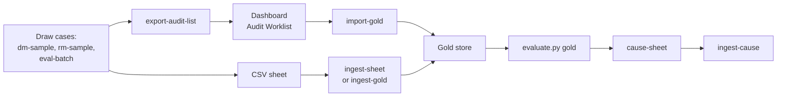

# Run the audit cycle

The commands for one round of manual audit: draw the cases, send them to the specialist, bring the
reviews back as gold, score against gold and run the cause pass. For the ML maintainer. What each
audit is for, the gold origins and the sampling rules are in
[manual-audit.md](../concepts/manual-audit.md); the file formats that cross to the dashboard are in
[handoff-contracts.md](../reference/handoff-contracts.md); every flag is in
[scripts-and-flags.md](../reference/scripts-and-flags.md).

No gold exists yet (`output/manual_audit/gold_store.csv` is absent), so the steps that need gold
(`evaluate.py gold`, the cause pass, promotion) cannot run for real until the vet reviewer returns
the first reviews. Everything up to sending the audit list can run now.



There are two ways reviews reach the gold store: the dashboard route (`export-audit-list`, then
`import-gold`), which is the normal one, and the CSV route (`ingest-sheet` or `ingest-gold`), for a
sheet or rows filled in outside the dashboard. Both end in the same store.

All commands use `ml/.venv/Scripts/python.exe`. To confirm a flag, run the subcommand with `--help`.

## 1. Draw the cases

Each command writes a case list (and a key or ledger CSV) under `output/manual_audit/`. Nothing is
sent yet, and the key CSVs hold diagnosis text, so they stay local.

**Diagnosis-Mapping audit** (rows where the cascade reached Tier 2 or 3; quotas per outcome):

```bash
ml/.venv/Scripts/python.exe ml/scripts/audit.py dm-sample --silver-id silver-0-legacy --batch 2
```

Draws `--n-rows 200` rows (default) from the calibration and test cases of `--split-id`
(default `three-way-v1`), skipping cases in earlier batches. Writes
`diagnosis_mapping_audit/diagnosis_mapping_audit_batch<N>_key.csv` and `..._batch<N>.txt`.

**Report-Mapping audit** (train cases where the gate contradicts the label, plus a random
baseline). It needs out-of-fold gate scores first:

```bash
ml/.venv/Scripts/python.exe ml/scripts/train.py --stage oof --oof-stage case-presence --labels silver-0-legacy --split three-way-v1 --device cuda
ml/.venv/Scripts/python.exe ml/scripts/audit.py rm-sample --oof-csv ml/output/report_mapping/oof/case_presence_oof_silver-0-legacy_three-way-v1.csv --batch 2
```

Draws 100 contradicted plus 100 random cases by default (`--n-contradicted`, `--n-random`). Writes
`report_mapping_audit/report_mapping_audit_batch<N>.csv` and `.txt`.

**Eval batch** (a stratified draw from the test partition; this is gold-eval):

```bash
ml/.venv/Scripts/python.exe ml/scripts/audit.py eval-batch --batch-id eval-batch-2 --silver-id silver-0-legacy --fraction 0.5
```

`--fraction` is the share of each stratum's *remaining* target to draw in this call. The draw
refuses to run without the Diagnosis-Mapping audit's batch 1 case list, which it excludes. Writes
`eval_batch/<batch_id>_review.csv` (`case_id`, a `record_pointer` column that repeats it, and blank
fill-in columns `term_1` to `term_5`, `no_cancer`, `reviewer`, `notes`; no prediction columns),
`<batch_id>_taxonomy.csv` and `<batch_id>_instructions.md`, and appends the batch to
`eval_batch_ledger.csv`. Reviews are non-blind (`app_non_blind`): the dashboard shows the case's
predicted codes.

## 2. Send the worklist to the dashboard

```bash
ml/.venv/Scripts/python.exe ml/scripts/handoff.py export-audit-list --list-id 2026-10-01
```

Writes `output/handoff/outbox/audit_list_<list_id>.txt` plus its `.manifest.json` sidecar: every case
awaiting review, one id per line. The source order and the exclusion rules are in
[manual-audit.md](../concepts/manual-audit.md); every list is the full current worklist. Use a new
`--list-id` each time. `--no-review-queue` leaves the
ML review queue off the list, and `--push` uploads the `manual_audit` and `handoff` sets to S3
afterwards ([sync-with-s3.md](sync-with-s3.md)). The list also records each case's gold origin in
`audit_list_ledger.csv`; only case ids travel. The admin imports the file into the dashboard Audit
Worklist ([handoff-contracts.md](../reference/handoff-contracts.md)).

## 3. Bring the reviews back as gold

**Dashboard route.** The admin exports a reviewer's reviews as `gold_<export_id>.csv`; land it with:

```bash
ml/.venv/Scripts/python.exe ml/scripts/handoff.py import-gold --csv gold_2026-10-01-1.csv --export-id 2026-10-01-1 --reviewer "Dr. Smith"
```

A blank or absent `origin` is filled from the audit-list ledger. The import is refused as a whole if
any row has a term outside the taxonomy, mixes `NO_CANCER` with a code, repeats a code, or names an
origin different from the list's. For random-slice reviews of new uploads (cases never on a list) add
`--upload-period` and `--slice-rate`. `--push` uploads the result.

**CSV route, eval batch sheet.** After the specialist fills `<batch_id>_review.csv`:

```bash
ml/.venv/Scripts/python.exe ml/scripts/audit.py ingest-sheet --sheet ml/output/manual_audit/eval_batch/eval-batch-2_review.csv --batch-id eval-batch-2 --reviewer "Dr. Smith"
```

**CSV route, direct rows.** For case-level rows with columns `case_id`, `origin`, and `term` and/or
`code` (a synthetic example row: `case_id=EX-1`, `origin=eval_batch`, `term=Group: Term`):

```bash
ml/.venv/Scripts/python.exe ml/scripts/audit.py ingest-gold --rows-csv PATH --reviewer "Dr. Smith"
```

Give `--origin` when the CSV has no `origin` column (it must not conflict with one that exists);
`--batch-or-export-id`, `--upload-period` and `--slice-rate` are recorded with the rows. Re-ingesting
a case replaces all of its earlier rows, but a case keeps the origin it was first ingested under.

## 4. Score against gold

```bash
ml/.venv/Scripts/python.exe ml/scripts/evaluate.py gold --predictions ml/output/predictions/<generation_id>_predictions.csv --silver silver-0-legacy --split three-way-v1 --misses-out ml/output/eval/misses.csv
ml/.venv/Scripts/python.exe ml/scripts/evaluate.py audit-rates
```

`evaluate.py gold` needs gold-eval rows, so it cannot run for real until the reviewer returns gold;
`audit-rates` reads the row-level audit store and runs now. `evaluate.py gold` prints the four
gold-eval results with intervals and the representativeness check,
and `--misses-out` writes the table of missed gold codes that step 5 needs (it holds case ids and
codes only). `audit-rates` reports the Diagnosis-Mapping audit's per-stratum rates. Read Good and
Slight separately ([evaluation.md](../concepts/evaluation.md)).

## 5. Cause pass on the misses

Needs the misses table from step 4, so it cannot run until gold exists.

```bash
ml/.venv/Scripts/python.exe ml/scripts/audit.py cause-sheet --verdicts-csv ml/output/eval/misses.csv --out-csv ml/output/eval/cause_sheet.csv
ml/.venv/Scripts/python.exe ml/scripts/audit.py ingest-cause --filled-csv ml/output/eval/cause_sheet_filled.csv --reviewer "Dr. Smith"
```

`cause-sheet` turns the misses into a sheet with one blank `input_supports` column. The specialist
answers `yes` (the method's own input supports the gold code: a method error) or `no` (an input
gap). `ingest-cause` stores the answers in `cause_store.csv`, and the next `evaluate.py gold` reports
the method-error share.

_Last verified against code: 2026-09-29_
