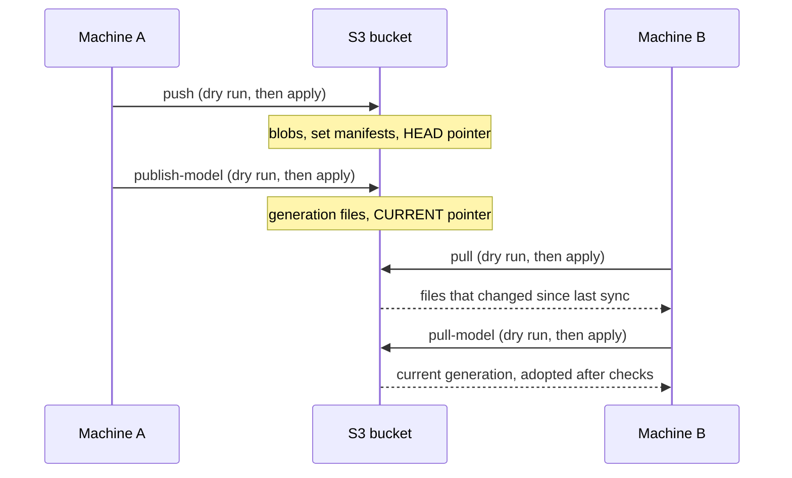

# Sync with S3

How the private data, stores and model generations move between machines, and the commands to do it.
For anyone working on the ML side on more than one machine. Package: `ml/s3sync/`. Entry point:
`ml/scripts/sync.py` (every flag in [scripts-and-flags.md](../reference/scripts-and-flags.md)). The
paths and set names are in [paths.md](../reference/paths.md). Everything here holds patient records:
nothing is ever committed, and every object is written with server-side encryption (`AES256`).
Setting up a machine for the first time is in [new-machine-setup.md](new-machine-setup.md).



Every command prints a plan and changes nothing until you add `--apply`. `push` and `publish-model`
move a pointer only if nobody moved it since this machine last synced (fast-forward only); `pull`
and `pull-model` verify every download before touching a local file.

## What syncs

**File sets** are mutable directories synced as a unit (`config.S3_SYNC_SETS`); the set names and
the directory each maps to are in [paths.md](../reference/paths.md).

**Model generation** — only `ml/output/report_mapping/current/`, published as one immutable
generation directory (`sync.py publish-model` / `pull-model`).

**Not synced:**

| What | Why |
|---|---|
| `report_mapping/embedding_cache/` | Rebuilt locally (~9 min on GPU) after a model pull; content-hash keyed, so a stale entry can never load. |
| `output/archive/` | Machine-local history; written only by `generations/promote.py`. |
| `report_mapping/candidate/` | Unpromoted work. (`pull-model` uses it briefly as a staging directory.) |
| `handoff/outbox/bundles/` | A bundle duplicates the model generation, which is published instead. |
| `s3sync_state.json`, `s3sync_backup/` | Per-machine (below). |
| Root `CLAUDE.md` | Gitignored and **not** carried by this tool — sync it by hand. |
| Code and docs | Git. |

Inside any set, junk is skipped: `.DS_Store`, `*.s3sync-partial` (unfinished downloads) and
`__pycache__`.

## Bucket and layout

The bucket, region, key prefix (`S3_PREFIX`) and the protected prefixes the key builder
(`s3sync/remote.py`) refuses are in [paths.md](../reference/paths.md). For a smoke run, narrow with
`--prefix`, a top-level flag that goes before the subcommand
(`ml/scripts/sync.py --prefix <S3_PREFIX>_scratch/x/ push data`); state is kept per prefix, so a
scratch run cannot disturb the real sync.

```
<S3_PREFIX>/
  blobs/<sha256>                       file contents, immutable
  sets/<set>/manifests/<id>.json       {set, created_at, created_by, parent, files{relpath: sha256,size}}, immutable
  sets/<set>/HEAD.json                 {"manifest": "<id>"}  -- the only mutable object of a set
  generations/<generation_id>/...      the generation directory, readable names, immutable; manifest.json last
  generations/CURRENT.json             {"generation_id": "<id>"}  -- the only mutable object of the model
```

**Why this shape.** Probed on 2026-09-28: the project's IAM user can read, write and list objects
and do conditional writes, but is denied listing versions and reading old versions (delete was not
probed, and is assumed unavailable). Nothing here relies on any of those.
Nothing is ever overwritten: contents, manifests and generation files are written once
(`If-None-Match: *`; blobs and generation files also carry a SHA-256 checksum that S3 verifies
server-side), and only the two kinds of pointer move, by conditional write (`If-Match: <etag>`),
which is what makes sync fast-forward-only.

**Rollback** is repointing a pointer to an older manifest or generation. There is no rollback
command yet; do it by hand with a recent AWS CLI v2. The pointers' full keys are
`<S3_PREFIX>/sets/<set>/HEAD.json` and `<S3_PREFIX>/generations/CURRENT.json`.

1. Find the older id — manifest ids and generation ids are timestamps.
2. Write the **whole** pointer document to `pointer.json`: `{"manifest": "<older id>"}` for a set,
   `{"generation_id": "<older id>"}` for the model.
3. Move the pointer only if nobody moved it since you read it (Git Bash; the ETag keeps its literal
   double quotes, which `--output text` preserves):

   ```bash
   BUCKET=<S3_BUCKET>
   KEY=<S3_PREFIX>/sets/<set>/HEAD.json   # or <S3_PREFIX>/generations/CURRENT.json
   aws s3 ls "s3://$BUCKET/<S3_PREFIX>/sets/<set>/manifests/"   # or .../generations/
   ETAG=$(aws s3api head-object --bucket "$BUCKET" --key "$KEY" --query ETag --output text)
   aws s3api put-object --bucket "$BUCKET" --key "$KEY" --body pointer.json --if-match "$ETAG" --server-side-encryption AES256
   ```

4. **Every** machine, including the one that did the rollback, must then `pull` (or `pull-model`):
   each still points at the old HEAD, so each sees "remote moved".

What a pull of a rolled-back set does: files added after the rollback point and unchanged locally
are moved into `s3sync_backup/`; changed files revert to the older content (your own unpushed edits
follow the conflict table below). For the model, `pull-model` fetches the older generation and
archives the newer one under `output/archive/`. Nothing is deleted from S3 — blobs and generation
directories stay — so repointing to the newer id reverses the rollback.

## Commands

Everything is a **dry run** until `--apply`. `SET` is one of the sets above, or `all` (default).
Paths are written for Windows; on macOS/Linux the interpreter is `ml/.venv/bin/python`.

```
ml/.venv/Scripts/python.exe ml/scripts/sync.py status [SET]
ml/.venv/Scripts/python.exe ml/scripts/sync.py push [SET] [--apply]
ml/.venv/Scripts/python.exe ml/scripts/sync.py pull [SET] [--apply]
ml/.venv/Scripts/python.exe ml/scripts/sync.py publish-model [--apply]
ml/.venv/Scripts/python.exe ml/scripts/sync.py pull-model [--apply]
```

Exit status is non-zero with `REFUSED: ...` on a guard, conflict or verification failure, and on an
AWS error (no credentials, unknown `AWS_PROFILE`, access denied).

**Hooks** — opt-in flags that run the sync after the local work succeeded (both need AWS
credentials; without the flag nothing touches S3):

| Command | Then |
|---|---|
| `promote.py ... --apply --publish` | If the candidate was promoted, `publish-model`. (Rejected without `--apply`; ignored if the candidate lost.) |
| `handoff.py import-pending ... --push` | pushes `handoff` |
| `handoff.py import-gold ... --push` | pushes `manual_audit`, then `handoff` |
| `handoff.py export-silver ... --push` | pushes `handoff` |
| `handoff.py export-coding ... --push` | pushes `handoff` |
| `handoff.py export-audit-list ... --push` | pushes `manual_audit`, then `handoff` |
| `handoff.py export-bundle` | no `--push` (bundles are not synced) |

The mapping is `PUSH_SETS` in `scripts/handoff.py`; a test checks each command writes only inside its
sets. On a failure the local work stands: the message lists what was pushed, what failed and what
was not attempted (it stops at the first failure) and the `sync.py` command that finishes the job.

## Conflict policy

- **Fast-forward only.** `push` is refused ("remote moved, pull first") if the remote HEAD is not
  the one this machine last pulled or pushed — including a machine that never pulled. Pull, then push.
- **`pull` is a 3-way merge per file** (last-synced version, local, remote):

  | Situation | Result |
  |---|---|
  | only the remote changed it (or nothing local) | fetched |
  | only you changed it | `kept_modified` — kept, and the next push sends it |
  | both changed it differently | `conflicts` — the remote version wins; your copy is backed up first |
  | deleted remotely, unchanged locally | moved into the backup directory |
  | deleted remotely, edited locally | `kept_modified` |
  | deleted locally, remote unchanged | `kept_modified` — not restored; the next push drops it from the new manifest (blobs stay) |
  | deleted locally, remote changed | re-fetched |
  | new local file | kept |

  The dry run prints the file names for `conflicts`, `kept_modified` and removals, and only a count
  for fetches. Downloads are verified (SHA-256, size) into `.s3sync-partial`
  files before any local file is touched; one bad blob leaves the set as it was.
  Safety copies go to `config.S3_SYNC_BACKUP_DIR` (`output/s3sync_backup/<UTC stamp>/<set>/<relpath>`).
- **Per-machine state**, `config.S3_SYNC_STATE_JSON` (`output/s3sync_state.json`), records per
  prefix and set the manifest, HEAD etag and file hashes this machine last synced. Delete it and the
  machine is "never synced": the next push is refused until it pulls. Never copy it, or
  `s3sync_backup/`, between machines by any other tool: a copied state corrupts the 3-way base.
- **Model.** `publish-model` publishes `current/` only after `generations.promote.check_candidate`
  passes (manifest, embedding fingerprint, calibrated), and moves `CURRENT.json` by the same rule.
  `pull-model` downloads into `candidate/`, verifies it, and calls `generations.promote.adopt`,
  which archives the replaced `current/` exactly as a promotion does: to
  `output/archive/YYYY-MM-DD_<old generation_id>/`, together with the embedding-cache entries the
  new generation cannot use. If that `current/` was never published it says so (`UNPUBLISHED ...
  will be archived to <path>`): it is kept, not lost. It refuses if `candidate/` already exists or
  that archive folder is taken (a second replacement of the same id on the same day — move the old
  archive aside), before downloading anything; a failed pull removes only the staging `candidate/`
  it created. Two outcomes fetch nothing: local `current/` already is the remote generation (state
  is recorded, nothing else), or the remote pointer has not moved since this machine's last sync
  while `current/` differs (`keep local: current <id> is unpublished; run publish-model`).
  If a `--publish` finds the remote model moved, run `pull-model --apply`, then re-run the promotion
  against the new `current/` if the candidate should still win.

## New machines and the first upload

A new machine installs the environment, sets up credentials and runs a first pull: the steps are in
[new-machine-setup.md](new-machine-setup.md). If the machine already holds any of these files, follow
[Joining with existing files](#joining-with-existing-files) before pushing.

The **first-ever upload**, from the machine that holds the data (~0.8 GB): `sync.py push --apply`,
then `sync.py publish-model --apply`. Run these yourself; dry-run first.

### Access

Keys come from the bucket owner (ask them; this project does not manage IAM). The tool uses boto3's
default credential chain, so `AWS_PROFILE` works; no keys are stored in the repo or by the tool. The
identity needs,
on `<S3_PREFIX>/*`: `s3:GetObject` and `s3:PutObject` (conditional writes are part of
`PutObject`); and on the bucket: `s3:ListBucket` — without it S3 answers a missing key with 403
instead of 404, and every first push or pull is REFUSED as access denied. Delete and version
permissions are not needed. `aws sts get-caller-identity` shows which identity you are using.

### Joining with existing files

A machine that has never synced has no merge base, so its first `pull` treats every file as new:

- a file that differs from S3 is replaced by the S3 version (the local copy goes to
  `s3sync_backup/` first);
- a file that exists **only locally** is kept — and the next `push` uploads it into the shared set.

So before the first push from a machine that already had data (a USB copy, an older checkout):

1. Run `sync.py pull` (dry run), then `sync.py pull --apply`.
2. Run `sync.py push` (dry run): after that pull, its `added:` lines are exactly the files that
   exist only locally. Move them somewhere outside the repo — unless they really should be shared.
3. `sync.py status` must show 0 added / 0 changed / 0 removed for every set, and a second
   `sync.py pull` dry run must plan nothing. Then `sync.py pull-model --apply`.
4. Before any later push, read the dry run's `added:` and `removed:` lines.

### Finding a file in the bucket

The S3 console shows data files as `blobs/<sha256>`, not by name. To locate one: read
`sets/<set>/HEAD.json` for the manifest id, open `sets/<set>/manifests/<id>.json`, and look the
file up under `files` — its `sha256` is the blob key. To get files by name, use `sync.py pull`. Model
generations are the exception: `generations/<id>/` keeps the real file names.

### Day to day

- Before you start: `sync.py pull --apply` (and `pull-model --apply` if someone promoted).
- After you change a synced set: `sync.py push --apply`, or add `--push` to the `handoff.py` command.
- After a promotion: `promote.py --apply --publish`.
- If a push says "remote moved, pull first": pull, check the conflicts it lists, push again.

## Known limits

- One `put_object` per file: a single file over 5 GB cannot be uploaded (no multipart yet).
- An existing object without a stored SHA-256 checksum is refused, not trusted (fail closed).
- `all` is not atomic across sets: a refusal on set N leaves sets before it already applied.
- A pull can stop "partially applied" if a file is locked (Windows, e.g. open in Excel): close it
  and re-run the pull.
- No delete or rollback command (see above).
- The backend and ml-worker still run on GCS. Once ported to AWS they can read
  `generations/<id>/...` directly — the layout keeps the generation's own file names for that.

_Last verified against code: 2026-09-29_
