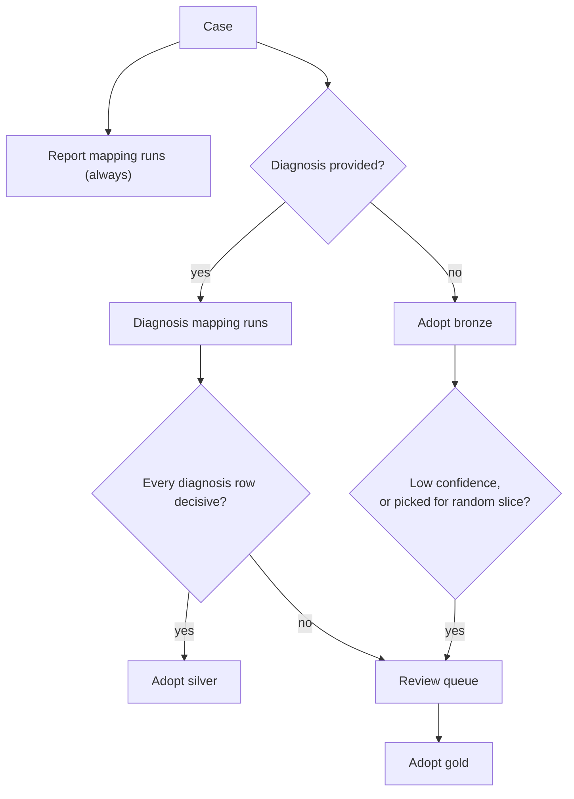
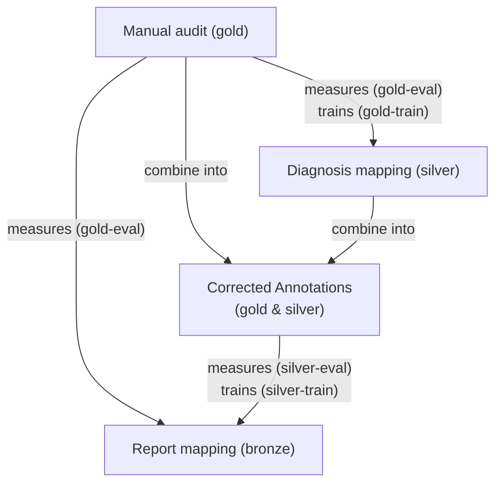

# ICD Mapping Strategy — Three Sources of Evidence

**Status:** Proposal for team review, 2026-09-15. Strategy-level. This redefines the project's scope:
the annotation pipeline, until now only a training-label generator, becomes a production coding
method, so a substantial overhaul is expected. [annotation-redesign-plan.md](annotation-redesign-plan.md)
remains the execution plan for the manual-audit tooling; this doc sets the frame it works within.

## Summary

The registry maps every case, historical or uploaded, to its Vet-ICD-O-canine-1 code(s), and
records how far each code can be trusted. Codes come from three methods of decreasing confidence:
a specialist's manual audit (**gold**), mapping the clinic's diagnosis text (**silver**), and
mapping the pathology report (**bronze**). Each case takes the most trusted code available, and a
vague diagnosis goes to the specialist rather than to a model. Gold measures both automated
methods on the same terms. Gold and silver, combined into corrected annotations, train the report
model. Because there is no funding for cloud compute beyond inference, the LLM and all training
run on developer machines, with data exchanged manually with the cloud. Once enough gold exists for evaluation to be
representative, a retraining tool built by the backend developer makes retraining routine.

## Terms

| Term | Meaning |
|---|---|
| **Gold** | A code set assigned by the specialist from the case's full record. Treated as ground truth. |
| **Silver** | A code from the **diagnosis mapping**: the annotation pipeline (keyword cascade + LLM). |
| **Bronze** | A code from the **report mapping**: the PetBERT 4-stage pipeline. |
| **Gold-eval** | Gold used only to measure accuracy. It is never trained on. |
| **Gold-train** | Gold used to improve the diagnosis mapping and, through the corrected annotations, to train the report mapping. |
| **Corrected annotations** | Gold and silver combined per case: gold where the case has it, silver elsewhere. The label set the report mapping is trained and routinely scored on. |
| **Silver-train / silver-eval** | The corrected annotations on the training / evaluation side of the split. Silver-eval is the cheap ruler available at scale; gold-eval remains the authority. |
| **Decisive / vague** | Whether the diagnosis mapping reached a usable answer for a diagnosis row (see [Coding a case](#coding-a-case)). |
| **Adopted code** | The code the registry publishes for a case. |
| **Generation** | One versioned output of a method: a silver run of the annotation pipeline, or a trained set of report-mapping models. |

## The three methods

| | Manual audit | Diagnosis mapping | Report mapping |
|---|---|---|---|
| **Produces** | Gold | Silver | Bronze |
| **Input** | The full case record | The clinic's free-text diagnosis | The pathology report text |
| **Code** | `annotation/gold/` + the review app | `annotation/llm_pipeline/` | `production/petbert_pipeline/` |
| **Confidence** | Highest | High where decisive | Lowest |
| **Cost per case** | Very high | Low | Very low |
| **Runs on** | Sampled and queued cases | Every case with a diagnosis | Every case |
| **Its code is adopted when** | Always, once it exists | A diagnosis is provided and every row is decisive | No diagnosis is provided |

## Coding a case

**Precedence is gold > silver > bronze.** Lower-precedence codes are kept alongside for comparison,
never discarded.

**Whether a diagnosis is provided is fixed at upload.** Case IDs are assigned inside this system and
carry no identifying information, so a later diagnosis cannot be linked back to an upload. A
report-only case gains better evidence only if the specialist codes it, which makes it gold.

**Vagueness is read from the diagnosis mapping's `decision_stage`:**

| `decision_stage` | Outcome | Treated as |
|---|---|---|
| `tier1_exact` | Code matched | Decisive |
| `tier2_fuzzy` | Code matched | Decisive, provisionally. The Tier-3 audit confirms or overturns this. |
| `no_signal` | No cancer vocabulary (e.g. "chronic dermatitis") | Decisive: non-cancer |
| `tier3_llm`, hedged (`Uncertain`) | No code | Vague |
| `tier3_no_candidates` | Cancer vocabulary present, but the LLM was never asked | Vague |
| `tier3_llm`, declined (`No Match`) | No code | **Undecided.** Vague if the Tier-3 audit finds a material share are missed cancers. |

`no_signal` is decisive on purpose: it covers 143,432 of 188,774 historical rows, and queuing it
would bury the specialist.

**If any row of a case is vague, the whole case is queued.** Its decisive rows are not adopted
separately, because gold is the case's complete code set.

**Bronze never overrides silver.** The report mapping learns mostly from silver, so when the two
disagree the report mapping is usually the one that is wrong; that is why it is bronze. Bronze may
set the *order* of the review queue (a vague case where bronze confidently says cancer goes
first), but it is never adopted over a decisive diagnosis, and by default a disagreement alone
never sends a case to review. Evaluation can carve out exceptions (see
[Improving the methods](#improving-the-methods)).

**Review is triggered three ways:** a vague diagnosis, a low-confidence bronze code, or a random
selection of auto-accepted bronze codes. The first two are gold-train; the random slice is
gold-eval (see [Measuring accuracy](#measuring-accuracy)).

## Measuring accuracy

**Gold is the true code set for the case.** The specialist codes from the full record (diagnosis and
report), not from one text field. That puts both automated methods on the same question: did this
method reach the case's true code? There is one specialist, and gold is treated as correct. Their
errors are therefore invisible to every number here; this is an accepted risk, to revisit if a
second reviewer becomes available.

**Each code is scored individually.** Every predicted code gets a verdict (`good` exact term,
`slightly_off` right group, `completely_off`, `false_positive`), and every gold code that no
prediction covers is a `false_negative`. This is how `ml/evaluation/evaluate.py` already scores.

**Gold-eval must be an unbiased sample, so it comes from two random sources only:**

- **Evaluation batches** drawn from `test_cases.txt`, stratified by group with `sample_weight`
  recorded. The review is **blind**: no method's prediction is shown, because a visible suggestion
  anchors the reviewer and inflates measured agreement.
- **The upload random slice:** a random share of auto-accepted bronze codes. This is the only
  measurement of the report mapping on the population where its codes are actually adopted.

**A cause pass follows, on misses only.** Where gold differs from a method's code, the specialist
answers: *does this method's own input (the diagnosis line, or the report) support the gold code?*
"Yes" is a method error, fixable in that method. "No" is an input gap, not fixable there. This adds
no work on the cases the methods got right.

**Four results, always reported together on the same cases:**

| Comparison | What it tells us |
|---|---|
| Silver vs gold, by `decision_stage` | Real accuracy of the diagnosis mapping; validates the decisive/vague split |
| Bronze vs gold, by confidence band | Real accuracy of the report mapping; basis for its review threshold |
| Bronze vs uncorrected silver | The cheap comparison, checked here against the real one |
| Who was right on disagreements, by `decision_stage` × bronze confidence | Tests "bronze never overrides silver" cell by cell |

The third row uses silver *before* gold correction: on these cases the corrected annotations are
gold, so comparing against them would just repeat the second row. If bronze-vs-silver tracks
bronze-vs-gold across retraining cycles, silver-eval (which covers the whole evaluation side, not
just gold cases) is a trustworthy stand-in for day-to-day iteration. If not, model decisions must
go through gold.

**Gold-eval is representative once all three hold** (proposed thresholds, to settle on real data):

- the overall per-code accuracy has a 95% confidence interval of about ±5 points or narrower
  (roughly 385 codes);
- every group making up at least ~1% of adopted codes has at least ~30 gold codes;
- it includes upload random-slice cases, not only historical ones.

Until then, gold-eval numbers are indicative, and model promotion is decided cautiously by hand.

**Relation to the Tier-3 audit.** The row-level audit already prepared under
annotation-redesign-plan.md shows the reviewer only the diagnosis line, on purpose: it diagnoses
the cascade's translation step, which case-level gold cannot isolate cheaply. Its rows are neither
gold-eval nor gold-train, and carry their own `provenance`.

## Improving the methods

**The report mapping trains on the corrected annotations: gold where it exists, silver
elsewhere.** Gold replaces a case's silver labels entirely rather than merging with them, since gold is the complete code set. This lets the
report mapping learn from the report where the diagnosis fell short, instead of only imitating
silver. Whether gold cases deserve a higher sample weight is tested on gold-eval, not assumed.

**Gold-train comes from the review queue:** vague cases from the train split in the historical
phase, and queued uploads later. It concentrates on the cases where silver is weakest. That skew
helps training and does not touch measurement, because gold-eval is drawn separately.

**Leakage guards:**

- Gold-eval always lands on the silver-eval side of the corrected annotations, never in
  silver-train. `check-split` enforces this for historical cases; uploads rely on each gold row's
  origin tag (see [Where work runs](#where-work-runs)).
- Threshold calibration never uses gold-eval. Thresholds are fitted parameters too.
- Tier-3 audit rows never enter the corrected annotations (they are row-level diagnosis-only
  judgements, not case truth).

**Disagreement between silver and bronze is read by silver's strength:**

- **Decisive silver:** the disagreement counts as a bronze error, unless gold exists, in which case
  gold decides. These cases become hard training examples, not review items.
- **Vague silver:** the case is already queued; bronze only sets priority.
- **Evidence overrides the default.** If the evaluation shows a cell where bronze beats decisive
  silver often enough to matter (say `tier2_fuzzy` with very high bronze confidence), that cell is
  routed to review.

Two cautions apply. **Agreement does not prove correctness:** the report mapping inherits silver's
systematic errors, so the two can be wrong together without disagreeing; only random gold finds
those. **Disagreement on historical training cases is suppressed:** the production model has fit
their labels, so historical disagreement analysis needs out-of-fold predictions (from models that did not
train on those cases). Uploads do not
have this problem.

**Generations are versioned and archived.** A silver generation feeds the registry *and* the report
mapping's training labels, so a new one changes both. A report-mapping generation is identified by
the silver generation plus the gold-train snapshot it trained on. Every replacement archives the
current generation first (per `CLAUDE.md`). A new generation is promoted only if it scores at least
as well **on the current gold-eval**, with the incumbent re-scored on the same gold-eval each time:
gold-eval grows between runs, so an old number is a different ruler.

## Where work runs

**The cloud stores, serves and reviews; developer machines compute.** The LLM is always hosted
locally, never through a third-party API, and there is no funding to host it or to train in the
cloud.

| Cloud | Developer machines |
|---|---|
| Uploads, storage, database, dashboards | The diagnosis mapping's LLM tier and ensemble cleanup |
| Report-mapping inference (ML worker) | All model training |
| The review app, where gold is produced | Evaluation against gold |

**Data crosses manually**, through exports the backend developer prepares:

| Direction | What | Purpose |
|---|---|---|
| Cloud → ML developer | Diagnoses of uploads awaiting the diagnosis mapping | Run the cascade |
| Cloud → ML developer | Review results (gold), each tagged random slice or review queue | Evaluation and training |
| ML developer → cloud | Silver codes for those uploads | Adopt codes at import |
| ML developer → cloud | Promoted model generations | Deploy to the ML worker |

- **The origin tag is mandatory.** It is the only thing separating gold-eval from gold-train for
  uploads, so ingest refuses untagged rows.
- **Re-ingesting a later export replaces earlier rows** rather than duplicating them. The gold store
  is already keyed and cumulative.
- **Exports contain case text,** so they live in gitignored data directories and are never
  committed.

For the historical data, all of this costs nothing extra today: the cascade has already been run
over the corpus, and the LLM re-runs only when the cascade changes.

**Roles:**

| Who | Responsible for |
|---|---|
| Specialist (one) | Evaluation batches, the review queue, the random slice, cause passes |
| ML developer | Running the cascade, training, evaluation, ingesting gold, the retraining contract |
| Backend developer | Upload format, pending states, exports and imports, review-app and schema changes, the retraining tool |

## Where things stand (2026-09-15)

| Area | Today | Needed |
|---|---|---|
| Gold | None. No `gold_annotation.csv`; the 30-row Tier-3 pilot is prepared but not filled in. | Evaluation batches (1.2) |
| Silver accuracy | Unmeasured. `annotation.csv`: 188,774 rows over 58,208 cases (26,791 with a cancer term); by `decision_stage` 143,432 `no_signal`, 34,784 `tier1_exact`, 6,279 `tier3_llm`, 3,813 `tier3_no_candidates`, 466 `tier2_fuzzy`. An earlier audit estimated ~7% error on confirmed positives, 25–30% on weaker matches. | Tier-3 audit (1.1), evaluation (1.2) |
| Bronze accuracy | Production's 62.1% Good + Slightly-off rate is agreement with silver, not correctness. | Evaluation (1.2) |
| Bronze training labels | Silver only. | Corrected annotations (1.4) |
| Silver versioning | None; the annotation pipeline is a one-off batch job. | Versioned generations (1.3) |
| Upload path | Runs bronze only. The parser reads demographics (sex, breed, date, species, zip), not a diagnosis; nothing in `backend/app/` or `ml-worker/` calls the annotation pipeline. | Diagnosis upload + handoff (2.1) |
| Review routing | `ingestion_service.py` queues a bronze code when confidence < 0.23 or top-1/top-2 margin < 0.15 (hand-set), and stamps everything else `confirmed`, the same status a human gives. Vague diagnoses are not routed. | Routing by adopted method (2.2) |
| Provenance | The registry does not record which method or generation produced a code. The gold schema in annotation-redesign-plan.md uses `bronze` for a weak *cascade* match, clashing with this doc. | Code provenance (2.2) |
| Upload accuracy | Unmeasured; the report mapping is trained and evaluated only on historical cases (94 of the 58,172 cases in the last production run lack a diagnosis). | Random slice (2.3) |

Already in place and reused: `review_filter.py` keeps `pending` rows out of dashboard counts, and
`evaluate.py --expectation-csv` scores against any label file.

## Roadmap

### Phase 1 — Historical data (current)

**1.1 Tier-3 audit.** Pilot → remainder → fix the cascade → re-run the LLM on a developer
machine, per annotation-redesign-plan.md. It also settles the two provisional rows of the vagueness
table: declined LLM answers, and whether `tier2_fuzzy` stays decisive.

**1.2 First evaluation batch.** About 385 cases from `test_cases.txt`: blind review, full record,
cause pass on misses, producing the four results.
*Test:* `check-split` passes; per-code scoring through `evaluate.py --expectation-csv`.
*Risk:* additive; `annotation.csv` untouched.

**1.3 Version silver generations.** Stamp every silver output with its annotation-pipeline
version; archive before replacing; retrain the report mapping after any new generation. Land this
before 1.1's re-run, so the fixed cascade's output becomes the first versioned generation.

**1.4 Train the report mapping on the corrected annotations.** Apply the coding rule to the
historical corpus; the vague cases in the train split form the first review queue, and their gold
becomes gold-train. That queue is large: 3,385 train-split cases are vague today (4,199 overall),
roughly double if declined LLM answers also count as vague. The specialist works it in the order
bronze sets, and it will take many rounds. Until reviewed, those cases have no adopted code, like
pending uploads. Vague test-split cases can be reviewed too, but their gold stays on the evaluation
side; being a biased sample, it is not gold-eval.
Also collect hard examples from decisive-silver disagreements, using out-of-fold predictions.
*Test:* against a silver-only model on the same cases, gold-eval accuracy is at least as high, with
gains where gold overturned silver. Agreement with silver may *fall*; that is expected, not a
regression.
*Risk:* training-data change; archive first and keep the silver-only model as the baseline.

Until real uploads exist, the temporal holdout split (`test_cases_temporal.txt`, ~1,400 newest
cases) stands in for them: a large drop from the random-split score warns of drift.

### Phase 2 — Uploads

**2.1 Diagnosis mapping for uploads.** Extend the upload format so a case can carry diagnosis rows. A case with a diagnosis
waits as *pending silver*, out of dashboard counts, until the manual cycle completes: the backend
developer exports it, the ML developer runs the cascade, and the import applies the coding rule.
The backend side is an export/import pair, not a live service.
*Option to shrink the handoff:* `no_signal`, Tier 1 and Tier 2 need no LLM and could run in the
cloud at upload, leaving only Tier-3 rows and the cleanup check for the manual cycle. Whether
skipping cleanup is acceptable is answered by silver-vs-gold accuracy per `decision_stage`.
*Test:* replay historical cases through the upload path; silver codes match `annotation.csv` for the
same generation, and the share of cases queued matches the whole-case count from `decision_stage`.
*Risk:* large. It touches the upload format, ingestion, the ML worker and the database, and makes
upload turnaround depend on two people. Build beside the existing path; switch over only once the
replay matches.

**2.2 Review routing and code provenance.** Every adopted code records:
- `code_source`: `manual`, `diagnosis` or `report`;
- `source_version`: the generation that produced it;
- `source_confidence`: `decision_stage` for silver, calibrated probability for bronze.

Review status separates `auto_accepted` from human `confirmed`. Queue by the adopted method:
vagueness for silver, a bronze threshold recalibrated from the random slice for bronze. Rename the
gold schema's `bronze` tier; its old meaning becomes a silver `source_confidence`.
*Test:* every code has exactly one `code_source`; any case with gold resolves to `manual`; nothing is
`confirmed` without a reviewer identity.
*Risk:* database migration, building on the existing `prediction_method` and `review_status` columns.

**2.3 Measure the report mapping on uploads.**
- Send a random slice (e.g. 2–5%) of auto-accepted bronze codes to review.
- Track bronze-vs-silver agreement on diagnosed uploads per upload period, as a drift warning. It
  is a warning, not a measurement: diagnosed and undiagnosed uploads may differ.
- Bring review results to the ML developer through the tagged export.

*Test:* random-slice accuracy is reported per upload period with a confidence interval.
*Risk:* reviewer workload, controlled by the slice percentage.

### Phase 3 — Representative gold

**3.1 Batch retraining tool.** Once gold-eval meets the representativeness criterion, retraining
becomes routine. The backend developer builds a tool that runs the whole cycle in one go; the
tool itself is outside the ML scope.

*ML defines the contract:*
- **Inputs:** a silver generation, a gold-train snapshot, the current gold-eval.
- **Recipe**, the [training-guide.md](training-guide.md) cycle in order, with production
  hyperparameters as defaults:
  1. build the corrected annotations
  2. adapt the backbone, only when a cold start is due
  3. rebuild embeddings
  4. train the CasePresence, Group and LabelPresence heads
  5. calibrate thresholds and the tail gate
  6. score
- **Promotion rule:** at least as good on the current gold-eval, incumbent re-scored.
- **Leakage guards:** as listed under Improving the methods.

*The tool:*
- runs the recipe on a developer machine with a GPU;
- archives the current generation;
- reports new vs. incumbent scores per code and per group, with confidence intervals;
- applies the promotion rule, and packages a promoted generation for the cloud.

*Test:* unchanged inputs reproduce the incumbent's scores within run-to-run noise and the tool
declines to promote; deliberately shuffled training labels are refused.
*Risk:* a wrong rule or guard ships a worse model silently. Until the rule has been trusted over a
few runs, the tool recommends and a person promotes.

### Phase 4 — Owned models (later)

**4.1 BERT-based diagnosis mapping.** Fine-tune a diagnosis-text coder to replace the LLM tiers
(Phase 3 of annotation-redesign-plan.md). Besides accuracy, it would run in the cloud ML worker
next to the report mapping, retiring the manual LLM handoff. Training stays on developer machines,
so the gold export remains. Fewer vague outcomes also means a smaller review queue and better silver.

**4.2 Reduce the report mapping's dependence on silver.** As gold-train grows, test whether silver
is still needed, or only for groups gold covers thinly.

Nothing in Phase 4 is promoted until it beats the method it replaces on gold-eval.

## Open questions

1. **Reviewer capacity** (under debate). Sets the random-slice percentage, whether the review queue
   needs a cap, and how fast gold-train grows. For scale: the historical vague queue alone is
   4,199 cases, before any upload arrives.
2. **Handoff cadence and transport.** How often each export runs; how long a case may stay pending
   silver before that counts as a failure; how files move between developers
   ([box-rclone-sync-proposal.md](box-rclone-sync-proposal.md) is a candidate).
3. **Running the retraining tool.** Who runs it, and on whose GPU machine. That machine needs the
   reports, silver and gold exports, all of which contain private case data.
