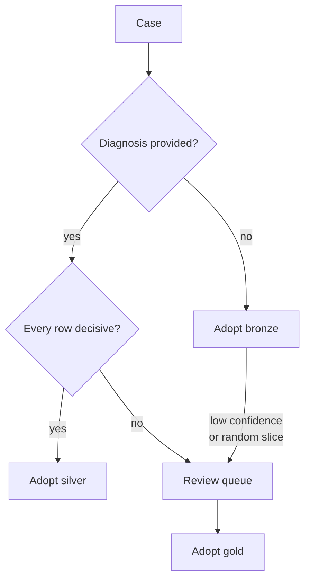
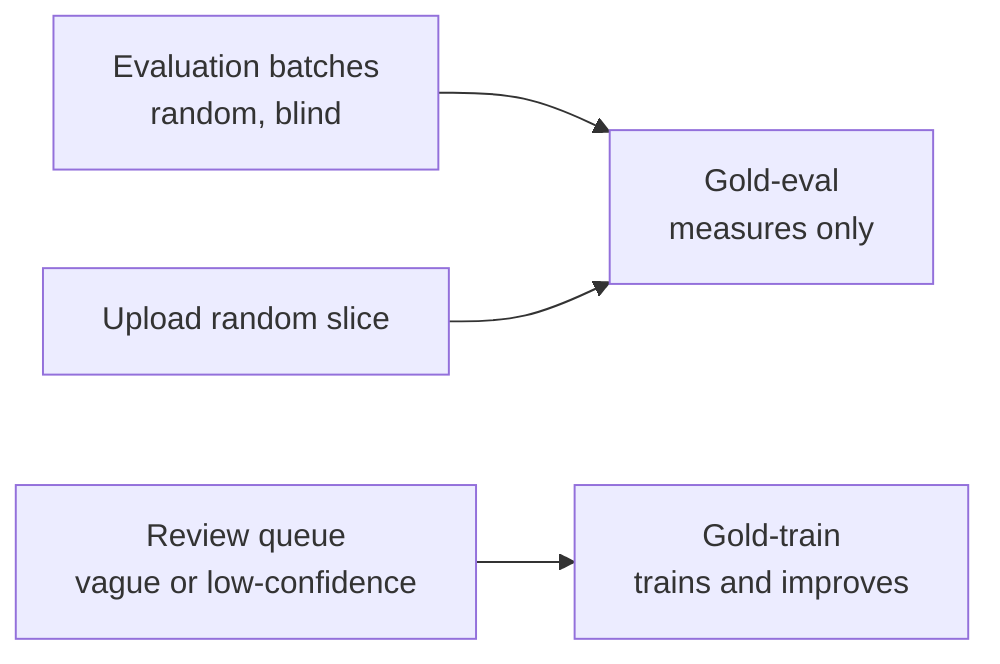
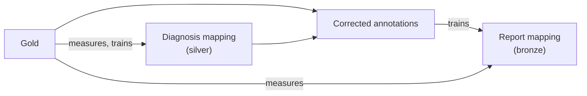
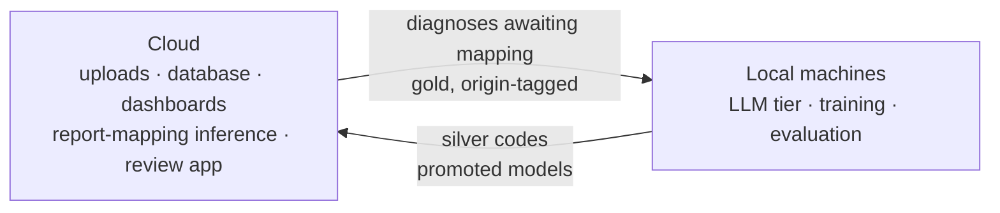
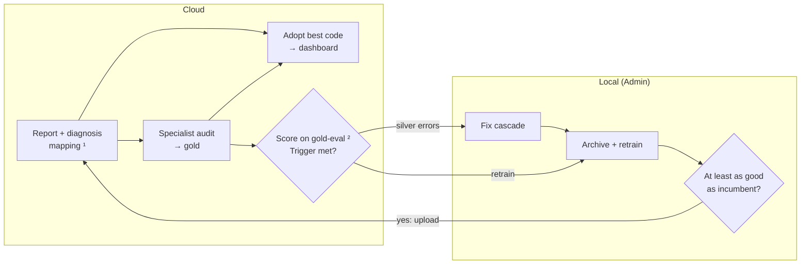
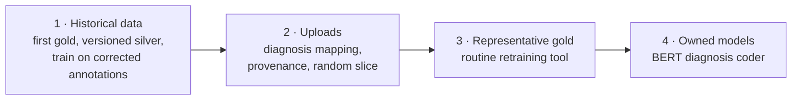

# ICD Mapping Strategy — Three Sources of Evidence

**Status:** Proposal for team review, revised 2026-09-25. Strategy-level: it sets the rules and the
roadmap; the other docs in this folder hold the details.

## Summary

The registry maps every case, historical or uploaded, to its Vet-ICD-O-canine-1 code(s), and
records how far each code can be trusted. Codes come from three methods of decreasing confidence:

- a specialist's **manual audit** (**gold**);
- mapping the clinic's **diagnosis** text (**silver**);
- mapping the pathology **report** (**bronze**).

Each case takes the most trusted code available, and a vague diagnosis goes to the specialist
rather than to a model. Gold measures both automated methods on the same terms. Gold and silver,
combined into corrected annotations, train the report mapping. There is no funding for cloud
compute beyond inference, so the LLM and all training run on local machines, with data exchanged
manually with the cloud.

## Terms

| Term | Meaning |
|---|---|
| **Gold** | A code set assigned by the specialist from the case's full record. Treated as ground truth. |
| **Silver** | A code from the **diagnosis mapping**: the annotation pipeline (keyword cascade + LLM). |
| **Bronze** | A code from the **report mapping**: the PetBERT 4-stage pipeline. |
| **Gold-eval** | Gold from random samples, used only to measure accuracy. Never trained on. |
| **Gold-train** | Gold from the review queue, used to improve the diagnosis mapping and to train the report mapping. |
| **Corrected annotations** | Per case: gold where it exists, silver elsewhere. The report mapping's training labels. |
| **Silver-eval** | The corrected annotations on the evaluation side of the split: a cheap ruler at scale, checked against gold-eval. |
| **Decisive / vague** | Whether the diagnosis mapping reached a usable answer for a diagnosis row. |
| **Adopted code** | The code the registry publishes for a case. |
| **Generation** | One versioned output of a method: a silver run, or a trained set of report-mapping models. |

## The three methods

| | Manual audit | Diagnosis mapping | Report mapping |
|---|---|---|---|
| **Produces** | Gold | Silver | Bronze |
| **Input** | The full case record | The clinic's free-text diagnosis | The pathology report text |
| **Code** | `annotation/gold/` + the review app | `annotation/llm_pipeline/` | `production/petbert_pipeline/` |
| **Confidence** | Highest | High where decisive | Lowest |
| **Cost per case** | Very high | Low | Very low |
| **Runs on** | Sampled and queued cases | Every case with a diagnosis | Every case |
| **Adopted when** | Always, once it exists | Every diagnosis row is decisive | No diagnosis is provided |

## Coding a case

The report mapping runs on every case, so bronze always exists for comparison.

**Precedence is gold > silver > bronze.** Lower-precedence codes are kept alongside, never
discarded.

**Whether a diagnosis is provided is fixed at upload.** Case IDs carry no identifying information,
so a later diagnosis cannot be linked back to an upload. A report-only case gains better evidence
only if the specialist codes it.

**Vagueness is read from the diagnosis mapping's `decision_stage`:**

| `decision_stage` | Outcome | Treated as |
|---|---|---|
| `tier1_exact` | Code matched | Decisive |
| `tier2_fuzzy` | Code matched | Decisive, provisionally (settled by 1.1) |
| `no_signal` | No cancer vocabulary (e.g. "chronic dermatitis") | Decisive: non-cancer |
| `tier3_llm`, hedged (`Uncertain`) | No code | Vague |
| `tier3_no_candidates` | Cancer vocabulary present, but the LLM was never asked | Vague |
| `tier3_llm`, declined (`No Match`) | No code | Undecided: vague if 1.1 finds a material share are missed cancers |

`no_signal` is decisive on purpose: it is most of the corpus, and queuing it would bury the
specialist.

**If any row of a case is vague, the whole case is queued.** Its decisive rows are not adopted
separately, because gold is the case's complete code set.

**Bronze never overrides silver.** The report mapping learns mostly from silver, so when the two
disagree the report mapping is usually the one that is wrong. Bronze may set the *order* of the
review queue (a vague case where bronze confidently says cancer goes first), but a disagreement
alone never sends a case to review. Evaluation can carve out exceptions (see
[Improving the methods](#improving-the-methods)).

## Measuring accuracy

**Gold is the true code set for the case.** The specialist codes from the full record, not from one
text field, so both automated methods answer the same question: did this method reach the case's
true code? There is one specialist and gold is treated as correct, so their errors are invisible to
every number here. This is an accepted risk, to revisit if a second reviewer becomes available.

**Where gold comes from decides what it may be used for:**

- **Evaluation batches** are drawn from the test split, stratified by group, with `sample_weight`
  recorded. Review is **blind**: no prediction is shown, because a visible suggestion anchors the
  reviewer.
- **The upload random slice** is a random share of auto-accepted bronze codes: the only measure of
  the report mapping where its codes are actually adopted.
- **The review queue** concentrates on the cases where silver is weakest. That skew helps training
  but would bias measurement, so queue gold is never gold-eval.

**Each code is scored individually.** Every predicted code gets a verdict (`good` exact term,
`slightly_off` right group, `completely_off`, `false_positive`), and every gold code no prediction
covers is a `false_negative`, as `evaluate.py` already scores.

**A cause pass follows, on misses only.** The specialist answers: *does this method's own input
(the diagnosis line, or the report) support the gold code?* "Yes" is a method error, fixable in
that method. "No" is an input gap, not fixable there.

**Four results, always reported together on the same cases:**

| Comparison | What it tells us |
|---|---|
| Silver vs gold, by `decision_stage` | Real accuracy of the diagnosis mapping; validates the decisive/vague split |
| Bronze vs gold, by confidence band | Real accuracy of the report mapping; basis for its review threshold |
| Bronze vs silver before gold correction | Whether the cheap silver-eval ruler tracks the real one |
| Who was right on disagreements, by `decision_stage` × bronze confidence | Tests "bronze never overrides silver" cell by cell |

If bronze-vs-silver tracks bronze-vs-gold across retraining cycles, silver-eval is a trustworthy
stand-in for day-to-day iteration. If not, model decisions must go through gold.

**Gold-eval is representative once all three hold** (proposed thresholds, to settle on real data):

- overall per-code accuracy has a 95% confidence interval of about ±5 points or narrower (roughly
  385 codes);
- every group making up at least ~1% of adopted codes has at least ~30 gold codes;
- it includes upload random-slice cases, not only historical ones.

Until then, gold-eval numbers are indicative, and model promotion is decided by hand.

## Improving the methods

**The report mapping trains on the corrected annotations.** Gold replaces a case's silver labels
entirely, since gold is the complete code set. This lets the report mapping learn from the report
where the diagnosis fell short, instead of only imitating silver. Whether gold cases deserve a
higher sample weight is tested on gold-eval, not assumed.

**Leakage guards:**

- Gold-eval never enters training. `check-split` enforces this for historical cases; uploads rely
  on each gold row's origin tag.
- Threshold calibration never uses gold-eval. Thresholds are fitted parameters too.
- Tier-3 audit rows (1.1) are row-level, diagnosis-only judgements, not case truth. They are neither
  gold-eval nor gold-train and never enter the corrected annotations.

**Disagreement between silver and bronze is read by silver's strength:**

- **Decisive silver:** a bronze error, unless gold exists, in which case gold decides. These cases
  become hard training examples, not review items.
- **Vague silver:** the case is already queued; bronze only sets priority.
- **Evidence overrides the default.** If evaluation shows a cell where bronze beats decisive silver
  often enough to matter (say `tier2_fuzzy` with very high bronze confidence), that cell is routed
  to review.

Two cautions. **Agreement does not prove correctness:** the report mapping inherits silver's
systematic errors, so the two can be wrong together; only random gold finds those. **Historical
training cases hide disagreement:** the model has fit their labels, so disagreement analysis there
needs out-of-fold predictions. Uploads do not have this problem.

**Generations are versioned, archived and gated.** A silver generation feeds both the registry and
the report mapping's training labels. A report-mapping generation is identified by the silver
generation plus the gold-train snapshot it trained on. Every replacement archives the current
generation first (per `CLAUDE.md`). **Promotion rule:** a new generation replaces the incumbent
only if it scores at least as well on the *current* gold-eval, with the incumbent re-scored on the
same cases each time, since gold-eval grows between runs.

## Where work runs

**The cloud stores, serves and reviews; local machines compute.** The LLM is always hosted locally,
never through a third-party API, and there is no funding to host it or to train in the cloud.

**Data crosses manually,** through exports and imports the backend developer builds.

- **The origin tag is mandatory.** It is the only thing separating gold-eval from gold-train for
  uploads, so ingest refuses untagged rows.
- **Re-ingesting a later export replaces earlier rows** rather than duplicating them.
- **Exports contain case text,** so they live in gitignored data directories and are never
  committed.

**Roles:**

| Who | Responsible for |
|---|---|
| Specialist (one) | Evaluation batches, the review queue, the random slice, cause passes |
| ML developer | Running the cascade, fixing it, evaluation, ingesting gold, the retraining contract |
| Admin | The ML developer, or any IT support maintaining the system. Runs the local lane of [the full cycle](#the-full-cycle): fetching exports, retraining, promotion, upload |
| Backend developer | Upload format, pending states, exports and imports, review-app and schema changes, the retraining tool |

## The full cycle

This is the whole system as one loop, once the roadmap is complete. The cloud codes cases, runs the
audits and decides when a model needs work; an Admin's local machine does that work. Two cloud
steps run locally today, marked ¹ and ². Branches that change nothing (no trigger met, or a
candidate model that loses) are left out.

¹ Today the LLM tier runs locally through the manual handoff (2.1). The whole diagnosis mapping
moves to the cloud only with the BERT coder (4.1).
² Scoring adopted codes against gold only compares tables and runs no model, so in the end state it
runs in the cloud. Until the backend developer builds it, an Admin runs it locally. Candidate
models are always scored locally.

**Proposed retraining trigger.** The report mapping is retrained when any one of these holds
(thresholds to settle on real data):

1. **A new silver generation lands.** Its training labels changed.
2. **Bronze accuracy has dropped.** Accuracy on the latest upload period's random slice is below the
   incumbent's gold-eval accuracy, and the two 95% confidence intervals do not overlap.
3. **Gold-train has grown.** About 200 new gold-train codes since the snapshot the incumbent
   trained on.

**The diagnosis mapping is fixed, not retrained,** until the BERT coder (4.1). A fix is due when the
cause pass finds silver method errors, or silver's accuracy in a `decision_stage` drops as in
trigger 2. The ML developer fixes the cascade and re-runs it; the new silver generation sets off
trigger 1.

**Not a trigger:** falling bronze-vs-silver agreement on diagnosed uploads. It is a drift warning
and prompts a look at the random slice. Until gold-eval is representative, trigger 2 is indicative
only, and an Admin decides by hand.

**The local lane is the retraining contract (3.1).** Each run fetches its inputs, archives the
current generation, retrains and applies the promotion rule. A winning generation is uploaded to
the ML worker; a losing one is discarded and the incumbent restored from the archive.

## Roadmap

### Phase 1 — Historical data (current)

**1.1 Tier-3 audit.** Pilot → remainder → fix the cascade → re-run the LLM locally, per
[annotation-redesign-plan.md](annotation-redesign-plan.md). It also settles the two provisional
rows of the vagueness table: declined LLM answers, and whether `tier2_fuzzy` stays decisive.

**1.2 First evaluation batch.** About 385 cases from the test split: blind review, full record,
cause pass on misses, producing the four results.
*Today:* there is no gold, and production's Good + Slightly-off rate is agreement with silver, not
correctness.
*Test:* `check-split` passes; per-code scoring through `evaluate.py --expectation-csv`.
*Risk:* additive; `annotation.csv` untouched.

**1.3 Version silver generations.** Stamp every silver output with its annotation-pipeline
version; archive before replacing; retrain the report mapping after any new generation. Land this
before 1.1's re-run, so the fixed cascade's output becomes the first versioned generation.
*Today:* the annotation pipeline is a one-off batch job with no versioning.

**1.4 Train the report mapping on the corrected annotations.** Apply the coding rule to the
historical corpus. The vague cases in the train split form the first review queue, and their gold
becomes gold-train. That queue runs to thousands of cases, more if declined LLM answers count as
vague, so the specialist works it over many rounds in the order bronze sets. Until reviewed, those
cases have no adopted code. Vague test-split cases can be reviewed too, but their gold stays on the
evaluation side and, being a biased sample, is not gold-eval. Also collect hard examples from
decisive-silver disagreements, using out-of-fold predictions.
*Today:* bronze trains on silver only.
*Test:* against a silver-only model, gold-eval accuracy is at least as high, with gains where gold
overturned silver. Agreement with silver may *fall*; that is expected, not a regression.
*Risk:* training-data change; archive first and keep the silver-only model as the baseline.

Until real uploads exist, the temporal holdout split (the newest cases) stands in for them: a large
drop from the random-split score warns of drift.

### Phase 2 — Uploads

**2.1 Diagnosis mapping for uploads.** Extend the upload format so a case can carry diagnosis
rows. A case with a diagnosis waits as *pending silver*, out of dashboard counts, until the manual
cycle completes: the backend developer exports it, the ML developer runs the cascade, and the
import applies the coding rule.
*Option to shrink the handoff:* `no_signal`, Tier 1 and Tier 2 need no LLM and could run in the
cloud at upload, leaving only Tier-3 rows for the manual cycle. Whether skipping ensemble cleanup
is acceptable is answered by silver-vs-gold accuracy per `decision_stage`.
*Today:* uploads run bronze only; the parser reads no diagnosis.
*Test:* replay historical cases through the upload path; silver codes match `annotation.csv` for
the same generation, and the queued share matches the count from `decision_stage`.
*Risk:* large. It touches the upload format, ingestion, the ML worker and the database, and makes
turnaround depend on two people. Build beside the existing path; switch over once the replay
matches.

**2.2 Review routing and code provenance.** Every adopted code records:

- `code_source`: `manual`, `diagnosis` or `report`;
- `source_version`: the generation that produced it;
- `source_confidence`: `decision_stage` for silver, calibrated probability for bronze.

Review status separates `auto_accepted` from human `confirmed`. Queue by the adopted method:
vagueness for silver, a bronze threshold recalibrated from the random slice for bronze. Rename the
gold schema's `bronze` tier (a weak cascade match), which clashes with this doc's meaning.
*Today:* bronze is queued by hand-set confidence and margin thresholds; everything else is stamped
`confirmed`, the same status a human gives. Vague diagnoses are not routed.
*Test:* every code has exactly one `code_source`; any case with gold resolves to `manual`; nothing
is `confirmed` without a reviewer identity.
*Risk:* database migration, building on the existing `prediction_method` and `review_status`
columns.

**2.3 Measure the report mapping on uploads.** Send a random slice (e.g. 2–5%) of auto-accepted
bronze codes to review, and track bronze-vs-silver agreement on diagnosed uploads per upload period
as a drift warning.
*Today:* the report mapping is trained and evaluated on historical cases only.
*Test:* random-slice accuracy is reported per upload period with a confidence interval.
*Risk:* reviewer workload, controlled by the slice percentage.

### Phase 3 — Representative gold

**3.1 Batch retraining tool.** Once gold-eval is representative, retraining becomes routine. The
backend developer builds a tool that runs the local lane of the full cycle in one go; ML defines
the contract.

- **Inputs:** a silver generation, a gold-train snapshot, the current gold-eval, the report texts
  and the incumbent model.
- **Recipe**, the [training-guide.md](training-guide.md) cycle with production hyperparameters as
  defaults:
  1. build the corrected annotations
  2. adapt the backbone, only when a cold start is due
  3. rebuild embeddings
  4. train the CasePresence, Group and LabelPresence heads
  5. calibrate thresholds and the tail gate
  6. score new vs. incumbent per code and per group, with confidence intervals
- **Rules:** archive first; the promotion rule and leakage guards from
  [Improving the methods](#improving-the-methods); package a promoted generation for the cloud.

*Test:* unchanged inputs reproduce the incumbent's scores within run-to-run noise and the tool
declines to promote; deliberately shuffled training labels are refused.
*Risk:* a wrong rule or guard ships a worse model silently. Until the rule has been trusted over a
few runs, the tool recommends and a person promotes.

### Phase 4 — Owned models (later)

**4.1 BERT-based diagnosis mapping.** Fine-tune a diagnosis-text coder to replace the LLM tiers. It
would run in the cloud ML worker next to the report mapping, retiring the manual LLM handoff.
Training stays local. Fewer vague outcomes also mean a smaller review queue and better silver.

**4.2 Reduce the report mapping's dependence on silver.** As gold-train grows, test whether silver
is still needed, or only for groups gold covers thinly.

Nothing in Phase 4 is promoted until it beats the method it replaces on gold-eval.

## Open questions

1. **Reviewer capacity** (under debate). Sets the random-slice percentage, whether the review queue
   needs a cap, and how fast gold-train grows. The historical vague queue alone runs to thousands
   of cases.
2. **Handoff cadence and transport.** How often each export runs, how long a case may stay pending
   silver, and how files move between machines
   ([box-rclone-sync-proposal.md](box-rclone-sync-proposal.md) is a candidate).
3. **The Admin's machine.** Which GPU machine runs the local lane, and whether IT support may hold
   the reports, silver and gold exports, all of which contain private case data.
4. **Retraining trigger thresholds.** The ~200-code and confidence-interval values in the proposed
   trigger are placeholders until real gold exists.
