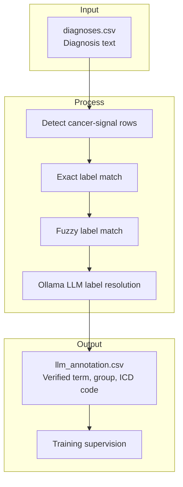

# Label Annotation — How It Works

This document describes the two annotation pipelines that map individual diagnosis field
text to standardized Vet-ICD-O-canine-1 labels: the **keyword pipeline** and the **LLM pipeline**.

> **Role in the system:**
> - **Annotation pipelines** (this document) — annotation only: `diagnosis text → cancer label`
>   Lives in `annotation/`. Two methods available; the LLM pipeline is the authoritative source.
>   Neither runs in production.
> - **Production pipeline** (`production/petbert_pipeline/`) — production system: `report text → cancer label`
>   See [production-pipeline.md](production-pipeline.md).

---

## Which Pipeline to Use

**Use the LLM pipeline** (`--method llm`) as the sole ground-truth source when running a full
scan. It handles negation, abbreviations, and rare subtypes that the keyword pipeline misses.
Runs entirely on local Ollama — no external API calls.

**Use the keyword pipeline** (`--method keyword`) as a fast, no-LLM fallback for quick testing
or when the Ollama server is unavailable. It has no negation handling, so phrases like
`"NO EVIDENCE OF NEOPLASIA"` are matched as cancer positives.

**Do not union both outputs.** Tier 1 of the LLM pipeline reuses the same keyword index, so
a union would reintroduce exactly the false positives the LLM pipeline is designed to reject.

### Coverage Comparison (as of 2026-03-22, 42,973 rows)

| | Keyword | LLM (gemma2:27b) |
|---|---|---|
| Matched rows | 8,238 (19.2%) | 7,918 (18.4%) |
| Cases with match | 5,864 (47.0%) | 5,614 (45.0%) |
| Unique terms matched | 70 | 69 |
| LLM call overhead | none | ~517 calls / 43k rows |

The keyword pipeline matches more rows overall because it is more permissive with hedged language
(e.g. it matches `"RULE OUT LYMPHOMA"` as a positive). The LLM pipeline adds ~106 cases the
keyword pipeline misses (metastasis phrasing, rare subtypes) but rejects ~426 keyword matches
as Uncertain or No Match due to negation and hedging.

---

## Why Annotation Is Needed

The production pipeline classifies full multi-section pathology reports. Training it
requires ground-truth cancer labels, but those labels don't exist in the raw database — only
free-text diagnosis strings do.

These annotation pipelines bridge that gap: they scan the short, structured `diagnosis` field
(e.g. `"Hemangiosarcoma, NOS"`, `"Mast cell tumor, grade II"`) that pathologists write directly
against the Vet-ICD-O taxonomy. Cases not matched are treated as non-cancer negative training
examples.

## Annotation Pipeline Flow

The strongest documented supervision path is the LLM pipeline: detect cancer-signal rows,
try exact and fuzzy matching first, then use Ollama only for unresolved cancer-positive rows.



---

## Shared Normalization

Both pipelines normalize all text before matching via `_normalize()`:

```
"Hemangiosarcoma, NOS"  →  "hemangiosarcoma nos"
"B-cell lymphoma/leukemia"  →  "b cell lymphoma leukemia"
"MALIGNANT NEOPLASIA (SEE COMMENT)"  →  "malignant neoplasm  see comment "
```

Normalization steps (applied in order):
1. Lowercase.
2. Collapse hyphens, underscores, and slashes to spaces.
3. Strip commas, parentheses, semicolons, and colons.
4. Collapse repeated whitespace.
5. Apply synonym substitutions:
   - `neoplasia` → `neoplasm`
   - `plasma cell tumor` → `plasmacytoma`

The LLM pipeline additionally expands:
- `metastasis` → `metastatic neoplasm` (for Tier 1 keyword matching)
- Abbreviations: `GIST`, `HSA`, `OSA`, `HCC`, `SCC`, `MCT`, `TVT`, `DLBCL`, `PNET`, `CPNET`,
  `angiosarcoma`, `perivascular wall tumor` (see [Abbreviation Expansion](#abbreviation-expansion))

---

## Keyword Pipeline

The keyword pipeline requires no ML model. Each diagnosis string is scanned for known taxonomy
term keywords using word-boundary regex patterns. Longest match wins, with a fallback for
`-oma`/`-emia` suffix words.

Entry point: `run_keyword_scan()` in `ml/annotation/keyword_pipeline/pipeline.py`.

### How It Works

**Step 1 — Build the keyword index** (`_build_keyword_index()`):

For each taxonomy label, generate candidates:
- **Full normalized term** — e.g. `"hemangiosarcoma nos"`
- **Core term** — qualifier words stripped (`nos`, `nec`, `malignant`, `benign`,
  `conventional`, `well differentiated`, `spindle cell`, `atypical`, etc.)
- **Word permutations** for 2–3 word candidates

Each candidate is compiled as `re.compile(r"\b" + re.escape(kw) + r"s?\b")` (word boundary
+ optional plural `s`). Candidates <6 characters are skipped. Index is sorted longest-first.

**Step 2 — Build the oma/emia index** (`_build_oma_index()`):

Every word in every taxonomy term ending in `-oma` or `-emia` (e.g. `hemangiosarcoma`,
`fibrosarcoma`, `leukemia`) is indexed. First occurrence wins.

**Step 3 — Match each diagnosis** (`_match_diagnosis()`):

| Stage | Description |
|-------|-------------|
| Keyword match | Scan all patterns longest-first; first match wins |
| Oma/emia fallback | Extract `-oma`/`-emia` words from text; look up in suffix index; longest tried first |
| No match | Row labeled non-cancer (Uncategorized) |

### Keyword Pipeline Coverage (as of 2026-03-05)

| Method | Count | % of total |
|--------|-------|-----------|
| `keyword` | 7,247 | 16.9% |
| `oma_fallback` | 991 | 2.3% |
| `no_match` | 34,735 | 80.8% |
| **Total matched** | **8,238** | **19.2%** |

### Keyword Pipeline Limitations

- **No negation handling.** `"NO EVIDENCE OF NEOPLASIA"` is matched as a positive.
- **Leukemia fallback maps to first taxonomy occurrence.** `"LEUKEMIA"` alone may be assigned
  the wrong subtype.
- **Synonym list is manually maintained.** New shorthands must be added to `_normalize()` by hand.
- **Metastasis wording mismatch.** `"METASTASIS"` doesn't match `"Neoplasm, metastatic"` without
  a synonym entry (adding one risks negation false positives).

---

## LLM Pipeline

The LLM pipeline is a three-tier cascade. Tiers 1 and 2 are rule-based and fast; Tier 3 calls
a local Ollama LLM only when there is a clear cancer signal in the text. This keeps LLM calls
to ~15% of rows, making a full 43k-row run feasible.

Entry point: `run_llm_scan()` in `ml/annotation/llm_pipeline/pipeline.py`.

### Abbreviation Expansion

Before any tier, `_normalize_llm()` expands abbreviations:

| Abbreviation / Synonym | Expansion |
|---|---|
| `GIST` | gastrointestinal stromal tumor |
| `HSA` | hemangiosarcoma |
| `OSA` | osteosarcoma |
| `HCC` | hepatocellular carcinoma |
| `SCC` | squamous cell carcinoma |
| `MCT` | mast cell tumor |
| `TVT` | transmissible venereal tumor |
| `DLBCL` | diffuse large b cell lymphoma |
| `PNET` | primitive neuroectodermal tumor |
| `CPNET` | central primitive neuroectodermal tumor |
| `angiosarcoma` | hemangiosarcoma |
| `plasma cell tumor` | plasmacytoma |
| `perivascular wall tumor` | canine perivascular wall tumor |

### Tier 1: Exact Match

Reuses the keyword pipeline's `_build_keyword_index()` directly. Scans longest-first; first
match wins. Returns method `Exact`, confidence `1.0`.

### Tier 2: Fuzzy Match

For each taxonomy label, compute the **token overlap** between the label's core term and the
diagnosis tokens. Match if ≥85% of core tokens appear in the diagnosis. Best score wins.
Short core terms (single token) are skipped to avoid false positives.
Returns method `Fuzzy`, confidence = overlap score (0.85–1.0).

### Tier 3: Signal Fallback + LLM

Only triggered if the normalized diagnosis contains a **cancer signal term**: `-oma`/`-emia`
suffix words or explicit terms (`tumor`, `tumour`, `leukemia`, `neoplasm`, `cancer`,
`malignant`, `malignancy`, `metastatic`, `carcinoid`, `mycosis fungoides`, `refractory anemia`,
`acanthomatous`, `fibromatosis`, and others).

**Candidate selection:** a group-level keyword index maps the diagnosis to a taxonomy group;
candidates are all terms in that group (up to 30). If no group is identified, candidates come
from the oma/emia suffix lookup.

**Prompt:**
```
You are a veterinary oncology classifier. Map the diagnosis below to the best
matching ICD term.

Diagnosis: "..."

Candidate ICD terms:
1. ...
2. ...

Rules:
- Reply with ONLY the exact text of the best matching candidate.
- If the diagnosis is negated (e.g. "no evidence of", "rule out", "negative for") → reply: no match
- If the diagnosis is uncertain (e.g. "suspect", "presumed", "versus", "likely") → reply: uncertain
- If no candidate fits → reply: no match
```

**Response parsing:** exact candidate → `LLM` (confidence 1.0); difflib ≥0.80 near-match →
`LLM` (confidence 0.9); `"no match"` → `No Match`; `"uncertain"` → `Uncertain`.

### LLM Pipeline Coverage (as of 2026-03-22)

| Method | Count | % of total |
|--------|-------|-----------|
| `Exact` | 7,315 | 17.0% |
| `LLM` | 517 | 1.2% |
| `Fuzzy` | 86 | 0.2% |
| `Uncertain` | 78 | 0.2% |
| `No Match` | 34,977 | 81.4% |
| **Total matched** | **7,918** | **18.4%** |

**Case-level:** 5,614 of 12,486 cases (45.0%) have ≥1 confirmed ICD match.

### LLM Pipeline Limitations

- **Metastasis maps to primary or generic.** Diagnoses like `"LYMPH NODE: METASTASIS (SEE COMMENT)"`
  are mapped to `Neoplasm, metastatic`. The LLM occasionally uses this even when the primary
  type appears in text.
- **Hedged language sometimes leaks through.** Parenthetical hedges (e.g. `"(SUSPECT METASTASIS)"`)
  are occasionally matched rather than flagged as Uncertain.
- **Group identification can mis-scope candidates.** If `_identify_group()` assigns the wrong group,
  the correct term won't be offered to the LLM.
- **Speed.** ~1–2s per LLM call × ~6k Tier 3 rows = 1.5–3 hours for a full 43k-row run.

---

## Input Format

Both pipelines read `ml/data/diagnoses.csv`:

| Column | Role |
|--------|------|
| `case_id` | Links diagnosis rows back to the original report |
| `diagnosis_number` | Ordering within the report (optional, passed through) |
| `diagnosis` | The free-text diagnosis string — the field that is matched |

---

## Configuration (LLM pipeline only)

Connection settings live in `ml/annotation/llm_pipeline/.env`:

```ini
TAILSCALE_IP=<your tailscale IP>
API_PORT=11434
OLLAMA_MODEL=gemma2:27b        # current recommended model
```

The `--model` CLI flag overrides `OLLAMA_MODEL` at runtime.

---

## CLI Options

Both pipelines share common options. Run via `python -m annotation --method <keyword|llm>`.

### Common Options

| Option | Default | Description |
|--------|---------|-------------|
| `--csv` | `ml/data/diagnoses.csv` | Input diagnoses CSV path |
| `--id-col` | `case_id` | Case ID column name |
| `--diag-num-col` | `diagnosis_number` | Diagnosis number column name (optional) |
| `--text-col` | `diagnosis` | Column containing the diagnosis text |
| `--labels-csv` | `ml/ICD_labels/labels.csv` | Path to Vet-ICD-O taxonomy CSV |
| `--max-rows` | all | Cap on input rows (for testing) |

### Keyword Pipeline Options

| Option | Default | Description |
|--------|---------|-------------|
| `--out-dir` | `ml/output/annotation/keyword` | Output directory |

### LLM Pipeline Options

| Option | Default | Description |
|--------|---------|-------------|
| `--out-dir` | `ml/output/annotation/llm` | Output directory |
| `--llm-timeout` | 60 | Seconds to wait per LLM call |
| `--model` | `.env` value | Ollama model name (overrides `.env`) |
| `--list-models` | — | Print available Ollama models and exit |
| `--compare-models` | — | Run all available models on `--max-rows` rows and print a comparison table |

---

## Example Commands

**Keyword pipeline — standard run:**
```bash
PYTHONPATH=ml ml/.venv/Scripts/python.exe -m annotation --method keyword
```

**Keyword pipeline — quick test on first 200 rows:**
```bash
PYTHONPATH=ml ml/.venv/Scripts/python.exe -m annotation --method keyword --max-rows 200
```

**LLM pipeline — standard full run:**
```bash
PYTHONPATH=ml ml/.venv/Scripts/python.exe -m annotation --method llm
```

**LLM pipeline — quick test on first 100 rows:**
```bash
PYTHONPATH=ml ml/.venv/Scripts/python.exe -m annotation --method llm --max-rows 100
```

**LLM pipeline — use a specific model:**
```bash
PYTHONPATH=ml ml/.venv/Scripts/python.exe -m annotation --method llm --model llama3.3:70b
```

**LLM pipeline — list available models:**
```bash
PYTHONPATH=ml ml/.venv/Scripts/python.exe -m annotation --method llm --list-models
```

**LLM pipeline — compare all models on 500 rows:**
```bash
PYTHONPATH=ml ml/.venv/Scripts/python.exe -m annotation --method llm --compare-models --max-rows 500
```

---

## Output Files

### Keyword Pipeline Outputs

**`keyword_annotation.csv`** — one row per input diagnosis row:

| Column | Description |
|--------|-------------|
| `case_id` | Case identifier |
| `diagnosis_number` | Diagnosis ordering within the report (if present) |
| `diagnosis` | Original diagnosis text |
| `matched_term` | Taxonomy term matched (empty if `no_match`) |
| `matched_group` | Taxonomy group for the matched term |
| `matched_code` | Vet-ICD-O-canine-1 morphology code |
| `matched_keyword` | The specific keyword string that triggered the match |
| `method` | `keyword`, `oma_fallback`, or `no_match` |

**`keyword_summary.json`** — aggregate statistics:

| Field | Description |
|-------|-------------|
| `csv_path` | Input file path |
| `total_rows` | Total diagnosis rows processed |
| `method_counts` | Counts for `keyword`, `oma_fallback`, and `no_match` |
| `match_rate_pct` | Percentage of rows with any match |
| `top_matched_terms` | Top 20 taxonomy terms by match count |
| `top_matched_groups` | Top 10 taxonomy groups by match count |

### LLM Pipeline Outputs

**`llm_annotation.csv`** — one row per input diagnosis row:

| Column | Description |
|--------|-------------|
| `case_id` | Case identifier |
| `diagnosis_number` | Diagnosis ordering within the report (if present) |
| `diagnosis` | Original diagnosis text |
| `matched_term` | Taxonomy term matched (empty if No Match or Uncertain) |
| `matched_group` | Taxonomy group for the matched term |
| `matched_code` | Vet-ICD-O-canine-1 morphology code |
| `matched_keyword` | The keyword/token string that triggered the match |
| `method` | `Exact`, `Fuzzy`, `LLM`, `Uncertain`, or `No Match` |
| `confidence` | Match confidence: 1.0 (Exact/LLM), 0.85–1.0 (Fuzzy), 0.0 (No Match) |

**`llm_summary.json`** — aggregate statistics:

| Field | Description |
|-------|-------------|
| `csv_path` | Input file path |
| `total_rows` | Total diagnosis rows processed |
| `matched_rows` | Rows with a confirmed ICD match (excludes Uncertain) |
| `uncertain_rows` | Rows marked Uncertain by the LLM |
| `match_rate_pct` | Percentage of rows with a confirmed match |
| `method_counts` | Counts per method (Exact, Fuzzy, LLM, Uncertain, No Match) |
| `tier_stats` | Per-tier call counts (see below) |
| `total_cases` | Unique case IDs in the input |
| `cases_with_confirmed_match` | Cases with ≥1 confirmed ICD match |
| `cases_with_uncertain` | Cases with ≥1 Uncertain diagnosis |
| `case_match_rate_pct` | Percentage of cases with a confirmed match |
| `unique_terms_matched` | Distinct taxonomy terms matched |
| `unique_groups_matched` | Distinct taxonomy groups matched |
| `imbalance` | top/bottom term counts, single-match term counts |
| `term_distribution` | Full count per matched term |
| `group_distribution` | Count + % for all 52 taxonomy groups (including zeros) |
| `top_matched_terms` | Top 20 terms by match count |
| `top_matched_groups` | Top 10 groups by match count |

The `tier_stats` object:

| Field | Description |
|-------|-------------|
| `signal_rows` | Rows where a cancer signal was detected (Tier 3 eligible) |
| `tier3_calls` | Actual Ollama API calls made |
| `tier3_matched` | Ollama returned a confirmed match |
| `tier3_uncertain` | Ollama returned "uncertain" |
| `tier3_no_match` | Ollama returned no match or errored |

**`llm_summary.md`** — human-readable version of `llm_summary.json` with tables for overview,
cases, method breakdown, tier statistics, taxonomy coverage, imbalance, full group distribution,
and top 20 terms.

---

## Code Location

### Keyword Pipeline

| File | Role |
|------|------|
| `ml/annotation/keyword_pipeline/pipeline.py` | Core logic: `_normalize`, `_build_keyword_index`, `_build_oma_index`, `_match_diagnosis`, `run_keyword_scan` |
| `ml/annotation/keyword_pipeline/cli.py` | CLI argument parsing |
| `ml/annotation/keyword_pipeline/__main__.py` | `python -m annotation.keyword_pipeline` entry point |

### LLM Pipeline

| File | Role |
|------|------|
| `ml/annotation/llm_pipeline/pipeline.py` | Core logic: tiers 1–4, prompt builders, summary writer, `run_llm_scan` |
| `ml/annotation/llm_pipeline/client.py` | Ollama HTTP client: `chat()`, `list_models()` |
| `ml/annotation/llm_pipeline/cli.py` | CLI argument parsing, `--list-models`, `--compare-models` |
| `ml/annotation/llm_pipeline/__main__.py` | `python -m annotation.llm_pipeline` entry point |
| `ml/annotation/llm_pipeline/.env` | Connection settings (`TAILSCALE_IP`, `API_PORT`, `OLLAMA_MODEL`) |

### Shared

| File | Role |
|------|------|
| `ml/annotation/cli.py` | Unified entry point: `python -m annotation --method <keyword|llm>` |
| `ml/ICD_labels/taxonomy.py` | Vet-ICD-O taxonomy CSV parser (`TaxonomyLabel`, `load_labels_taxonomy`) |
| `ml/ICD_labels/labels.csv` | Vet-ICD-O-canine-1 taxonomy (~857 terms across 44 cancer groups) |

### Outputs

| File | Role |
|------|------|
| `ml/output/annotation/keyword/keyword_annotation.csv` | Keyword pipeline: per-row match results |
| `ml/output/annotation/keyword/keyword_summary.json` | Keyword pipeline: aggregate statistics |
| `ml/output/annotation/llm/llm_annotation.csv` | LLM pipeline: per-row match results |
| `ml/output/annotation/llm/llm_summary.json` | LLM pipeline: aggregate statistics |
| `ml/output/annotation/llm/llm_summary.md` | LLM pipeline: human-readable summary |
