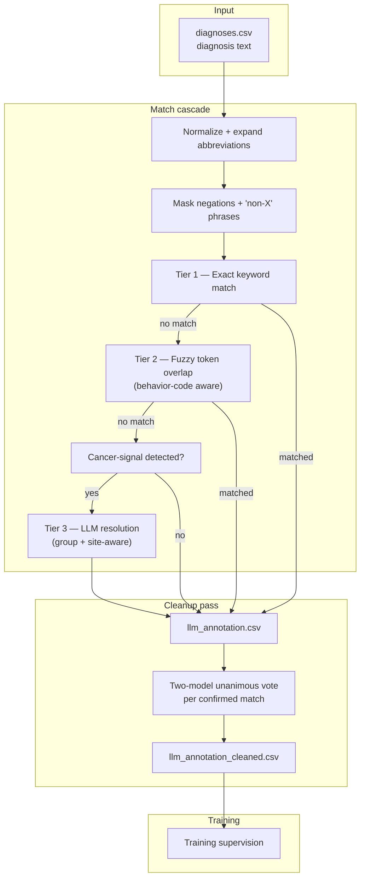

# Label Annotation — How It Works

This document describes the annotation pipeline that maps individual diagnosis-field
text to standardized Vet-ICD-O-canine-1 labels.

> **Role in the system:**
> - **Annotation pipeline** (this document) — annotation only: `diagnosis text → cancer label`
>   Lives in `ml/annotation/llm_pipeline/`. Produces `llm_annotation.csv`. Does not run in production.
> - **Production pipeline** (`production/petbert_pipeline/`) — production system: `report text → cancer label`
>   See [production-pipeline.md](production-pipeline.md).

---

## Why Annotation Is Needed

The production pipeline classifies full multi-section pathology reports. Training it
requires ground-truth cancer labels, but those labels don't exist in the raw database — only
free-text diagnosis strings do.

The annotation pipeline bridges that gap: it scans the short, structured `diagnosis` field
(e.g. `"Hemangiosarcoma, NOS"`, `"Mast cell tumor, grade II"`) that pathologists write directly
against the Vet-ICD-O taxonomy. Cases not matched are treated as non-cancer negative training
examples.

## Annotation Pipeline Flow

A three-tier matching cascade followed by a default ensemble verification pass.
Tiers 1 and 2 are rule-based and fast; Tier 3 calls a local LLM only when there
is a clear cancer signal in the text (~1% of rows). The verification pass then
re-checks every confirmed match with two diverse models and downgrades any
non-unanimous result to `Uncertain` (or replaces it with the agreed correction).



Entry points:
- `run_llm_scan()` in `ml/annotation/llm_pipeline/pipeline.py` — match cascade.
- `run_cleanup()` in `ml/annotation/llm_pipeline/cleanup.py` — verification pass.

Both are invoked by `run_annotation.py` (cleanup runs by default; pass
`--skip-cleanup` to stop after the cascade).

---

## Pre-pass: Normalization, abbreviation expansion, negation masking

### Normalization

Input text is lowercased, has hyphens / underscores / slashes collapsed to spaces, has
commas / parentheses / semicolons / colons stripped, and runs of whitespace collapsed.
Two synonyms are applied at this stage:

- `neoplasia` → `neoplasm`
- `plasma cell tumor` → `plasmacytoma`

### Abbreviation expansion

| Abbreviation / Synonym | Expansion |
|---|---|
| `GIST` | gastrointestinal stromal tumor |
| `HSA` | hemangiosarcoma |
| `OSA` | osteosarcoma |
| `HCC` | hepatocellular carcinoma |
| `SCC` | squamous cell carcinoma |
| `MCT` | mast cell tumor |
| `TVT` | transmissible venereal tumor |
| `DLBCL` | diffuse large b cell lymphoma |
| `PNET` | primitive neuroectodermal tumor |
| `CPNET` | central primitive neuroectodermal tumor |
| `metastasis` | metastatic neoplasm |
| `angiosarcoma` | hemangiosarcoma |
| `perivascular wall tumor` | canine perivascular wall tumor |

### Negation masking

Negation phrases plus the next ~6 tokens are replaced with whitespace before
Tier 1/2 see the text. This stops the keyword index from matching cancer terms
inside an exclusion span. Tier 3 (LLM) still sees the original text and applies
its own negation rules in the prompt.

Phrases recognised:
`no evidence of`, `no histopathologic evidence of`, `negative for`, `absence of`,
`without evidence of`, `not consistent with`, `cannot be confirmed`,
`rule(d|s)? out`, `no signs of`.

A separate pattern strips `non-X` / `non X` / `non X cell` compounds (e.g.
`non-B cell`, `non-T cell`, `non-neoplastic`) so that the surviving Tier 2 token
overlap doesn't false-match `B-cell lymphoma` against `non-B cell` text.

---

## Tier 1: Exact match

Reuses a longest-first keyword index built from the Vet-ICD-O taxonomy.
For each label, two candidates are added:

- **Full normalized term** — e.g. `"hemangiosarcoma nos"`
- **Core term** — qualifier words stripped (`nos`, `nec`, `malignant`, `benign`,
  `conventional`, `well differentiated`, `spindle cell`, `atypical`, etc.)

For 2–3 word candidates, all word permutations are also indexed (e.g.
`"mast cell tumor"` ↔ `"tumor mast cell"`). Each candidate compiles to
`re.compile(r"\b" + re.escape(kw) + r"s?\b")` (word boundary + optional plural).
Candidates shorter than 6 characters are skipped. Index is sorted longest-first
so more specific terms beat shorter substrings.

Returns method `Exact`, confidence `1.0`.

---

## Tier 2: Fuzzy match (behavior-code aware)

For each taxonomy label, compute the token overlap between the label's core term
and the diagnosis tokens. Match if ≥85% of core tokens appear in the diagnosis.
Best score wins. Single-token cores are skipped to avoid false positives.

**Behavior-code awareness.** If the diagnosis contains an explicit modifier —
`benign` / `malignant` / `metastatic` / `in situ` — Tier 2 first restricts to
candidates whose ICD-O behavior digit (`/0`, `/2`, `/3`) matches. If no
behavior-matching candidate clears the threshold, the scan falls back to the
unfiltered candidate set so well-formed terms like `"Mixed tumor, malignant"` still
match a diagnosis that lacks an explicit modifier.

This catches the systematic "Mixed mammary tumor, BENIGN → mapped to malignant"
class of error that the original tier-2 produced.

Returns method `Fuzzy`, confidence = overlap score (0.85–1.0).

---

## Tier 3: Signal fallback + LLM

Only triggered if the masked diagnosis still contains a cancer signal: an
`-oma`/`-emia` suffix word or one of `tumor`, `tumour`, `leukemia`, `neoplasm`,
`cancer`, `malignant`, `malignancy`, `metastatic`, `carcinoid`, `mycosis fungoides`,
`refractory anemia`, `acanthomatous`, `fibromatosis`, etc.

**Candidate selection.** A group token index scores each Vet-ICD-O group by the
count of distinct content tokens in the group's name that appear in the
diagnosis (longest group name is the tiebreak). The highest-scoring group wins.
This replaces the previous first-match approach, which collapsed T-cell / B-cell
lymphomas into the broader "Malignant lymphomas, NOS or diffuse" bucket because
that group's keywords sorted earlier. Up to 30 candidate terms from the chosen
group are passed to the LLM. If no group is identified, candidates come from
the `-oma`/`-emia` suffix index.

**Anatomic site enrichment.** The diagnosis is scanned for anatomic-site keywords
(`skin / haired skin / cutaneous / subcutis / dermis`, `gingiva / tongue / mucosal / lip`,
`lymph node / nodal`, `spleen / splenic`, `liver / hepatic`, `bone / osseous`,
`eye / ocular / cornea / retina / uveal / iris`, `nasal`, `kidney / renal`,
`lung / pulmonary`, `mammary / breast`, `intestinal / colon / rectum / cecum / jejunum / ileum / duodenum`,
`brain / cerebrum / cortex / spinal cord / meninges`, `oral`). The first match is
injected into the prompt to disambiguate site-specific subtypes — e.g.
`"Plasmacytoma, extramedullary (cutaneous)"` is reserved for skin sites; mucosal
or nodal plasmacytomas use the appropriate variant.

**Prompt template:**

```
You are a veterinary oncology classifier. Map the diagnosis below to the best
matching ICD term.

Diagnosis: "..."
Anatomic site context: <site>.    [optional, only if a site was detected]

Candidate ICD terms:
1. ...
2. ...

Rules:
- Reply with ONLY the exact text of the best matching candidate.
- If the diagnosis is negated (e.g. "no evidence of", "rule out", "negative for") → reply: no match
- If the diagnosis is uncertain (e.g. "suspect", "presumed", "versus", "likely") → reply: uncertain
- If no candidate fits → reply: no match
```

**Response parsing.** Exact candidate match → `LLM` (confidence 1.0); a difflib
near-match at ≥0.80 → `LLM` (confidence 0.9); `"no match"` → `No Match`;
`"uncertain"` → `Uncertain`.

---

## Pipeline limitations

- **Metastasis maps to primary or generic.** Diagnoses like
  `"LYMPH NODE: METASTASIS (SEE COMMENT)"` are mapped to `Neoplasm, metastatic`.
  The LLM occasionally uses this even when a primary type appears in text.
- **Hedged language sometimes leaks through.** Parenthetical hedges
  (e.g. `"(SUSPECT METASTASIS)"`) are occasionally matched rather than flagged
  as Uncertain.
- **Group identification can mis-scope candidates.** If the group token index
  picks the wrong group, the correct term won't be offered to the LLM.
- **Speed.** ~1–2 s per LLM call × ~1.7k Tier 3 rows = 30–60 minutes for a full
  188k-row run.

## Cleanup pass (ensemble verification)

Runs by default after the three-tier cascade. For every confirmed positive
(`Exact` / `Fuzzy` / `LLM`), the row is sent to two diverse local LM-Studio
models. Each model returns one of: `CORRECT`, `WRONG_should_be:<term>`,
`WRONG_no_cancer`, `UNCERTAIN`. Resolution rules:

| Both models say | Action |
|---|---|
| `CORRECT` | keep the original match |
| `WRONG_no_cancer` | demote row to `No Match` |
| `WRONG_should_be:<X>` (same X) | replace match with X |
| anything else (disagreement) | optional 3rd-model tiebreaker, otherwise demote to `Uncertain` |

Default verifier pair (validated 2026-05-09 on a 26-row Tier-3 sample):
`google/gemma-4-31b` and `qwen/qwen3.6-27b`. Both are calibrated (low
fabrication rate) and architecturally diverse, so unanimous votes carry signal.
Override with `--cleanup-models a,b` and optionally
`--cleanup-tiebreaker c`.

Outputs: `llm_annotation_cleaned.csv` (full row set with cleaned values),
`cleanup_diff.csv` (only changed rows, with before/after columns), and
`cleanup_summary.json`.

Re-run cleanup independently — without redoing the cascade — via
`python ml/annotation/llm_pipeline/run_annotation_cleanup.py`.

---

## Input format

Input file: `ml/data/diagnoses.csv`.

| Column | Role |
|--------|------|
| `case_id` | Links diagnosis rows back to the original report |
| `diagnosis_number` | Ordering within the report (optional, passed through) |
| `diagnosis` | The free-text diagnosis string — the field that is matched |

---

## Configuration

LM-Studio / Ollama-compatible HTTP server. Connection settings live in
`ml/annotation/llm_pipeline/.env`:

```ini
LLM_HOST=127.0.0.1
API_PORT=1234
LLM_MODEL=google/gemma-4-e4b    # current default — fast and conservative
```

For Tier-3 annotation, `gemma-4-e4b` was selected as the production default
after a 6-model bake-off (2026-05-09) showed it had the best calibration among
fast models. `medgemma-27b` and `meta/llama-3.3-70b` had higher raw match
rates but routinely fabricated subtypes ("LEUKEMIA" → "Lymphoblastic leukemia,
NOS"; "MEIBOMIAN EPITHELIOMA" ↔ "INFUNDIBULAR KERATINIZING EPITHELIOMA"
flipped between two distinct entities) and are not recommended.

For the verification cleanup pass, `google/gemma-4-31b` and `qwen/qwen3.6-27b`
are the recommended verifier pair — see
`ml/annotation/llm_pipeline/run_annotation_cleanup.py`.

The `--model` CLI flag overrides `LLM_MODEL` at runtime.

---

## CLI options

| Option | Default | Description |
|--------|---------|-------------|
| `--csv` | `ml/data/diagnoses.csv` | Input diagnoses CSV path |
| `--id-col` | `case_id` | Case ID column name |
| `--diag-num-col` | `diagnosis_number` | Diagnosis number column name (optional) |
| `--text-col` | `diagnosis` | Column containing the diagnosis text |
| `--labels-csv` | `ml/ICD_labels/labels.csv` | Path to Vet-ICD-O taxonomy CSV |
| `--out-dir` | `ml/output/annotation/llm` | Output directory |
| `--max-rows` | all | Cap on input rows (for testing) |
| `--llm-timeout` | 60 | Seconds to wait per Tier-3 LLM call |
| `--model` | `.env` value | Tier-3 model name (overrides `.env`) |
| `--skip-cleanup` | off | Stop after the cascade; do not run the cleanup pass |
| `--cleanup-models` | `google/gemma-4-31b,qwen/qwen3.6-27b` | Comma-separated verifier pair |
| `--cleanup-tiebreaker` | none | Optional third model used on disagreement |
| `--cleanup-timeout` | 60 | Seconds to wait per cleanup LLM call |
| `--list-models` | — | Print available models on the configured server and exit |
| `--compare-models` | — | Run all available models on `--max-rows` rows and print a comparison |

---

## Example commands

**Standard full run** (cascade + cleanup):
```bash
ml/.venv/Scripts/python.exe ml/scripts/run_annotation.py
```

**Skip the cleanup pass** (cascade only — useful for quick iterations):
```bash
ml/.venv/Scripts/python.exe ml/scripts/run_annotation.py --skip-cleanup
```

**Quick test on first 100 rows:**
```bash
ml/.venv/Scripts/python.exe ml/scripts/run_annotation.py --max-rows 100
```

**Use a specific Tier-3 model:**
```bash
ml/.venv/Scripts/python.exe ml/scripts/run_annotation.py --model qwen/qwen3.6-27b
```

**Override the cleanup verifier pair / add a tiebreaker:**
```bash
ml/.venv/Scripts/python.exe ml/scripts/run_annotation.py \
  --cleanup-models google/gemma-4-31b,qwen/qwen3.6-27b \
  --cleanup-tiebreaker nvidia/nemotron-3-nano-omni
```

**Re-run cleanup only** (uses the existing `llm_annotation.csv`):
```bash
ml/.venv/Scripts/python.exe ml/annotation/llm_pipeline/run_annotation_cleanup.py
```

**List available models on the configured server:**
```bash
ml/.venv/Scripts/python.exe ml/scripts/run_annotation.py --list-models
```

---

## Output files

**`llm_annotation.csv`** — one row per input diagnosis row:

| Column | Description |
|--------|-------------|
| `case_id` | Case identifier |
| `diagnosis_number` | Diagnosis ordering within the report (if present) |
| `diagnosis` | Original diagnosis text |
| `matched_term` | Taxonomy term matched (empty if No Match or Uncertain) |
| `matched_group` | Taxonomy group for the matched term |
| `matched_code` | Vet-ICD-O-canine-1 morphology code |
| `matched_keyword` | The keyword/token string that triggered the match |
| `method` | `Exact`, `Fuzzy`, `LLM`, `Uncertain`, or `No Match` |
| `confidence` | 1.0 (Exact/LLM), 0.85–1.0 (Fuzzy), 0.0 (No Match/Uncertain) |

**`llm_summary.json`** — aggregate statistics: row totals, method counts, per-tier
call statistics, case-level coverage, taxonomy coverage, term/group distributions,
and imbalance counts. See the field list in `_write_summary_md()` and
`run_llm_scan()` in `pipeline.py`.

**`llm_summary.md`** — human-readable version of `llm_summary.json` with tables
for overview, cases, method breakdown, tier statistics, taxonomy coverage,
imbalance, full group distribution, and top 20 terms.

---

## Code location

| File | Role |
|------|------|
| `ml/annotation/llm_pipeline/pipeline.py` | Tiers 1–3, normalization + negation masking, prompt builder, summary writer, `run_llm_scan` |
| `ml/annotation/llm_pipeline/cleanup.py` | Ensemble verification pass: `run_cleanup`, vote resolution, diff/summary writer |
| `ml/annotation/llm_pipeline/client.py` | HTTP client: `chat()`, `list_models()` |
| `ml/annotation/llm_pipeline/cli.py` | CLI argument parsing; orchestrates cascade + cleanup |
| `ml/annotation/llm_pipeline/.env` | Connection settings (`LLM_HOST`, `API_PORT`, `LLM_MODEL`) |
| `ml/ICD_labels/taxonomy.py` | Vet-ICD-O taxonomy CSV parser |
| `ml/ICD_labels/labels.csv` | Vet-ICD-O-canine-1 taxonomy (~857 terms across 44 groups) |

### Outputs

| File | Role |
|------|------|
| `ml/output/annotation/llm/llm_annotation.csv` | Per-row match results from the three-tier cascade |
| `ml/output/annotation/llm/llm_summary.json` | Aggregate cascade statistics |
| `ml/output/annotation/llm/llm_summary.md` | Human-readable cascade summary |
| `ml/output/annotation/llm/llm_annotation_cleaned.csv` | Per-row results after the verification pass (downstream training input) |
| `ml/output/annotation/llm/cleanup_diff.csv` | Only rows the cleanup changed, with before/after columns |
| `ml/output/annotation/llm/cleanup_summary.json` | Aggregate cleanup statistics (kept, term_changed, set_no_match, flagged_uncertain, parse_errors) |
