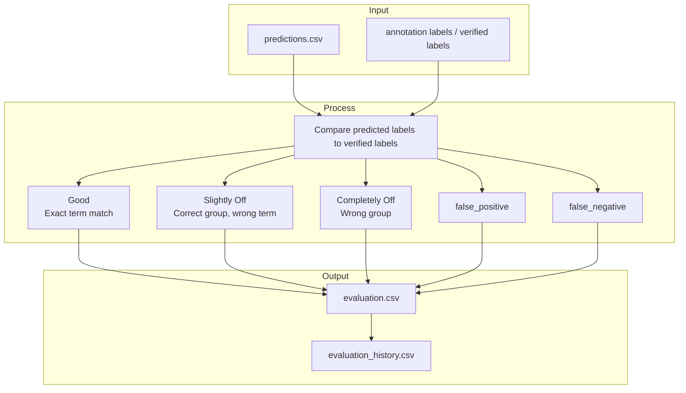

# Model Training — Approaches and Architecture

The goal is to map veterinary pathology report text to standardized Vet-ICD-O-canine-1
cancer labels (term, group, ICD code). Several classifier approaches have been explored.

| Approach | Status | Best result |
|---|---|---|
| Binary PresenceClassifier (single all-label) | Removed in Phase 28 | 65.7% G+S train (Phase 25 c14, contrastive backbone, 5,788 cases) |
| GroupClassifier (2304-dim concat-3) | **Stage 2 of 4-stage pipeline** | **macro F1=0.5712** (concat-3 + per-section contrastive backbone, dropout=0.1, epoch 258/300) |
| Per-group LabelPresenceClassifier (`n_cols=3, col_pair_mode=True, col_combine="learned"`) | **Stage 3a of 4-stage pipeline (concat-3, 25 LPs)** | Mean val score ~0.88 across groups; G+S 62.1% as part of full pipeline |
| Concat-3 + per-section contrastive PetBERT + 4-stage pipeline | **Production best (2026-05-13)** | **G+S 62.1% on unbiased eval-half** (G 46.1 / S 16.0 / CO 14.7 / FP 2.3 / FN 20.8, n=4,414); 62.3% on full test (n=8,835) |
| Prior TF-IDF 4-stage baseline | Preserved at `../ml-tfidf/` | G+S 56.6% on eval-half — superseded 2026-05-13 (+5.5 pp G+S, +8.8 pp Good) |

> For full current results and Phase 25 details see [classifiers.md](classifiers.md).

---

## Background: Ground Truth and Evaluation

### Ground Truth Generation

No labelled cancer dataset exists — only free-text diagnosis strings written by
pathologists. A separate keyword pipeline scans these diagnosis strings against the
Vet-ICD-O taxonomy to produce ground-truth labels. Cases with no keyword match are
treated as non-cancer (Uncategorized).

In production, only the full pathology report text is available (not the structured
diagnosis field). All three classifier approaches must therefore predict from report
text alone, using the keyword-matched labels only for training supervision.

### Evaluation Verdicts

Predictions are scored against keyword ground truth per case:

| Verdict | Meaning |
|---------|---------|
| `good` | Predicted term exactly matches a keyword-matched term |
| `slightly_off` | No exact term match, but predicted group matches a keyword group |
| `completely_off` | Neither term nor group matches any keyword label for this case |
| `false_positive` | Case has no keyword labels but a cancer label was predicted |
| `false_negative` | Confirmed cancer case with no good/slightly_off prediction |

**Good+Slight** is the primary performance metric. The CO rate (completely off) is the
key failure mode — the classifier is confidently predicting the wrong cancer group.

### Evaluation Pipeline Flow

Standard evaluation compares model predictions against verified annotation labels and
assigns each case to an outcome bucket before logging cycle history.



---

## Approach 1 — Binary PresenceClassifier

### Architecture

Each report section (Histopathological Summary, Final Comment, Ancillary Tests) is
embedded independently through PetBERT, producing a 768-dim vector per column. The
MLP then scores every (report, label) pair independently by concatenating the three
column embeddings with the label embedding:

```
report text
    ↓
PetBERT (frozen)
    ↓
per-column embeddings (3 × 768)
    ↓
for each of ~857 taxonomy labels:
    concat(col1_emb ‖ col2_emb ‖ col3_emb ‖ label_emb)
    ↓
    binary MLP → present/absent score
    ↓
argmax across all label scores → predicted label
```

Labels compete implicitly — the one with the highest present/absent score wins.

### Training Strategy

Training is **iterative**. Each cycle:

1. Run the pipeline with the current checkpoint → predictions
2. Evaluate predictions → identify completely-off (CO) and false-positive (FP) cases
3. Accumulate CO predictions into a rolling bank
4. Retrain using positives + CO negatives + FP negatives from the bank
5. Repeat

The rolling CO bank is the key mechanism. It ensures the classifier trains on the
specific wrong-group pairs that fool cosine similarity, compounding across cycles.

| Training data source | Description |
|---|---|
| Positives | Keyword-confirmed (report, term) pairs |
| CO negatives | Completely-off predictions from the rolling CO bank |
| FP negatives | Labels sampled for false-positive cases |
| Easy negatives | Random wrong labels for confirmed cancer cases |

### Advantages

- Works at low data volumes — competitive from ~1,273 confirmed cases upward
- Iterative CO feedback produces steady improvement across cycles
- Fast training — MLP trains on cached PetBERT embeddings, no re-embedding needed

### Disadvantages

- **Hard CO floor (~30%)**: labels compete implicitly via argmax. A wrong-group
  prediction cannot be redirected — only the individual pair can be rejected.
- Pairwise scoring over all ~857 labels is slow at inference
- Label enrichment attempts caused regressions and are off by default

---

## Approach 2 — GroupClassifier

### Motivation

The binary classifier's CO floor arises because labels compete implicitly through
argmax after independent pairwise scoring. There is no mechanism to say "wrong group
entirely" — the classifier can only lower the score of a specific pair.

The GroupClassifier addresses this directly: predict the cancer *group* first (explicit
group competition in the loss), then select the specific *term* within that group.

### Architecture

```
report text
    ↓
PetBERT (frozen)
    ↓
mean embedding (768-dim, averaged across all columns)
    ↓
GroupClassifier MLP → sigmoid score per group (45 outputs)
    ↓
threshold → predicted group(s)
    ↓
for each predicted group:
    cosine similarity against terms within that group only
    ↓
    best term + ICD code
```

The MLP produces one sigmoid probability per group simultaneously. Sigmoid (not
softmax) because a report can belong to multiple groups. Loss is binary cross-entropy
per class with inverse-frequency class weights.

```
GroupClassifier MLP:
    Linear(768 → 256) → ReLU → Dropout(0.3) → Linear(256 → 45) → Sigmoid
```

Training is **one-shot**: build multi-hot targets from keyword-matched cases, train
on cached embeddings, evaluate. Re-run whenever keyword coverage improves.

| Training data | Cases | Label |
|---|---|---|
| Cancer (keyword-matched) | ~5,788 (44 groups) | Multi-hot over matched groups |
| Non-cancer | ~6,832 | Uncategorized (all zeros) |

### Evaluation Results

Early results (768-dim mean embedding, incorrect pipeline input — archived for reference):

| Data | Metric | Binary | GroupClassifier @ 0.3 | GroupClassifier @ 0.8 |
|---|---|---|---|---|
| 1,273 cases | Good+Slight | 20.4% | 14.3% | 23.4% |
| 5,788 cases | Good+Slight | 33.1% | 13.9% | 21.9% |

End-to-end results after fixing the pipeline to use 2304-dim `col_emb_concat`:

| Metric | Binary (Phase 16) | GroupClassifier (best, t=0.3) |
|---|---|---|
| **Good+Slight** | **41.9%** | 9.3% |
| CO% | 29.6% | ~37% |
| FP% | 27.2% | 33.3% |
| FN% | 1.2% | 16.8% |

The results above are from Phase 16 (keyword annotation, 5,788 cases). GroupClassifier
became competitive in Phase 23 with ~21,853 LLM-annotated train cases:

| Phase | Train cases | GroupClassifier G+S @ t=0.90 | Notes |
|-------|-------------|------------------------------|-------|
| Phase 16 | 5,788 (keyword) | 9.3% | Severely overfits |
| Phase 23 | 21,853 (LLM, 46,652 total) | **50.1%** | Beats binary (+2.9pp), FP −15.3pp |

See [classifiers.md](classifiers.md) for Phase 23+ full results and the three-stage pipeline (Phase 25).

### Advantages

- Wrong-group assignments are directly penalised in the loss — designed to eliminate
  the CO floor once sufficient data is available
- Faster inference: cosine over ~20 terms per group instead of all ~857 labels
- Simple re-training: one-shot, seconds on cached embeddings

### Disadvantages

- Overfits at current data volume (5,788 cases across 44 groups)
- Uses mean embedding — per-column signal is averaged away
- A mis-predicted group guarantees a wrong term (no recovery path within-group)

### Potential Improvement: Discriminating-Keyword Term Selection

Instead of cosine similarity within the predicted group, the group's own taxonomy
labels can be used to auto-derive discriminating keywords, which are then scanned
for in the report text to pick the specific term.

**Example — "Neoplasms, NOS" group:**

| Term | Discriminating words |
|---|---|
| Neoplasm, benign | `benign` |
| Neoplasm, malignant | `malignant` |
| Neoplasm, NOS | *(fallback)* |

Report says "...consistent with a **malignant** neoplasm..." → "Neoplasm, malignant"

**Example — "Mast cell neoplasms" group:**

| Term | Discriminating words |
|---|---|
| Mast cell tumor, grade I | `grade i`, `grade 1` |
| Mast cell tumor, grade II | `grade ii`, `grade 2` |
| Mast cell tumor, grade III | `grade iii`, `grade 3` |
| Mast cell leukemia | `leukemia` |
| Mast cell tumor, NOS | *(fallback)* |

**Proposed inference flow:**
```
group_classifier → predicted group
        ↓
discriminating keyword scan on report text
        ↓ (match)                    ↓ (no match)
specific term             cosine similarity within group (fallback)
```

Discriminating words are words that appear in *some but not all* terms within a group
— auto-derivable from the taxonomy CSV without manual curation. They are short
qualifiers (`benign`, `grade ii`) rather than full tumor names, making them less prone
to false matches. This idea applies equally to Approach 3, which shares the same
within-group term selection step.

---

## Approach 3 — Contrastive Fine-tuning (InfoNCE)

### Motivation

The binary classifier's ~30% CO floor comes from labels competing implicitly via
arg max over an embedding space that was never optimized for this task. PetBERT was
pre-trained with masked-language-modeling — its weights have no signal pulling report
embeddings toward their correct label embeddings and away from wrong ones.

Contrastive fine-tuning directly optimizes this geometry. For each (report, label)
positive pair, the report embedding is pulled toward the correct label embedding and
pushed away from all other labels in the batch. The fine-tuned backbone then produces
better per-column embeddings, which the PresenceClassifier (retrained from scratch
after a cold start) uses as input.

Unlike end-to-end group classification (attempted and reverted in 2026-05; see `training-log/training-log-finetune.md` Approach B), this does not require group-level generalization and works at current data volumes.

### Architecture

```
Fine-tuning:
    for each batch of N (report_text, label_text) pairs:
        report_emb = PetBERT.base_model(report_text) → mean pool → 768-dim → L2-norm
        label_emb  = PetBERT.base_model(label_text)  → mean pool → 768-dim → L2-norm
        sim_matrix = report_emb @ label_emb.T / temperature    # (N, N)
        loss = symmetric cross-entropy (diagonal = positives)   # InfoNCE
        backprop through PetBERT base transformer only

    save full AutoModelForMaskedLM checkpoint

Inference (after cold start + PresenceClassifier retraining):
    identical to current pipeline — pass --model <checkpoint> --local-only
```

Training data: confirmed `(case_id, matched_term, matched_group)` pairs from
`llm_annotation.csv` joined with report text from `report.csv`.

Label text format: `"{term} {group}"` — exactly what the pipeline uses for label embeddings.

### Results (Phase 17, 2026-03-23)

Fine-tuning config: 3 epochs, batch=32, lr=2e-5, temperature=0.07, 7,398 pairs.
InfoNCE loss: 1.90 → 1.36 → 1.22 (converged normally).

| Metric | Phase 16 (frozen PetBERT) | Phase 17 (contrastive) | Δ |
|--------|--------------------------|------------------------|---|
| **Good+Slight** | 41.9% | **69.0%** | **+27.1pp** |
| CO% | 29.6% | **6.9%** | **−22.7pp** |
| FP% | 27.2% | 23.7% | −3.5pp |
| FN% | 1.2% | 0.3% | −0.9pp |

The CO floor — the core failure mode for the frozen-backbone approach — was shattered.
Contrastive training directly fixed the wrong-group problem: labels that had nearly
identical cosine similarity under the frozen backbone became separable after fine-tuning.

PresenceClassifier cycle trajectory (cold start, hd=512, co=5):

| Cycle | Good+Slight | CO% | Notes |
|-------|-------------|-----|-------|
| c1 | 49.6% | 22.3 | Already above Phase 16 best |
| c2 | 54.5% | 22.1 | |
| c3 | 64.5% | 8.8 | Large jump — CO bank kicking in |
| c4 | 68.0% | 7.9 | |
| c8 | **69.0%** | **6.9** | **Best checkpoint** — plateau confirmed |
| c10 | 68.8% | 7.0 | Plateau oscillation — stopped here |

Best checkpoint: `ml/output/checkpoints/binary/presence_classifier_best.pt`
Backbone: `ml/output/checkpoints/contrastive/`

### Advantages

- Works at current data volumes (~7,398 pairs) — no group-level generalization needed
- Directly optimizes the embedding geometry the PresenceClassifier operates on
- No new inference code — fine-tuned checkpoint is a drop-in replacement for `SAVSNET/PetBERT`
- MLM head weights are unchanged (never called during contrastive forward pass)
- **Proven**: reduced CO floor from ~30% to ~7% in Phase 17

### Disadvantages

- Requires a full cold start after fine-tuning (embedding space changes)
- False negatives in-batch: if the same label appears twice in a batch, the off-diagonal
  entry is wrongly treated as a negative (~4% collision rate at batch_size=32 — acceptable)
- FP floor (~24%) remains — driven by non-cancer cases with similar vocabulary to cancer reports

### How to Run

```bash
# Step 1: Adapt the embedding backbone
ml/.venv/Scripts/python.exe ml/scripts/run_training.py \
  --mode adapt-backbone \
  --epochs 3 --batch-size 32 --lr 2e-5 --temperature 0.07 \
  --device xpu --local-only

# Step 2: Cold start
rm -f ml/output/training/embedding_cache.npz

# Step 3: Retrain downstream classifiers in order — pass --model and --local-only
ml/.venv/Scripts/python.exe ml/scripts/run_training.py --mode train-case-presence ...
ml/.venv/Scripts/python.exe ml/scripts/run_training.py --mode train-groups        ...
ml/.venv/Scripts/python.exe ml/scripts/run_training.py --mode train-label-presence ...
```

---

## End-to-end fine-tuning (attempted, reverted 2026-05)

End-to-end fine-tuning of PetBERT as a Stage 2 classifier was integrated and benchmarked in 2026-05. Standalone val macro F1 reached 0.5774 (vs Phase 27 GroupCLF's 0.4475), but end-to-end test G+S landed at 56.4% — a 1.5pp loss vs Phase 28's 57.9% (the contemporary baseline at that comparison; the **current** baseline is G+S 62.1% on eval-half under concat-3 + per-section contrastive + 4-stage with per-LP thresholds + tail-gate). Reverted. See `training-log/training-log-finetune.md` Approach B for the full Phase A/B/sweep/8-epoch findings, the cost analysis, and the resurrection path.

---

## Comparison

| | Binary PresenceClassifier | GroupClassifier (alone) | Contrastive + 4-stage (concat-3) |
|---|---|---|---|
| **Status** | Removed Phase 28 | Stage 2 of 4-stage | **Production best (2026-05-13)** |
| **Best result** | 41.9% G+S (Phase 16) | **macro F1=0.5712 (epoch 258, concat-3 + per-section contrastive)** | **G+S 62.1% on eval-half** (Good 46.1, Slight 16.0, CO 14.7, FP 2.3, FN 20.8, n=4,414) |
| **PetBERT** | Frozen | Per-section contrastive fine-tuned | Per-section contrastive fine-tuned |
| **Training style** | Iterative (CO feedback) | One-shot | Four one-shot stages + per-LP threshold sweep |
| **Data requirement** | Works from ~1,273 cases | Competitive at ~21,853 LLM cases | 46,652 train cases |
| **Training speed** | Fast (MLP on cached embeddings) | Fast (MLP on cached embeddings) | Slow once (backbone) + fast (four downstream heads) |
| **Inference speed** | Slow (~857 pair scores/report) | Fast (25 group scores + cosine) | Fast (gate + 25 group scores + within-group LP) |
| **CO floor** | ~30% | ~25.5% @ t=0.90 (legacy) | **14.7% (concat-3, 4-stage)** |
| **Main constraint** | Removed | FN trade-off at high threshold | FN at gate-t=0.85 (20.8%); LLM annotation ceiling |

### Roadmap

- **Now**: 4-stage pipeline (concat-3 + per-section contrastive backbone, 25 LPs with per-LP calibrated thresholds, Stage-2 tail-gate) — see `ideas-accepted.md` for the per-improvement breakdown. **Current baseline: G+S 62.1% on eval-half** (Good 46.1 / Slight 16.0 / CO 14.7 / FP 2.3 / FN 20.8; verified 2026-05-13 in `pipeline_eval_half/evaluation_history.csv`). The legacy TF-IDF stack (G+S 56.6%) is preserved at `ml-tfidf/`. See [classifiers.md](classifiers.md) for full details.
- **Next**: Tier 1 quick wins (QW4 Adenomas keywords, QW5 soft-tissue threshold; QW1 fallback at fraction=0.5) in `training-ideas/ideas-to-try.md`. Backbone Round 2 (hard-neg) is LB2 in Tier 3 — current backbone has no hard-neg pass, so this is genuinely untried in the concat-3 embedding space.

---

## Explored Ideas

### Hybrid Binary + KNN Group Selector (2026-03-23) — Abandoned

**Motivation:** The binary classifier's ~30% CO floor comes from labels competing implicitly
via argmax — a wrong-group prediction cannot be redirected. The idea was to use a KNN group
selector to constrain which groups the binary classifier's scores can be chosen from.

**Architecture:**
```
Per-column embeddings (2304-dim)
          │
          ├──► Binary Classifier ──► (N, M) presence score matrix
          │                           (845 labels scored per case)
          │
          └──► KNN Group Selector ──► (N, G) group vote fractions
                                       (top-K confirmed neighbours vote)
                           │
                           ▼
              For each case, restrict label candidates
              to groups with vote fraction ≥ threshold
                           │
                           ▼
              Pick highest binary score within those groups
```

**Evaluation results** (LLM ground truth, baseline binary-only = 37.8% Good+Slight):

| Run | Config | Good+Slight | CO% | FP% | FN% |
|---|---|---|---|---|---|
| Baseline | Binary only | **37.8%** | 30.1% | 30.3% | 1.8% |
| KNN only | threshold=0.1 | 5.6% | — | — | 25.8% |
| Hybrid | threshold=0.1 | 5.6% | 37.6% | 53.0% | 3.8% |
| Hybrid | threshold=0.2 | 7.5% | 31.9% | 47.7% | 13.0% |
| Hybrid | threshold=0.3 | ~6.1% | ~28% | ~39% | 26.6% |

**Root causes of failure:**
1. "Slightly off" collapses when KNN excludes the correct group.
2. KNN FP floor (53% at threshold=0.1) is not reduced by the binary gate — non-cancer cases still find cancer neighbours in embedding space.
3. KNN sparsity (~150 confirmed cases/group) misses correct groups → FN spikes.

**Conclusion:** Approach abandoned. Revisit when the database grows past ~15,000 confirmed cases.
Code is preserved: `run_categorization_hybrid()` in `categorization.py`, wired in `pipeline.py`.
Full root-cause analysis in [training-log/training-log-binary.md](training-log/training-log-binary.md).
