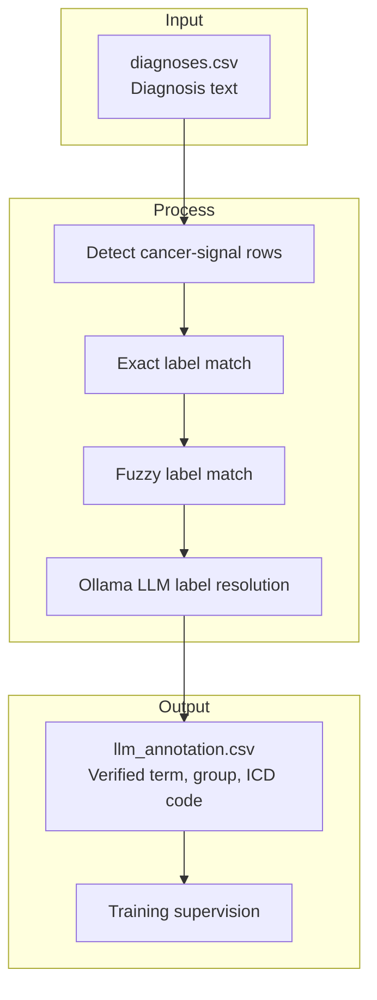
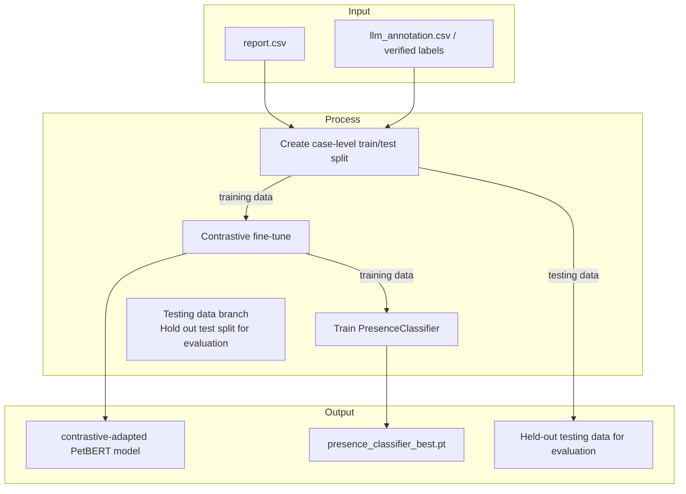
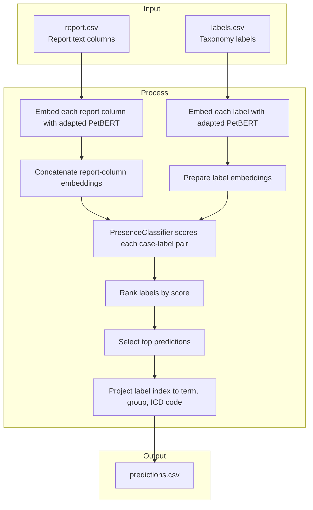
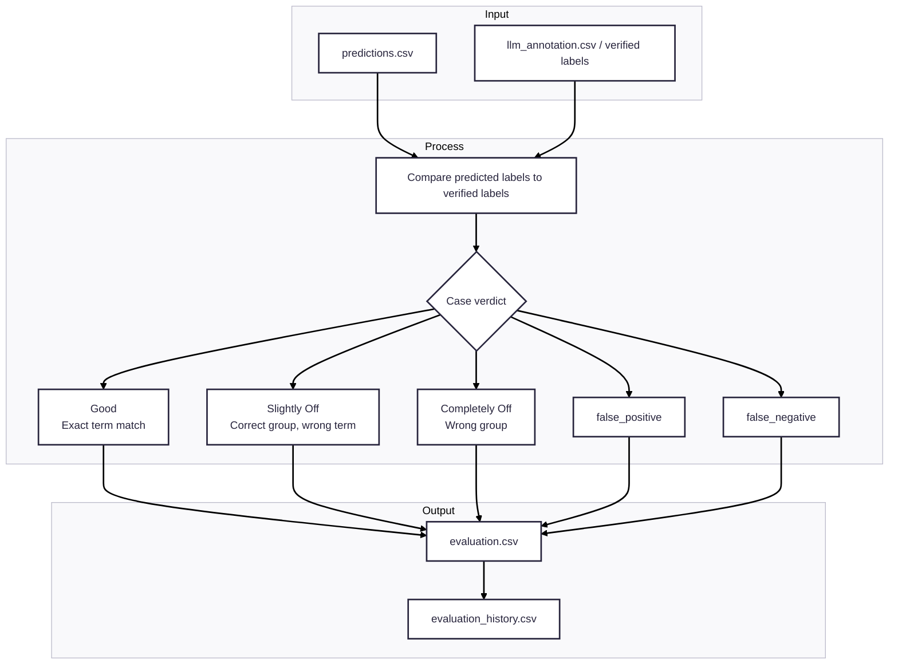

# Pipeline Flowcharts

These diagrams show the strongest documented path only:
- LLM annotation
- Contrastive backbone adaptation
- PresenceClassifier-based production scoring
- Standard evaluation against verified labels

This keeps the focus on architecture rather than implementation details like caching,
fallback modes, or experimental branches.

---

## 1. Annotation Pipeline

Best documented supervision path: `LLM annotation`.

---

## 2. Training Pipeline

Best documented training path: `Contrastive PetBERT adaptation -> PresenceClassifier training`.

---

## 3. Production Pipeline

Best documented inference path: `Contrastive-adapted PetBERT + PresenceClassifier`.

---

## 4. Evaluation Pipeline

Standard evaluation path used to measure model quality.

