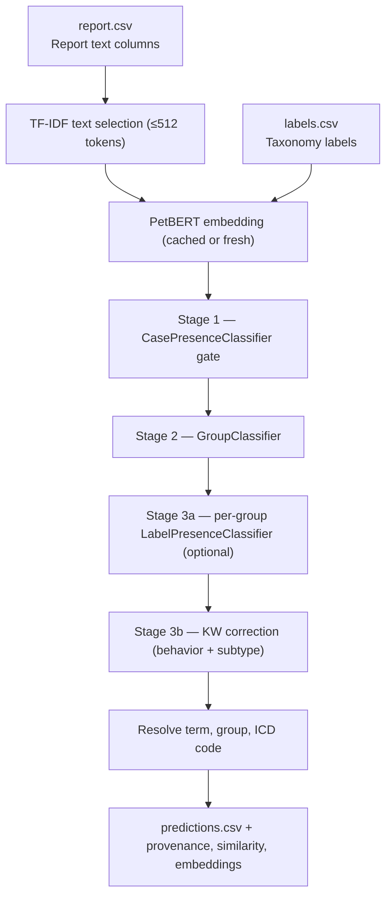

 # Production Pipeline

Implementation-based description of what `ml/scripts/run_production.py` does today.

This is the authoritative source for current production inference behavior. Older
architectural experiments are preserved in the training logs and idea docs, not here.

The production path is a four-stage sequential pipeline where each stage has
one distinct responsibility:

```text
report.csv
  -> PetBERT embedding (cached or fresh)
  -> CasePresenceClassifier gate   — filters non-cancer cases               (reduces FP)
  -> GroupClassifier               — assigns cancer to ICD group(s)          (reduces CO)
  -> LabelPresenceClassifier       — picks specific label(s) within group    (learned, optional)
  -> KW correction                 — behavior + subtype keyword post-filter  (converts Slight → Good)
  -> (term, group, code) predictions + debug artifacts
```

Stage 3 (LabelPresenceClassifier) is optional: when `--label-presence-classifier-dir` is
not set, the pipeline falls back directly to KW correction within each active group. Stages 1
and 2 are unchanged regardless.

Each stage lives in its own module under `ml/production/petbert_pipeline/stages/`:

| Stage | Module | Entry function |
|---|---|---|
| 1 — CasePresence gate | `stages/case_presence_classifier.py` | `run_case_presence_classifier()` |
| 2 — GroupClassifier | `stages/group_classifier.py` | `run_group_classifier()` |
| 3a — LabelPresence (optional) | `stages/label_presence_classifier.py` | `load_label_presence_models()`, `score_within_group()` |
| 3b — KW correction | `stages/keyword_correction.py` | `apply_keyword_correction()` |

`pipeline.py::run_scan()` is the thin orchestrator: load → text-select → embed → call each
stage in order → write outputs. The Stage 3 per-case dispatcher is `stages/__init__.py::categorize_per_case()`.

## Flow Chart



## Entry Point And Defaults

`ml/scripts/run_production.py` is the production launcher. It pre-wires the 4-stage
pipeline before calling `run_scan`:

| Default | Source |
|---|---|
| `--model` | `ml/output/checkpoints/contrastive/` (adapted PetBERT backbone) |
| `--embedding-cache` | `ml/output/training/embedding_cache.npz` |
| `--case-presence-classifier` | `config.CASE_PRESENCE_CLASSIFIER_PT` (Stage 1 gate) |
| `--group-classifier` | `ml/output/checkpoints/group/group_classifier_best.pt` (Stage 2) |
| `--label-presence-classifier-dir` | `ml/output/checkpoints/label_presence/` (Stage 3a, optional) |
| `--out-dir` | `ml/output/production/contrastive/` |
| `--text-cols` | empty (TF-IDF text selection — production default) |
| `--local-only` | True |

These defaults can be overridden via CLI flags. To disable Stage 3a, pass
`--label-presence-classifier-dir ""`. To disable Stage 1 (gate), pass
`--case-presence-classifier ""`.

## Input Format

The pipeline reads `ml/data/report.csv` with one row per case.

Important columns:

| Column | Role |
|---|---|
| `case_id` | Unique case identifier |
| `HISTOPATHOLOGICAL SUMMARY` | Microscopic pathology findings — primary diagnostic source |
| `FINAL COMMENT` | Pathologist's diagnostic conclusion |
| `COMMENT` | Pathologist notes |
| `ANCILLARY TESTS` | IHC, stains, PCR, and related tests (not used in TF-IDF path) |
| `GROSS DESCRIPTION` | Macroscopic specimen description (excluded — adds noise, not signal) |
| `CLINICAL ABSTRACT` | Referring clinician history (excluded — adds noise, not signal) |

Production uses TF-IDF-based text selection: it concatenates HISTOPATHOLOGICAL SUMMARY +
FINAL COMMENT + COMMENT with section markers, then compresses to a 512-token budget if
needed using TF-IDF sentence scoring. This replaces the old fallback-chain approach (single
column) as the default input path. See `text_selection/text_selector.py`.

## Step-by-Step Runtime Flow

The main implementation lives in `ml/production/petbert_pipeline/pipeline.py`.

### 1. Load and clean report data

The pipeline reads `ml/data/report.csv` using `latin-1`, strips BOM artifacts from
column names, and normalizes missing values to empty strings.

### 1b. TF-IDF text selection (default production path)

When `--text-cols` is empty (the production default), `TextSelector` walks
`SOURCE_COLS` in order — `HISTOPATHOLOGICAL SUMMARY`, `ANCILLARY TESTS`, `COMMENT`,
`FINAL COMMENT`, `ADDENDUM`, `GROSS DESCRIPTION`, `CLINICAL ABSTRACT` — and packs each
column whole into the 512-token (≈2048-char) budget if it fits. When a column overflows
the remaining budget, that column's sentences are scored by **its own** TF-IDF
vectorizer (one vectorizer per column, fitted on the corresponding column corpus) and
the highest-scoring sentences that fit are selected. The order of selected sentences
within a column is preserved in the output.

Per-column vectorizers must exist at `ml/output/training/tfidf_selector.joblib` before
the first run. Build them with `fit_text_selector.py` (writes a single dict mapping
column name → fitted `TfidfVectorizer`).

### 2. Reuse embedding cache when possible

If `ml/output/training/embedding_cache.npz` is valid for the current:

- report CSV
- labels CSV
- model name
- selected text columns

then the pipeline skips re-embedding and reuses:

- per-column report embeddings
- per-column content masks
- mean case embeddings
- token counts
- label embeddings

This is what keeps repeated production and training-cycle runs fast.

### 3. Otherwise embed each report column separately

On a cache miss, the pipeline loads PetBERT and embeds each selected report column
independently.

Important details:

- Each column gets its own token budget.
- Mean pooling over non-padding tokens produces one 768-d embedding per column.
- Empty cells are tracked separately with boolean masks.

### 4. Build a mean report embedding for analysis outputs

After per-column embedding, the pipeline averages the non-empty column embeddings into a
single 768-d mean embedding per case.

That mean embedding is used for:

- PCA visualization
- nearest-neighbor outputs
- the saved embeddings NPZ
- some non-default group-based paths

It is not the main tensor used by the default production classifier.

### 5. Embed every ICD label with the same base model

The taxonomy is loaded from `ml/ICD_labels/labels.csv`.

Each label is converted to display text and embedded through the same PetBERT base model,
producing a label embedding matrix aligned with the report embedding space.

### 6. Concatenate report columns for Stage 2 input

For Stage 2 inference, the pipeline concatenates the per-column report embeddings into
one wide vector per case, zeroing out empty columns first. This `col_emb_concat` tensor
is what the `GroupClassifier` consumes; the per-case mean embedding feeds Stage 1 and
Stage 3a.

## Output Files

The production pipeline writes:

| File | Purpose |
|---|---|
| `petbert_predictions.csv` | Ranked predictions per case |
| `petbert_column_scores.csv` | Per-column debug breakdown |
| `petbert_provenance.csv` | Per-case traceability and merged report text |
| `petbert_similarity_scores.csv` | Full label-score matrix dump |
| `petbert_visualization.csv` | PCA coordinates per case |
| `petbert_embeddings.npz` | Saved mean embeddings and related arrays |
| `petbert_summary.json` | Run metadata and aggregate counts |

Optional neighbor output:

- `petbert_neighbors.csv` when `--task neighbors` or `--task both` is used

These files are written under `ml/output/production/contrastive/` when launched
through `run_production.py`.

## Current CLI Behaviors That Matter

- `run_production.py` pre-wires all four stage checkpoints by default (see "Entry Point And Defaults").
- `--label-presence-classifier-dir` enables Stage 3a; default is the production directory.
  Pass an empty string to disable and fall back to KW correction directly.
- `--label-presence-threshold` (default 0.5) is the within-group label selection threshold and the fallback when no per-group threshold is set.
- `--label-presence-thresholds-json` (default `ml/output/checkpoints/label_presence/lp_thresholds.json`) is a `{group_name: threshold}` map that overrides the global threshold per LP. Produced by `ml/scripts/sweep_lp_thresholds.py`; loaded automatically by `run_production.py`. Missing file → warn and fall back to the global threshold.
- `--tail-max-predictions` (default **2**) caps the number of group predictions emitted per case. Set to 1 to keep only the top group.
- `--tail-max-group-prob-gap` (default **0.08**) drops tail group predictions whose probability is more than this far below the top group. Set to 1.0 to disable. Defaults calibrated 2026-05-11 on the held-out test set — see `ml/scripts/sweep_tail_gate.py` for the trade-off curve.
- `--no-group-classifier-fallback-to-argmax` turns off the GroupClassifier argmax fallback
  (gate-passed cases with no group above threshold then become "Unidentified Cancer").
- `--embedding-cache` reuses `ml/output/training/embedding_cache.npz` when provided.
- `--task neighbors` or `--task both` adds nearest-neighbor output alongside categorization.
- `--local-only` keeps model loading offline when the files are already cached locally.

## Four-Stage Pipeline (Intended Production Path)

Run after training `CasePresenceClassifier`, `GroupClassifier`, and per-group `LabelPresenceClassifier`s:

```bash
ml/.venv/Scripts/python.exe ml/scripts/run_production.py \
  --group-classifier-threshold 0.85 \
  --label-presence-threshold 0.5 \
  --device xpu --local-only
```

(Defaults from `run_production.py` cover the three checkpoint paths.)

**Stage 1 — CasePresenceClassifier gate:**
Takes the mean report embedding (768-dim) and outputs a cancer probability. Cases below
`--case-presence-threshold` are predicted Uncategorized without reaching the GroupClassifier.
Trained with `recall_weight=0.85` so it errs toward passing uncertain cases rather than
missing cancer. Train with `--mode train-case-presence`.

**Stage 2 — GroupClassifier:**
For cases that passed the gate, predicts which cancer group(s) the case belongs to
(sigmoid per group, threshold applied). When no group clears the threshold, argmax fallback
is applied: the top-scoring group is used regardless of confidence, so gate-passed cases
always receive a concrete group prediction rather than "Unidentified Cancer". MLP on
cached `col_emb_concat` from the contrastive backbone. Phase 28 production: macro F1=0.4475.
Tail-gate: at most `--tail-max-predictions` (default 2) groups are kept per case, and any
tail group more than `--tail-max-group-prob-gap` (default 0.08) below the top group's
probability is dropped. Calibrated 2026-05-11 — gives +0.9pp G+S vs no-gate at the cost
of recall on multi-label cases. Recalibrate with `ml/scripts/sweep_tail_gate.py` after
any GroupClassifier retrain.

**Stage 3 — LabelPresenceClassifier (optional):**
When `--label-presence-classifier-dir` is set, one per-group `LabelPresenceClassifier`
model scores all labels within each active group. Labels whose score exceeds the
threshold for that LP are selected; argmax fallback applies when nothing passes.
The per-LP threshold is looked up in `--label-presence-thresholds-json` first (default
`ml/output/checkpoints/label_presence/lp_thresholds.json`); groups missing from the map
fall back to the global `--label-presence-threshold` (default 0.5). Multiple labels
per group can be selected, enabling within-group multi-diagnosis prediction. Groups
without a corresponding `.pt` file in the directory fall through to KW correction
directly. Train with `--mode train-label-presence`; recalibrate thresholds after
each retrain with `ml/scripts/sweep_lp_thresholds.py`.

**Stage 4 — KW correction (post-filter):**
Within the label pool selected by Stage 3 (or the full group pool when Stage 3 is absent),
ICD-O behavior keyword matching narrows candidates to the matching behavior digit. A subtype
keyword filter (Mast cell, Blood vessel, Melanomas, Meningiomas, Osseous, Gliomas) then
applies group-specific discriminators before cosine similarity selects the final term.

## Notes on Past Experiments

> **End-to-end FinetuneGroupClassifier** was integrated as a Stage 2 swap and benchmarked in 2026-05, then reverted. See `training-log/training-log-finetune.md` Approach B for findings and the resurrection path.

> **Whole-corpus LabelPresenceClassifier** (`--presence-classifier`) was the original
> production path through Phase 25. Removed during the 4-stage refactor; preserved in the
> training-log/training-log-binary.md history.

Older experimental and deprecated paths are preserved in the training logs and idea docs,
not in this file.

## Source Of Truth

If this file and an older architecture doc disagree, trust the implementation in:

- `ml/scripts/run_production.py`
- `ml/config.py`
- `ml/production/petbert_pipeline/pipeline.py`
- `ml/production/petbert_pipeline/stages/` (one file per stage)
- `ml/production/petbert_pipeline/embedding.py`
- `ml/text_selection/text_selector.py`
