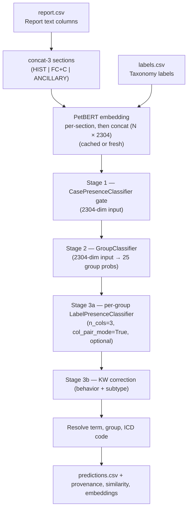

 # Production Pipeline

Implementation-based description of what `ml/scripts/run_production.py` does today.

This is the authoritative source for current production inference behavior. Older
architectural experiments are preserved in the training logs and idea docs, not here.

The production path is a four-stage sequential pipeline where each stage has
one distinct responsibility:

```text
report.csv
  -> per-section text (HIST | FC+C | ANCILLARY) — concat-3
  -> PetBERT embedding (each section independently, cached or fresh) — concat to 2304-dim
  -> CasePresenceClassifier gate   — filters non-cancer cases               (reduces FP) — 2304-dim input
  -> GroupClassifier               — assigns cancer to ICD group(s)          (reduces CO) — 2304-dim input
  -> LabelPresenceClassifier       — picks specific label(s) within group    (n_cols=3, col_pair_mode=True)
  -> KW correction                 — behavior + subtype keyword post-filter  (converts Slight → Good)
  -> (term, group, code) predictions + debug artifacts
```

Stage 3 (LabelPresenceClassifier) is optional: when `--label-presence-classifier-dir` is
not set, the pipeline falls back directly to KW correction within each active group. Stages 1
and 2 are unchanged regardless.

Each stage lives in its own module under `ml/production/petbert_pipeline/stages/`:

| Stage | Module | Entry function |
|---|---|---|
| 1 — CasePresence gate | `stages/case_presence_classifier.py` | `run_case_presence_classifier()` |
| 2 — GroupClassifier | `stages/group_classifier.py` | `run_group_classifier()` |
| 3a — LabelPresence (optional) | `stages/label_presence_classifier.py` | `load_label_presence_models()`, `score_within_group()` |
| 3b — KW correction | `stages/keyword_correction.py` | `apply_keyword_correction()` |

`pipeline.py::run_scan()` is the thin orchestrator: load → text-select → embed → call each
stage in order → write outputs. The Stage 3 per-case dispatcher is `stages/__init__.py::categorize_per_case()`.

## Flow Chart



## Entry Point And Defaults

`ml/scripts/run_production.py` is the production launcher. It pre-wires the 4-stage
pipeline before calling `run_scan`:

| Default | Source |
|---|---|
| `--model` | `ml/output/checkpoints/contrastive/` (per-section-adapted PetBERT backbone) |
| `--embedding-cache` | `ml/output/training/embedding_cache.npz` (stores 2304-dim `col_concat_3`) |
| `--case-presence-classifier` | `config.CASE_PRESENCE_CLASSIFIER_PT` (Stage 1 gate, 2304-dim) |
| `--case-presence-threshold` | `0.85` (recommended) |
| `--group-classifier` | `ml/output/checkpoints/group/group_classifier_best.pt` (Stage 2, 2304-dim) |
| `--label-presence-classifier-dir` | `ml/output/checkpoints/label_presence/` (Stage 3a, optional) |
| `--label-presence-thresholds-json` | `ml/output/checkpoints/label_presence/lp_thresholds.json` (per-group calibration) |
| `--embed-only` | False. Set to short-circuit after the embed step (cache-building runs). |
| `--out-dir` | `ml/output/production/contrastive/` |
| `--local-only` | True |

The concat-3 sectioning is hardcoded in `pipeline.py::CONCAT_3_SECTIONS` (HIST, FC+C,
ANCILLARY) — there is no per-run override. The legacy `--concat-3` opt-in flag and
`--text-cols`/`--tfidf-vectorizer` overrides were removed on 2026-05-20 along with the
TF-IDF text-selection fallback.

These defaults can be overridden via CLI flags. To disable Stage 3a, pass
`--label-presence-classifier-dir ""`. To disable Stage 1 (gate), pass
`--case-presence-classifier ""`.

## Input Format

The pipeline reads `ml/data/report.csv` with one row per case.

Important columns:

| Column | Role |
|---|---|
| `case_id` | Unique case identifier |
| `HISTOPATHOLOGICAL SUMMARY` | Microscopic pathology findings — **Section 0** in concat-3 |
| `FINAL COMMENT` | Pathologist's diagnostic conclusion — joined with COMMENT to form **Section 1** |
| `COMMENT` | Pathologist notes — joined with FINAL COMMENT to form **Section 1** |
| `ANCILLARY TESTS` | IHC, stains, PCR, related tests — **Section 2** in concat-3 |
| `GROSS DESCRIPTION` | Macroscopic specimen description (excluded — adds noise, not signal) |
| `CLINICAL ABSTRACT` | Referring clinician history (excluded — adds noise, not signal) |

**Concat-3 text representation (the only production path).** The pipeline builds three
synthetic columns (`__sec_0__`, `__sec_1__`, `__sec_2__`) by joining the raw columns above,
embeds each section independently through PetBERT (each gets the full token budget), then
concatenates the three 768-dim section embeddings per row into a single **2304-dim view
stored under the cache key `concat_3`**. This aligned shape feeds Stage 1 (case gate),
Stage 2 (GroupClassifier), and Stage 3a (LabelPresenceClassifier with
`n_cols=3, col_pair_mode=True`).

The earlier TF-IDF sentence-scoring path (single 512-token budget producing one 768-dim
view) is preserved at `../ml-tfidf/` and was removed from `ml/` on 2026-05-20.

## Step-by-Step Runtime Flow

The main implementation lives in `ml/production/petbert_pipeline/pipeline.py`.

### 1. Load and clean report data

The pipeline reads `ml/data/report.csv` using `latin-1`, strips BOM artifacts from
column names, and normalizes missing values to empty strings.

### 1b. Concat-3 section build

The pipeline builds three synthetic per-row columns (`__sec_0__`, `__sec_1__`, `__sec_2__`)
by joining the relevant raw columns:

- `__sec_0__` = `HISTOPATHOLOGICAL SUMMARY`
- `__sec_1__` = `FINAL COMMENT` + `\n` + `COMMENT`
- `__sec_2__` = `ANCILLARY TESTS`

Empty cells become empty strings (tracked via the `has_*` content masks). Section grouping
lives in `production/petbert_pipeline/pipeline.py::CONCAT_3_SECTIONS` and matches the data
pipeline used to train the per-section contrastive backbone — see [[project-ml-pipeline]]
memory.

### 2. Reuse embedding cache when possible

If `ml/output/training/embedding_cache.npz` is valid for the current:

- report CSV
- labels CSV
- model name
- selected text columns

then the pipeline skips re-embedding and reuses:

- per-column report embeddings
- per-column content masks
- mean case embeddings
- token counts
- label embeddings

This is what keeps repeated production and training-cycle runs fast.

### 3. Otherwise embed each report column separately

On a cache miss, the pipeline loads PetBERT and embeds each of the three `__sec_N__`
synthetic section columns independently.

Important details:

- Each column gets its own token budget (`--max-length`, default 512).
- Mean pooling over non-padding tokens produces one 768-d embedding per column.
- Empty cells are tracked separately with boolean masks.
- After per-section embedding, the three section vectors are concatenated per-row into a
  2304-dim view and stored under the cache alias `concat_3`. That alias is what the
  Stage 1 gate, Stage 2 GroupClassifier, and Stage 3a LP head consume.

### 4. Build a mean report embedding for analysis outputs 

After per-section embedding, the pipeline averages the non-empty section embeddings into a
single 768-d masked-mean per case.

That mean embedding is used for:

- PCA visualization
- nearest-neighbor outputs
- the saved embeddings NPZ
- cosine-similarity fallbacks inside `categorize_per_case` (where the comparison set is the
  768-dim `label_embeddings` — dim must match)

It is **not** the main tensor used by the production classifier; that is the 2304-dim
concat-3 view. The dispatcher receives both: `mean_embeddings=embeddings` (768-d) and
`lp_embeddings=report_emb_classifier` (2304-d).

### 5. Embed every ICD label with the same base model

The taxonomy is loaded from `ml/ICD_labels/labels.csv`.

Each label is converted to display text and embedded through the same PetBERT base model,
producing a label embedding matrix aligned with the report embedding space.

### 6. Concatenate report columns for Stage 2 input

For Stage 2 inference, the pipeline concatenates the per-column report embeddings into
one wide vector per case, zeroing out empty columns first. The `concat_3` alias (already
2304-dim) is the per-row concat — the helper excludes it from a second round of stacking
to avoid double-counting (`group_input_cols = [c for c in cols if c != "concat_3"]`). This
`col_emb_concat` tensor is what the `GroupClassifier` consumes (2304-dim). The same
2304-dim view goes to Stage 1 (case gate) and Stage 3a (LP head); the 768-dim masked-mean
is reserved for cosine-similarity fallbacks against the 768-dim label embeddings.

## Output Files

The production pipeline writes:

| File | Purpose |
|---|---|
| `petbert_predictions.csv` | Ranked predictions per case |
| `petbert_column_scores.csv` | Per-column debug breakdown |
| `petbert_provenance.csv` | Per-case traceability and merged report text |
| `petbert_similarity_scores.csv` | Full label-score matrix dump |
| `petbert_visualization.csv` | PCA coordinates per case |
| `petbert_embeddings.npz` | Saved mean embeddings and related arrays |
| `petbert_summary.json` | Run metadata and aggregate counts |

Optional neighbor output:

- `petbert_neighbors.csv` when `--task neighbors` or `--task both` is used

These files are written under `ml/output/production/contrastive/` when launched
through `run_production.py`.

## Current CLI Behaviors That Matter

- `run_production.py` pre-wires all four stage checkpoints by default (see "Entry Point And Defaults").
- The text/embed path is fixed to per-section concat-3 (2304-dim). All current classifiers (case-presence, group, LP heads) are trained on 2304-dim input.
- `--embed-only` short-circuits after the embed step; useful for cache-building runs without running classifiers (e.g., when bringing up a new arm or a fresh backbone).
- `--label-presence-classifier-dir` enables Stage 3a; default is the production directory.
  Pass an empty string to disable and fall back to KW correction directly.
- `--label-presence-threshold` (default 0.5) is the within-group label selection threshold and the fallback when no per-group threshold is set.
- `--label-presence-thresholds-json` (default `ml/output/checkpoints/label_presence/lp_thresholds.json`) is a `{group_name: threshold}` map that overrides the global threshold per LP. Produced by `ml/scripts/sweep_lp_thresholds.py`; loaded automatically by `run_production.py`. Missing file → warn and fall back to the global threshold.
- `--case-presence-threshold` (recommended **0.85**) — gate the GroupClassifier behind the case-presence cancer probability.
- `--tail-max-predictions` (default **2**) caps the number of group predictions emitted per case. Set to 1 to keep only the top group.
- `--tail-max-group-prob-gap` (default **0.08**) drops tail group predictions whose probability is more than this far below the top group. Set to 1.0 to disable. Defaults calibrated 2026-05-11 on the held-out test set — see `ml/scripts/sweep_tail_gate.py` for the trade-off curve.
- `--no-group-classifier-fallback-to-argmax` turns off the GroupClassifier argmax fallback
  (gate-passed cases with no group above threshold then become "Unidentified Cancer").
- `--embedding-cache` reuses `ml/output/training/embedding_cache.npz` when provided. The cache is invalidated on model_name string mismatch, report.csv mtime mismatch, or labels.csv mtime mismatch (see `embedding_cache.py:85`).
- `--task neighbors` or `--task both` adds nearest-neighbor output alongside categorization.
- `--local-only` keeps model loading offline when the files are already cached locally.

## Four-Stage Pipeline (Intended Production Path)

Run after training `CasePresenceClassifier`, `GroupClassifier`, and per-group `LabelPresenceClassifier`s:

```bash
ml/.venv/Scripts/python.exe ml/scripts/run_production.py \
  --csv ml/data/report.csv \
  --model ml/output/checkpoints/contrastive --local-only \
  --embedding-cache ml/output/training/embedding_cache.npz \
  --case-presence-classifier ml/output/checkpoints/case_presence/case_presence_classifier.pt \
  --case-presence-threshold 0.85 \
  --group-classifier ml/output/checkpoints/group/group_classifier_best.pt \
  --group-classifier-threshold 0.85 \
  --label-presence-classifier-dir ml/output/checkpoints/label_presence \
  --label-presence-thresholds-json ml/output/checkpoints/label_presence/lp_thresholds.json \
  --tail-max-predictions 2 --tail-max-group-prob-gap 0.08 \
  --out-dir ml/output/production --device cuda
```

**Stage 1 — CasePresenceClassifier gate (2304-dim):**
Takes the 2304-dim concat-3 report view and outputs a cancer probability. Cases below
`--case-presence-threshold` (recommended 0.85) are predicted Uncategorized without reaching
the GroupClassifier. Val F1 ≈ 0.94. Trained with `recall_weight=0.7` so it errs toward
passing uncertain cases rather than missing cancer. Train with `--mode train-case-presence`
(the trainer auto-detects emb_dim from the cache shape).

**Stage 2 — GroupClassifier (2304-dim → 25 groups):**
For cases that passed the gate, predicts which cancer group(s) the case belongs to
(sigmoid per group, threshold applied). When no group clears the threshold, argmax fallback
is applied: the top-scoring group is used regardless of confidence, so gate-passed cases
always receive a concrete group prediction rather than "Unidentified Cancer". MLP on
the 2304-dim per-section concat from the contrastive backbone. **Current production: macro
F1 = 0.5712** (up from 0.4475 on the preserved `ml-tfidf/` baseline; +28% relative).
Tail-gate: at most `--tail-max-predictions` (default 2) groups are kept per case, and any
tail group more than `--tail-max-group-prob-gap` (default 0.08) below the top group's
probability is dropped. Calibrated 2026-05-11 — gives +0.9pp G+S vs no-gate at the cost
of recall on multi-label cases. Recalibrate with `ml/scripts/sweep_tail_gate.py` after
any GroupClassifier retrain.

**Stage 3 — LabelPresenceClassifier (per-section, per-group):**
When `--label-presence-classifier-dir` is set, one per-group `LabelPresenceClassifier` head
scores every label within each active group. Each head is built with `n_cols=3,
col_pair_mode=True, col_combine="learned"` — the report's 2304-dim concat is split into
three 768-dim section views; each section forms a `[section_emb | label_emb]` pair (1536-dim)
that goes through a shared 1536→512→1 MLP; a learned 3→1 combiner weights the per-section
logits into a single per-(case, label) score. Labels whose score exceeds the threshold for
that LP are selected; argmax fallback applies when nothing passes. The per-LP threshold is
looked up in `--label-presence-thresholds-json` first (default
`ml/output/checkpoints/label_presence/lp_thresholds.json`); groups missing from the map
fall back to the global `--label-presence-threshold` (default 0.5). Multiple labels per
group can be selected. Groups without a corresponding `.pt` file in the directory fall
through to KW correction directly. Train with `--mode train-label-presence
--label-presence-n-cols 3 --label-presence-col-pair-mode --label-presence-col-combine
learned`; recalibrate thresholds after each retrain with `ml/scripts/sweep_lp_thresholds.py`.

**Stage 4 — KW correction (post-filter):**
Within the label pool selected by Stage 3 (or the full group pool when Stage 3 is absent),
ICD-O behavior keyword matching narrows candidates to the matching behavior digit. A subtype
keyword filter (Mast cell, Blood vessel, Melanomas, Meningiomas, Osseous, Gliomas) then
applies group-specific discriminators before cosine similarity selects the final term.

## Notes on Past Experiments

> **End-to-end FinetuneGroupClassifier** was integrated as a Stage 2 swap and benchmarked in 2026-05, then reverted. See `training-log/training-log-finetune.md` Approach B for findings and the resurrection path.

> **Whole-corpus LabelPresenceClassifier** (`--presence-classifier`) was the original
> production path through Phase 25. Removed during the 4-stage refactor; preserved in the
> training-log/training-log-binary.md history.

Older experimental and deprecated paths are preserved in the training logs and idea docs,
not in this file.

## Source Of Truth

If this file and an older architecture doc disagree, trust the implementation in:

- `ml/scripts/run_production.py`
- `ml/config.py`
- `ml/production/petbert_pipeline/pipeline.py`
- `ml/production/petbert_pipeline/stages/` (one file per stage; `stages/__init__.py` is the per-case dispatcher with the `lp_embeddings` parameter)
- `ml/production/petbert_pipeline/embedding.py`
- `ml/production/petbert_pipeline/pipeline.py` (defines `CONCAT_3_SECTIONS` and `CONCAT_3_KEY`)
