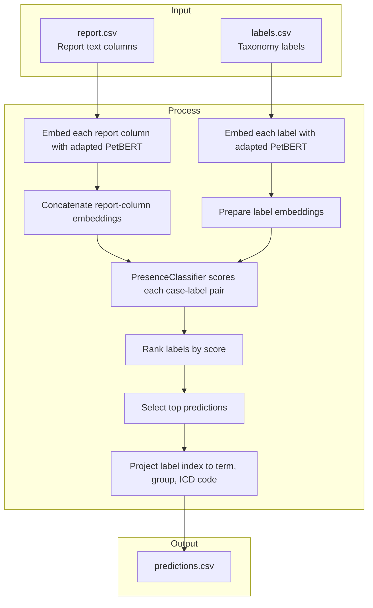

# Production Pipeline

Implementation-based description of what `ml/scripts/run_production.py` does today.

This is the authoritative source for current production inference behavior. Older
architectural experiments are preserved in the training logs and idea docs, not here.

As of the current implementation, the default production path is:

```text
report.csv
  -> contrastive-aware model/checkpoint auto-selection
  -> cached or fresh PetBERT per-column embeddings
  -> PresenceClassifier score matrix over all ICD labels
  -> group-keyword term correction within the predicted group
  -> ranked (term, group, code) predictions + debug artifacts
```

## Flow Chart



## Entry Point And Auto-Selection

`ml/scripts/run_production.py` is the production launcher.

Before it calls the pipeline, it:

1. Looks for the best saved classifier checkpoint.
2. Prefers `ml/output/checkpoints/contrastive/presence_classifier_best.pt`.
3. Falls back to `ml/output/checkpoints/binary/presence_classifier_best.pt`.
4. Uses the matching embedding model for that checkpoint:
   - `ml/output/checkpoints/contrastive/` if the chosen classifier is contrastive-backed
   - `SAVSNET/PetBERT` otherwise
5. Sets the default embedding cache to `ml/output/training/embedding_cache.npz`.
6. Writes production outputs to `ml/output/production/{contrastive|binary}/`.

This means the code treats the contrastive-backed PresenceClassifier stack as the
default production path whenever that checkpoint exists.

## Input Format

The pipeline reads `ml/data/report.csv` with one row per case.

Important columns:

| Column | Role |
|---|---|
| `case_id` | Unique case identifier |
| `HISTOPATHOLOGICAL SUMMARY` | Microscopic pathology findings |
| `FINAL COMMENT` | Pathologist's diagnostic conclusion |
| `ANCILLARY TESTS` | IHC, stains, PCR, and related tests |
| `ADDENDUM` | Follow-up notes or consultations |
| `CLINICAL ABSTRACT` | Referring clinician history and differential diagnoses |
| `GROSS DESCRIPTION` | Macroscopic specimen description |

By default, production uses the configured text columns from the CLI and model constants.

## Step-by-Step Runtime Flow

The main implementation lives in `ml/production/petbert_pipeline/pipeline.py`.

### 1. Load and clean report data

The pipeline reads `ml/data/report.csv` using `latin-1`, strips BOM artifacts from
column names, validates the configured text columns, and normalizes missing values to
empty strings.

The merged report text used for provenance and neighbor views is built by concatenating
non-empty sections with labels like:

```text
[FINAL COMMENT] ...
[HISTOPATHOLOGICAL SUMMARY] ...
[ANCILLARY TESTS] ...
```

### 2. Reuse embedding cache when possible

If `ml/output/training/embedding_cache.npz` is valid for the current:

- report CSV
- labels CSV
- model name
- selected text columns

then the pipeline skips re-embedding and reuses:

- per-column report embeddings
- per-column content masks
- mean case embeddings
- token counts
- label embeddings

This is what keeps repeated production and training-cycle runs fast.

### 3. Otherwise embed each report column separately

On a cache miss, the pipeline loads PetBERT and embeds each selected report column
independently.

Important details:

- Each column gets its own token budget.
- Mean pooling over non-padding tokens produces one 768-d embedding per column.
- Empty cells are tracked separately with boolean masks.

### 4. Build a mean report embedding for analysis outputs

After per-column embedding, the pipeline averages the non-empty column embeddings into a
single 768-d mean embedding per case.

That mean embedding is used for:

- PCA visualization
- nearest-neighbor outputs
- the saved embeddings NPZ
- some non-default group-based paths

It is not the main tensor used by the default production classifier.

### 5. Embed every ICD label with the same base model

The taxonomy is loaded from `ml/ICD_labels/labels.csv`.

Each label is converted to display text and embedded through the same PetBERT base model,
producing a label embedding matrix aligned with the report embedding space.

### 6. Concatenate report columns for classifier scoring

For classifier inference, the pipeline concatenates the per-column report embeddings into
one wide vector per case, zeroing out empty columns first.

This `col_emb_concat` tensor is what the `PresenceClassifier` consumes.

### 7. Score all labels with the PresenceClassifier

In the default production path:

1. The pipeline loads the selected `PresenceClassifier` checkpoint.
2. It scores every `(case, label)` pair.
3. The result is an `(N, M)` score matrix over all taxonomy labels.

This is the key production decision point. The live production path is
classifier-driven scoring on top of PetBERT embeddings.

### 8. Apply group-keyword term correction

If production is run with `--categorization-mode group-keyword`, the code uses a
two-stage post-processing strategy on top of the score matrix:

1. Mean-center label scores and choose the top Stage 1 label.
2. Use that label's ICD group as the predicted group.
3. Infer an ICD behavior digit from report text using behavior keywords.
4. Restrict candidates within the predicted group to matching behavior codes when possible.
5. Pick the best term in that filtered pool using the raw classifier scores.

This stage is designed to improve term selection inside the already-predicted group.
It changes Good vs Slightly Off behavior without changing the core Stage 1
predict-vs-Uncategorized decision.

## Output Files

The production pipeline writes:

| File | Purpose |
|---|---|
| `petbert_predictions.csv` | Ranked predictions per case |
| `petbert_column_scores.csv` | Per-column debug breakdown |
| `petbert_provenance.csv` | Per-case traceability and merged report text |
| `petbert_similarity_scores.csv` | Full label-score matrix dump |
| `petbert_visualization.csv` | PCA coordinates per case |
| `petbert_embeddings.npz` | Saved mean embeddings and related arrays |
| `petbert_summary.json` | Run metadata and aggregate counts |

Optional neighbor output:

- `petbert_neighbors.csv` when `--task neighbors` or `--task both` is used

These files are written under `ml/output/production/{contrastive|binary}/` when launched
through `run_production.py`.

## Current CLI Behaviors That Matter

The production CLI still supports multiple modes, but the important current behaviors are:

- `run_production.py` auto-selects the best available classifier checkpoint.
- `--presence-classifier` can explicitly override that checkpoint choice.
- `--embedding-cache` reuses `ml/output/training/embedding_cache.npz` when provided.
- `--task neighbors` or `--task both` adds nearest-neighbor output alongside categorization.
- `--local-only` keeps model loading offline when the files are already cached locally.

## What Is Not The Default Production Path

The following code paths exist, but are not the default production route:

- `--group-classifier`
  Uses `GroupClassifier` group probabilities first, then picks terms within groups.
- `--finetuned-model-path`
  Uses a sequence-classification checkpoint to predict groups directly.

Older experimental and deprecated paths are preserved in the training logs and idea docs,
not in this file.

## Source Of Truth

If this file and an older architecture doc disagree, trust the implementation in:

- `ml/scripts/run_production.py`
- `ml/config.py`
- `ml/production/petbert_pipeline/pipeline.py`
- `ml/production/petbert_pipeline/categorization.py`
- `ml/production/petbert_pipeline/embedding.py`
