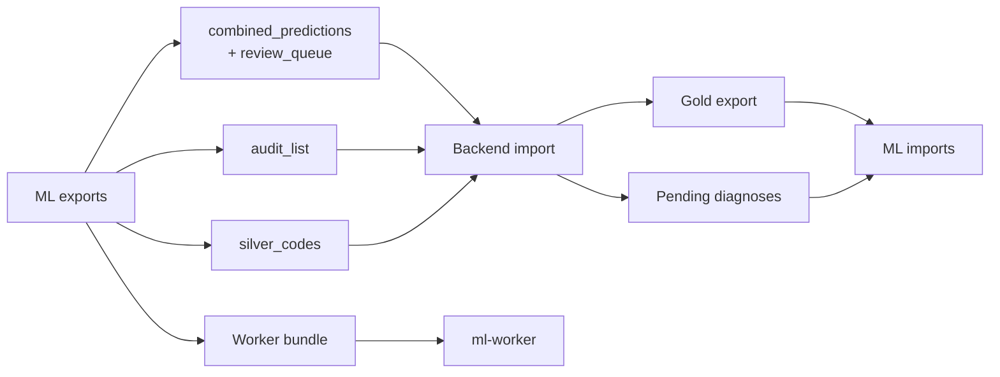

# Handoff contracts

The file contracts between ML (this codebase) and the cloud: the registry backend and ml-worker.
For the backend developer building against ML's exports, and for anyone changing a file shape.
Package: `ml/handoff/` (`contracts.py`, `imports.py`, `exports.py`, `worker_format.py`). Entry point:
`ml/scripts/handoff.py` (flags in [scripts-and-flags.md](scripts-and-flags.md)). Per
[icd-mapping-strategy.md](../concepts/icd-mapping-strategy.md), the cloud stores, serves and reviews
while local machines compute; data crosses manually, through the exports and imports below.



The backend loads `combined_predictions` and `review_queue`
as the registry's code of record (`backend/app/routers/registry_import.py`), and the dashboard's
Audit Worklist (`backend/app/routers/audit_review.py`) reads the audit list and produces the gold
export. ml-worker serves the bundle.

## What the backend does with each file

- **Combined predictions and review queue** are loaded together as the registry's code of record
  (`POST /api/v1/registry/combined-predictions/import`, admin only).
- **The audit list** becomes the Audit Worklist (`POST /api/v1/audit-review/lists/import`, admin
  only). Reviews are exported as gold (`POST /api/v1/audit-review/gold-exports`, then downloaded from
  `GET /api/v1/audit-review/gold-exports/{export_id}`).
- **Review surfaces.** The Audit Worklist is the only dashboard review surface, and the backend still
  imports `review_queue_<run>.csv` to flag cases ([coding.md](../concepts/coding.md)).

## Schemas and sidecars (`contracts.py`)

Every exchanged file except the worker bundle gets a sidecar `<file>.manifest.json` (`{kind,
schema_version, sha256, written_at}`), so a schema change on either side is visible rather than silently misread. Bump a
`*_SCHEMA_VERSION` constant whenever a file's columns change in a way the other side must know about.
Column lists are read from their owning module's constants (`diagnosis_mapping.silver`,
`coding.combine`, `coding.queue`) rather than duplicated.

| Kind | Schema | Direction | Columns | Contains case text? |
|---|---|---|---|---|
| `pending_diagnoses` | v1 | cloud to ML | `case_id, diagnosis_number, diagnosis` | Yes: inbox only, never committed |
| `gold` | v2 | cloud to ML | `case_id`, `term` and/or `code`; `origin` optional for a listed case | No |
| `silver_codes` | v1 | ML to cloud | annotation columns minus `diagnosis`, plus `silver_generation` | No |
| `combined_predictions` | v2 | ML to cloud | `coding.combine.COMBINED_PREDICTIONS_COLUMNS` | No |
| `review_queue` | v1 | ML to cloud | `coding.queue.REVIEW_QUEUE_COLUMNS` | No |
| `audit_list` | v1 | ML to cloud | a `.txt`, one case_id per line, in review order | No |
| `report_mapping_bundle` | v1 (declared, not stamped) | ML to cloud | a whole generation directory, tarred; checked by a `.sha256` file, with no `.manifest.json` sidecar | No |

## Combined predictions and the review queue (ML to cloud)

`combined_predictions_<run>.csv` (UTF-8, header row, no report or diagnosis text) has the columns
`case_id, code, term, group, code_source, source_version, source_confidence, review_status, n_codes`:
one row per code, and exactly one `NO_CANCER` row for a non-cancer case. What each column means and
how gold, silver and bronze combine into it is in [coding.md](../concepts/coding.md). A synthetic
example (ids and versions are made up):

```
case_id,code,term,group,code_source,source_version,source_confidence,review_status,n_codes
EX-1,8810/3,"Fibrosarcoma, NOS",Fibromatous neoplasms,diagnosis,silver-x,tier1_exact,auto_accepted,1
EX-2,NO_CANCER,,,diagnosis,silver-x,no_signal,auto_accepted,1
EX-3,8810/3,"Fibrosarcoma, NOS",Fibromatous neoplasms,report,gen-x,0.74,queued,1
```

`review_queue_<run>.csv` is sent with every combined-predictions file, under the same `<run>`; the
backend only reads its `case_id` column. Each file is complete: every case ML has coded, not only what
changed. A new pair goes out after every pending-diagnoses import and every gold import, and a newer
`<run>` replaces the older one.

**What the backend enforces on import** (`registry_import.py`):

- Each file is checked against its sidecar first: `kind`, `schema_version` (2 for combined
  predictions, 1 for the queue) and `sha256`.
- All nine columns must be present. Per case, `n_codes` must equal the row count, a `NO_CANCER` case
  must have exactly one row, `code_source` must be `manual`, `diagnosis` or `report`, and
  `review_status` must be `confirmed`, `auto_accepted` or `queued`. Any failure refuses the whole file.
- For every case in the file, the case's existing code rows are deleted and replaced by the file's
  rows. (This also drops that case's older per-row review history.)
- ML's status maps to the dashboard's: `confirmed` and `auto_accepted` become confirmed, `queued`
  becomes pending. `code_source`, `source_version` and ML's own `review_status` are stored beside it.
  `source_confidence` is stored as text: a number when `code_source` is `report`, the
  diagnosis-mapping stage when it is `diagnosis`, and empty when it is `manual`.
- A `NO_CANCER` case is recorded on the patient (no cancer, with its source version), not as a code row.
- A case on the review queue with no row in the combined predictions is flagged as awaiting review;
  any codes it already has are left as they are. A case in neither file is left untouched. Case ids the backend cannot find are
  returned in the summary as `not_found`.

## The audit list (ML to cloud)

`audit_list_<list_id>.txt` with its sidecar: one `case_id` per line, UTF-8, `\n` line endings, no
header, no other columns, in review order (work from the top).

- Which sources feed the list, and in what order, is in
  [manual-audit.md](../concepts/manual-audit.md).
- **Each list is the complete current worklist, not an increment.** A newer list replaces the older
  one; a case that drops off no longer needs review.
- The backend refuses an empty list, a list that repeats a case id, a `list_id` it already imported,
  and a file that does not match its sidecar (`kind`, `schema_version`, `sha256`). It takes `list_id`
  from the file name, so use a new one each time.
- Only case ids cross. The gold origin each case must come back under stays in
  `config.AUDIT_LIST_LEDGER_CSV` on the ML side; a case never changes origin (the first list wins).

## Gold export (cloud to ML)

`gold_<export_id>.csv` (UTF-8, header row) is the reviewers' final code set per case:

```
case_id,term
EX-1,"Fibromatous neoplasms: Fibrosarcoma, NOS"
EX-1,Mast cell neoplasms: Example term
EX-2,NO_CANCER
```

(Synthetic rows.)

- One row per code, or exactly one `NO_CANCER` row for a case with no reportable cancer. An approved
  case exports the same way as a corrected one: its complete final code set.
- Write each term as `Group: Term`, exactly as in `ml/taxonomy/labels.csv` (one term,
  "Papillary adenocarcinoma", exists in two groups, so the prefix keeps it unambiguous). Quote fields
  that contain commas.
- **Leave `origin` out** for cases that came from an audit list: `import-gold` fills it in from the
  ledger. A case reviewed outside any list needs an `origin` value, for example `random_slice` for a
  random slice of new uploads, with the upload period and slice rate given alongside.
- **One file per reviewer**, with the reviewer's name given to ML. `export_id` must be new each time
  (the backend uses a date plus a counter). Re-sending a case replaces its earlier review.
- ML refuses the whole file, importing nothing, if any row has a term that is not in the taxonomy,
  mixes `NO_CANCER` with a code, repeats a code for a case, carries an `origin` different from the
  list the case came from, or leaves out `origin` for a case that was never on a list. The error names
  the case ids.
- Reviews are non-blind: the dashboard shows the case's predicted codes, so accuracy measured on
  eval-batch cases can read optimistic, and ML labels every gold-eval report accordingly
  ([evaluation.md](../concepts/evaluation.md)).

## Imports (`imports.py`)

```
ml/.venv/Scripts/python.exe ml/scripts/handoff.py import-pending --csv PATH --export-id ID
ml/.venv/Scripts/python.exe ml/scripts/handoff.py import-gold     --csv PATH --export-id ID --reviewer "Dr. Smith"
```

- **`import_pending_diagnoses`**: every import is keyed by a mandatory `export_id`. A later export's
  rows for a case replace that case's earlier rows in the cumulative landing table
  (`config.HANDOFF_PENDING_DIAGNOSES_CSV`), the same "later export replaces the earlier one" rule the
  gold store applies per case.
- **`import_gold`**: lands a raw copy for the audit trail, then hands the rows to
  `manual_audit.gold.ingest_gold` for validation and storage.

Every raw import is also copied into `config.HANDOFF_INBOX_DIR` under its export-stamped file name
with a sidecar, an audit trail of exactly what the cloud sent and when. Handoff files are read as UTF-8.

## Exports (`exports.py`)

```
ml/.venv/Scripts/python.exe ml/scripts/handoff.py export-silver --silver-id silver-0-legacy
ml/.venv/Scripts/python.exe ml/scripts/handoff.py export-coding --run-id 2026-10-01
ml/.venv/Scripts/python.exe ml/scripts/handoff.py export-bundle --generation current
ml/.venv/Scripts/python.exe ml/scripts/handoff.py export-audit-list --list-id 2026-10-01
```

- **`export_silver`**: `silver_codes_<silver_id>.csv`, no diagnosis text (the cloud already holds it).
- **`export_coding`**: `combined_predictions_<run>.csv` and `review_queue_<run>.csv`, the computed
  `coding.combine` and `coding.queue` outputs re-stamped with a schema version. Both are text-free.
- **`export_bundle`**: tars a report-mapping generation directory plus a `.sha256` file for ml-worker.
  The generation is verified (manifest hashes and embedding fingerprint) before bundling, so a stale
  or tampered generation is refused; `verify_bundle` repeats the check on the extracted tarball.
- **`export_audit_list`**: `audit_list_<list_id>.txt` as described above. Refuses an existing `list_id`.

Task walkthrough for the audit round: [run-audit-cycle.md](../how-to/run-audit-cycle.md).

## Transport

The inbox and outbox live in `ml/output/handoff/`, the S3 sync set `handoff`
([sync-with-s3.md](../how-to/sync-with-s3.md)). Add `--push` to any import or export except
`export-bundle` and the sets it wrote (`handoff`, plus `manual_audit` for `import-gold` and
`export-audit-list`) are pushed once it succeeds; or run `sync.py push handoff --apply` yourself.
Bundles are not synced (`outbox/bundles/` is excluded; a bundle duplicates the model). The generation
itself is published with `sync.py publish-model` or `promote.py --apply --publish`.

## The worker bundle contract (`worker_format.py`)

A bundle is a report-mapping generation directory: `report_mapping.model.generation`'s own layout is
the layout ml-worker loads ([generations.md](../concepts/generations.md)). This module names the subset
ml-worker needs and the one check both sides run before trusting a bundle (`verify_worker_bundle`:
manifest file hashes plus embedding fingerprint).

`resolve_bundle_root(env, model_var)`: the bundle root is the parent of the worker's model-path
variable (`PETBERT_MODEL_PATH` for the HTTP worker `ml-worker/app.py`, `MODEL_PATH` for the batch
worker `ml-worker/batch_predict.py`), which must be `<root>/petbert`. Every other path variable, if
set, must point at its own place in that bundle:

| Variable | Must be |
|---|---|
| `LABELS_CSV_PATH` | `<root>/labels/labels.csv` |
| `GROUP_CLASSIFIER_PATH` | `<root>/checkpoints/group_classifier_best.pt` |
| `CASE_PRESENCE_CLASSIFIER_PATH` | `<root>/checkpoints/case_presence_classifier.pt` |
| `LP_THRESHOLDS_JSON_PATH` | `<root>/checkpoints/label_presence/lp_thresholds.json` |
| `UNCOMMON_GROUPS_PATH` | `<root>/checkpoints/uncommon_groups.txt` |

A deployment mixing files from two generations refuses to start rather than predicting with them.

`upload_to_reports(upload)`: an upload (Dataset A: `anon_id` plus one `Text` column) is expanded into
report-shaped columns. `Text` fills the first source column of every section and the rest stay empty,
so section 1 (FINAL COMMENT + COMMENT) is `Text` alone.

`response_rows(rows, text_by_id)`: one dict per case in the payload
`ingestion_service.parse_predictions` reads. A case with several prediction rows gets numbered strings
(`1) a 2) b`) per field, and every dict carries `source_version`, the `generation_id` that made the
prediction.

ml-worker serves `GET /health` (status and the loaded generation id) and `POST /predict` (a Dataset A
CSV; reports are embedded fresh with the bundle's own backbone, never through the on-disk cache). The
backend deployment that provides these variables is described in the implemented
[ml-worker change request](../history/plans/ml-worker-change-request.md), kept as history, as is the
original [audit-list change request](../history/plans/audit-list-change-request.md).

_Last verified against code: 2026-09-29_
