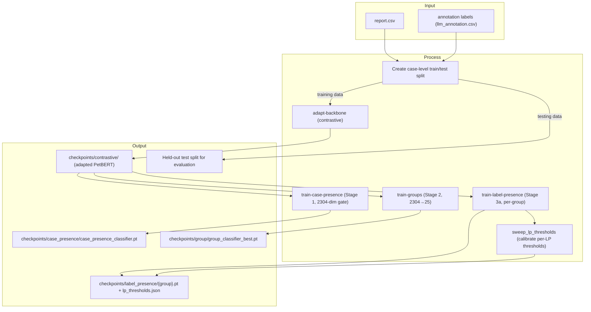

# Training Guide

How to run each training approach from prerequisites through to a trained checkpoint.
For architectural details, approach comparisons, and pros/cons see [classifiers.md](classifiers.md).

> **Prerequisites for all approaches:**
> - An annotation CSV must exist. The default is `ml/output/annotation/annotation.csv`
>   (`config.ANNOTATION_CSV`); production training uses the LLM annotation at
>   `ml/output/annotation/llm/llm_annotation.csv`. `run_training.py` auto-runs the keyword
>   pipeline only when the missing file is exactly the default keyword path; for any
>   other missing path it errors out and asks you to run annotation first.
> - `ml/data/report.csv` must exist
> - Use `ml/.venv/Scripts/python.exe` (Windows) or `ml/.venv/bin/python3` (macOS/Linux)

---

## Train/Test Split

A case-level holdout is required to get an honest estimate of generalization. All
labeled data was previously used for both training and evaluation, so metrics were
in-sample. With no new labeled data expected, the split is the only way to measure
true held-out performance.

## Training Pipeline Flow

The current production training path is contrastive backbone adaptation followed by
four one-shot classifier trainings (Stage 1 → 2 → 3a) with per-LP threshold calibration,
holding out the test split for later evaluation.



### Generate the split (run once)

```bash
ml/.venv/Scripts/python.exe ml/training/data/create_split.py
```

Outputs:
- `ml/output/splits/train_cases.txt` — 80% of cases (stratified by label group)
- `ml/output/splits/test_cases.txt` — 20% held out (stratified by label group)

Non-cancer cases are split randomly (20% held out). Do **not** regenerate the split
between training runs — a new random seed invalidates comparisons with previous results.

### Training with the split active

Pass `--train-cases` to any training command. Training data is automatically restricted
to train cases only — test cases are excluded from positives and negatives.

See the per-stage sections below — Group Classifier, Case Presence Classifier, Label
Presence Classifier — for the actual training commands.

### Evaluating on held-out test cases

After training, score only the held-out test cases to get the true generalization metric:

```bash
ml/.venv/Scripts/python.exe ml/scripts/run_evaluation.py \
  --test-cases ml/output/splits/test_cases.txt \
  --out-dir ml/output/evaluation/contrastive_test \
  --label "held-out test"
```

> **Note:** Training-time validation uses a held-out slice of the train set; test cases
> never influence checkpoint selection.

### Per-stage evaluation (4-stage pipeline)

When the end-to-end metric moves between training cycles, `--stage all` writes
isolated metrics for each classifier so you can attribute the change to a single stage:

```bash
ml/.venv/Scripts/python.exe ml/scripts/run_evaluation.py \
  --stage all \
  --test-cases ml/output/splits/test_cases.txt \
  --out-dir ml/output/evaluation/contrastive_test \
  --label "phase XX"
```

This writes (alongside the existing `evaluation*.csv`):
- `case_presence_evaluation*.csv` — Stage 1 (cancer vs non-cancer; P/R/F1/AUC)
- `groups_evaluation*.csv` — Stage 2 on cancer cases only (per-group + macro/micro + top-k)
- `label_presence_evaluation*.csv` — Stage 3 per-LP (per-LP + macro/micro)

Each stage appends one row to its own `*_history.csv`. Run with one stage at a time
(`--stage case-presence`, `--stage groups`, `--stage label-presence`) to skip the others.

---

## Legacy iterative LabelPresenceClassifier (removed)

The single-classifier `--mode train-classifier` cycle (Phases 1–22) was replaced
in Phase 28 by four one-shot stages: `train-case-presence`, `train-groups`,
`train-label-presence`, and `adapt-backbone`. The `binary/` cycle scripts
(`build_training_pairs.py`, `run_cycle.py`, `update_co_bank.py`,
`train.py`) and `model/presence_classifier.py` were deleted. See
`training-log/training-log-binary.md` for the historical phase log.

---

## Case Presence Classifier (one-shot)

Trains a binary MLP that predicts cancer vs. non-cancer at the case level. This is the
first stage of the four-stage production pipeline — it filters non-cancer cases before
the GroupClassifier runs.

**Input:** 2304-dim concat-3 report embedding (`col_concat_3`, three per-section
768-dim views concatenated per row). `emb_dim` is auto-detected from the cache.
**Output:** scalar cancer probability per case.
**Training objective:** recall-weighted (`recall_weight=0.85`) — errs toward letting
uncertain cases through rather than missing cancer.

```bash
ml/.venv/Scripts/python.exe ml/scripts/run_training.py \
  --mode train-case-presence \
  --train-cases ml/output/splits/train_cases.txt \
  --annotation-csv ml/output/annotation/llm/llm_annotation.csv \
  --embedding-cache ml/output/training/embedding_cache.npz \
  --epochs 20 --device xpu
```

Checkpoint saved to `ml/output/checkpoints/case_presence/case_presence_classifier.pt`
(path is `config.CHECKPOINT_CASE_PRESENCE_DIR`).

> **Prerequisite:** the embedding cache must already exist. Run `run_production.py` once
> (which embeds all reports on first run) to build it.

### Key parameters

| Parameter | Default | Notes |
|-----------|---------|-------|
| `--epochs` | 20 | One-shot; no iterative cycling |
| `--case-presence-recall-weight` | 0.85 | Prefer missing fewer cancer cases over reducing FP |
| `--case-presence-pos-weight` | 1.0 | Increase if cancer-positive cases are heavily outnumbered |

---

## Group Classifier (one-shot)

Trains a multi-label MLP that predicts cancer group(s) per report. One-shot — run once,
no iterative cycles. Re-run whenever annotation coverage improves.

```bash
ml/.venv/Scripts/python.exe ml/scripts/run_training.py --mode train-groups --device xpu
```

This builds training data from the embedding cache and annotation file, trains for the
configured number of epochs, and saves to `ml/output/checkpoints/group/group_classifier_best.pt`.

### Options (current recommended hyperparameters)

```bash
ml/.venv/Scripts/python.exe ml/scripts/run_training.py \
  --mode train-groups \
  --epochs 300 --lr 5e-5 --dropout 0.1 \
  --max-class-weight 50 --weight-decay 1e-3 \
  --device xpu --local-only \
  --train-cases ml/output/splits/train_cases.txt \
  --annotation-csv ml/output/annotation/llm/llm_annotation.csv
```

**Critical hyperparameters:** `--max-class-weight 50` caps BCE pos_weights (otherwise up to 3,587× on rare groups) and `--weight-decay 1e-3` prevents the model from predicting all groups for every case. Both are required. `--dropout 0.1` is the current default (Phase 27+).

**Epoch count:** 300 epochs. Under the current concat-3 + per-section contrastive backbone, the best checkpoint is **macro F1=0.5712 at epoch 258/300**. The prior TF-IDF-on-default-PetBERT baseline (preserved at `ml-tfidf/`) tops out at F1=0.4475 (epoch 192). `lr=2e-5` was tested and found inferior. The hyperparameter recipe has not changed across backbones — only the F1 ceiling moved.

---

## Per-Group Label Presence Classifier (train-label-presence)

Trains one `LabelPresenceClassifier` per ICD group, plus one shared model for all
uncommon groups combined. This is Stage 3 of the four-stage production pipeline —
it scores all labels within each active group and selects those above a threshold,
enabling within-group multi-diagnosis prediction.

**Prerequisites:**
- Embedding cache must exist (`ml/output/training/embedding_cache.npz`).
- GroupClassifier must be trained (`ml/output/checkpoints/group/group_classifier_best.pt`).
- Uncommon group list must exist (`ml/output/training/group/uncommon_groups.txt`).

```bash
ml/.venv/Scripts/python.exe ml/scripts/run_training.py \
  --mode train-label-presence \
  --group-classifier-path ml/output/checkpoints/group/group_classifier_best.pt \
  --train-cases ml/output/splits/train_cases.txt \
  --annotation-csv ml/output/annotation/llm/llm_annotation.csv \
  --embedding-cache ml/output/training/embedding_cache.npz \
  --model ml/output/checkpoints/contrastive \
  --label-presence-epochs 25 \
  --label-presence-negs-per-pos 5 \
  --label-presence-n-cols 3 --label-presence-col-pair-mode \
  --label-presence-col-combine learned \
  --device xpu --local-only
```

`--label-presence-col-pair-mode` is on by default; pass `--no-label-presence-col-pair-mode`
to fall back to the single-MLP concat path (n_cols=1).

Checkpoints saved to `ml/output/checkpoints/label_presence/{safe_group_name}.pt`.
The "Uncommon" model saves to `ml/output/checkpoints/label_presence/uncommon.pt`.

**Use in production:**

```bash
ml/.venv/Scripts/python.exe ml/scripts/run_production.py \
  --csv ml/data/report.csv \
  --model ml/output/checkpoints/contrastive --local-only \
  --embedding-cache ml/output/training/embedding_cache.npz \
  --case-presence-classifier ml/output/checkpoints/case_presence/case_presence_classifier.pt \
  --case-presence-threshold 0.85 \
  --group-classifier ml/output/checkpoints/group/group_classifier_best.pt \
  --group-classifier-threshold 0.85 \
  --label-presence-classifier-dir ml/output/checkpoints/label_presence \
  --label-presence-thresholds-json ml/output/checkpoints/label_presence/lp_thresholds.json \
  --tail-max-predictions 2 --tail-max-group-prob-gap 0.08 \
  --out-dir ml/output/production --device xpu
```

**Calibrate per-LP thresholds (preferred over a single global threshold):**

```bash
# 1. Run the LP-only eval on the test split to produce per-(case, label) scores
ml/.venv/Scripts/python.exe ml/scripts/run_evaluation.py --stage label-presence \
  --test-cases ml/output/splits/test_cases.txt \
  --out-dir ml/output/evaluation/label_presence \
  --label "lp eval (baseline t=0.5)"

# 2. Sweep per-LP thresholds on the sweep-half; eval-half is unbiased
ml/.venv/Scripts/python.exe ml/scripts/sweep_lp_thresholds.py \
  --eval-csv ml/output/evaluation/label_presence/label_presence_evaluation.csv \
  --baseline-threshold 0.5 --grid 0.05,0.95,0.05 \
  --out-json ml/output/checkpoints/label_presence/lp_thresholds.json
```

`run_production.py` auto-loads the resulting `lp_thresholds.json` when present and falls back
to `--label-presence-threshold` (default 0.5) for any group missing from the map.

### Key parameters

| Parameter | Default | Notes |
|-----------|---------|-------|
| `--label-presence-epochs` | 25 | One-shot per group |
| `--label-presence-negs-per-pos` | 5 | Within-group negatives per positive pair |
| `--label-presence-recall-weight` | 0.5 | F1 for checkpoint selection; raise to prefer recall |
| `--label-presence-threshold` | 0.5 | Inference threshold — calibrate via sweep_lp_thresholds.py for per-LP tuning |
| `--label-presence-n-cols` | 3 | Number of per-row sections (matches concat-3 inference) |
| `--label-presence-col-pair-mode` | True | Per-section pair architecture (each section scores label independently) |
| `--label-presence-col-combine` | learned | How per-section logits combine; `learned` = `Linear(3 → 1)` |

---

## Backbone Adaptation (adapt-backbone)

Adapts PetBERT's embedding space so that report text and cancer label text land
closer together. The adapted backbone is then used as the starting point for
the downstream classifiers (`train-case-presence`, `train-groups`,
`train-label-presence`). A cold start is required after adaptation.

### Step 1 — Adapt the backbone

**Round 1 (base PetBERT → adapted, no hard negatives):**

```bash
ml/.venv/Scripts/python.exe ml/scripts/run_training.py \
  --mode adapt-backbone \
  --epochs 3 \
  --batch-size 32 \
  --lr 2e-5 \
  --temperature 0.07 \
  --device xpu \
  --local-only
```

**Round 2 (warm-start from existing adapted backbone, lower LR):**

Backup the current backbone first, then continue fine-tuning from it:

```bash
# Backup Phase 18 backbone before overwriting
cp ml/output/checkpoints/contrastive/model.safetensors \
   ml/output/checkpoints/contrastive/model_phase18_backup.safetensors

ml/.venv/Scripts/python.exe ml/scripts/run_training.py \
  --mode adapt-backbone \
  --model ml/output/checkpoints/contrastive \
  --epochs 2 \
  --batch-size 32 \
  --lr 1e-5 \
  --temperature 0.07 \
  --device xpu \
  --local-only \
  --skip-pair-build
```

**Round 3 (warm-start + hard-negative loss from CO bank):**

First build the hard-negative triplets from the CO bank, then fine-tune:

```bash
# Step 1: Build hard-negative triplets
ml/.venv/Scripts/python.exe ml/training/contrastive/build_contrastive_dataset.py \
  --mode build-hard-neg \
  --co-bank-csv ml/output/training/contrastive/evaluation_co_bank.csv

# Step 2: Fine-tune with both InfoNCE and hard-neg margin loss
ml/.venv/Scripts/python.exe ml/scripts/run_training.py \
  --mode adapt-backbone \
  --model ml/output/checkpoints/contrastive \
  --epochs 2 \
  --batch-size 32 \
  --lr 1e-5 \
  --temperature 0.07 \
  --device xpu \
  --local-only \
  --skip-pair-build \
  --hard-neg-csv ml/output/training/contrastive/hard_neg_pairs.csv \
  --hard-neg-weight 0.5 \
  --hard-neg-margin 0.3
```

The hard-neg loss adds a per-triplet margin penalty: for each (report, correct_label,
wrong_label) from the CO bank, it fires when `sim(report, wrong) > sim(report, correct) - margin`.
This directly targets the residual CO cases the InfoNCE alone couldn't resolve.

This builds `(report_text, label_text)` pairs from the annotation file + report CSV,
then adapts PetBERT using contrastive loss. Saves a full checkpoint to
`ml/output/checkpoints/contrastive/`.

Use `--skip-pair-build` to reuse an existing `ml/output/training/contrastive/contrastive_pairs.csv`.

### Step 2 — Cold start

The embedding space has changed. Delete the stale cache:

```bash
rm -f ml/output/training/embedding_cache.npz
```

### Step 3 — Retrain the downstream classifiers in order

```bash
# Pass --model ml/output/checkpoints/contrastive --local-only to each invocation
ml/.venv/Scripts/python.exe ml/scripts/run_training.py --mode train-case-presence ...
ml/.venv/Scripts/python.exe ml/scripts/run_training.py --mode train-groups        ...
ml/.venv/Scripts/python.exe ml/scripts/run_training.py --mode train-label-presence ...
```

Step 0 of the cycle will re-embed all reports using the adapted model.
Continue with subsequent cycles (update `--label` each time) as normal.

### Key parameters

| Parameter | Default | Notes |
|-----------|---------|-------|
| `--epochs` | 3 | Keep low — 110M params, ~5,800 pairs |
| `--batch-size` | 32 | Larger = more in-batch negatives; try 64 if memory allows |
| `--lr` | 2e-5 | Standard BERT fine-tuning rate |
| `--temperature` | 0.07 | Contrastive loss temperature; lower = harder negatives |

---

> **End-to-end fine-tuned PetBERT** was attempted in 2026-05 and reverted — it didn't beat the 4-stage pipeline. The current bar to clear is **G+S 62.1%** on eval-half (concat-3 + per-section contrastive + 4-stage with per-LP thresholds + tail-gate), not the Phase 28 57.9% baseline that the experiment was measured against. See `training-log/training-log-finetune.md` Approach B for findings, cost analysis, and the resurrection path.

---

## Running Production Inference

After training, score all reports using the 4-stage pipeline:

```bash
# 4-stage pipeline (current production path — Phase 28+)
ml/.venv/Scripts/python.exe ml/scripts/run_production.py \
  --group-classifier-threshold 0.85 \
  --label-presence-threshold 0.5 \
  --device xpu --local-only
```

`run_production.py` pre-wires all four stage checkpoints by default — you only need to
override the path flags if you've moved them. Pass `--label-presence-classifier-dir ""`
to fall back to the 3-stage pipeline (KW correction directly within each predicted group).

---

## What Triggers a Cold Start

| Change | Cache valid? | Bank valid? | Checkpoint valid? |
|--------|-------------|-------------|-------------------|
| New annotation data | No | No | No — full cold start |
| Architecture change (e.g. `n_cols`, input pipeline) | No | No | No — full cold start |
| Backbone adaptation completed | No | No | No — full cold start |
| Hyperparameter change (`--hidden-dim`, `--epochs`) | Yes | Yes | No — retrain only |
| New training cycle (same architecture) | Yes | Yes | Overwritten each cycle |
