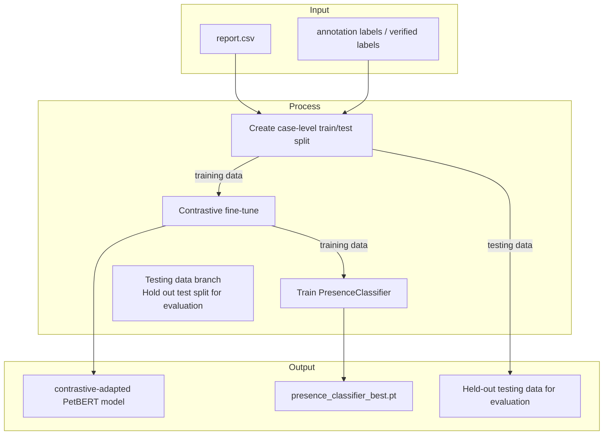

# Training Guide

How to run each training approach from prerequisites through to a trained checkpoint.
For architectural details, approach comparisons, and pros/cons see [classifiers.md](classifiers.md).

> **Prerequisites for all approaches:**
> - `ml/output/annotation/keyword/keyword_annotation.csv` must exist (run annotation first if not)
> - `ml/data/report.csv` must exist
> - Use `ml/.venv/Scripts/python.exe` (Windows) or `ml/.venv/bin/python3` (macOS/Linux)

---

## Train/Test Split

A case-level holdout is required to get an honest estimate of generalization. All
labeled data was previously used for both training and evaluation, so metrics were
in-sample. With no new labeled data expected, the split is the only way to measure
true held-out performance.

## Training Pipeline Flow

The strongest documented training path is contrastive backbone adaptation followed by
iterative `PresenceClassifier` training, with the test split held out for later evaluation.



### Generate the split (run once)

```bash
ml/.venv/Scripts/python.exe ml/training/data/create_split.py
```

Outputs:
- `ml/output/splits/train_cases.txt` — 80% of cases (stratified by label group)
- `ml/output/splits/test_cases.txt` — 20% held out (stratified by label group)

Non-cancer cases are split randomly (20% held out). Do **not** regenerate the split
between training runs — a new random seed invalidates comparisons with previous results.

### Training with the split active

Pass `--train-cases` to any training command. Training data is automatically restricted
to train cases only — test cases are excluded from positives, CO negatives, and FP negatives.

```bash
ml/.venv/Scripts/python.exe ml/scripts/run_training.py \
  --mode train-classifier \
  --model ml/output/checkpoints/contrastive \
  --label "c1" \
  --train-cases ml/output/splits/train_cases.txt \
  --co-neg-per-case 5 --fp-neg-per-case 10 \
  --embedding-min-sim 0.05 --epochs 25 \
  --recall-weight 0.25 --hidden-dim 512 \
  --device xpu --local-only
```

### Evaluating on held-out test cases

After training, score only the held-out test cases to get the true generalization metric:

```bash
ml/.venv/Scripts/python.exe ml/scripts/run_evaluation.py \
  --test-cases ml/output/splits/test_cases.txt \
  --out-dir ml/output/evaluation/contrastive_test \
  --label "held-out test"
```

> **Note:** When `--train-cases` is active, the within-cycle evaluation (Step 4) filters
> to train cases only. This keeps the CO bank and checkpoint selection entirely within
> the training set — test cases never influence the training feedback loop.

---

## Label Presence Classifier (iterative)

The recommended approach. Trains an MLP on cached PetBERT embeddings using a rolling
bank of hard negatives. Each cycle takes ~10 minutes; run 6–8 cycles to reach plateau.

### First run (cold start)

A cold start is required after any architecture change, new annotation data, or after
adapting the embedding backbone. Deletes the stale cache, feedback bank, and checkpoint:

```bash
rm -f ml/output/training/embedding_cache.npz
rm -f ml/output/training/contrastive/evaluation_co_bank.csv
rm -f ml/output/checkpoints/contrastive/presence_classifier_current.pt
```

Then run cycle 1 — Step 0 will embed all reports automatically (takes several minutes):

```bash
ml/.venv/Scripts/python.exe ml/scripts/run_training.py \
  --mode train-classifier \
  --model ml/output/checkpoints/contrastive \
  --label "cold-start c1" \
  --co-neg-per-case 5 \
  --fp-neg-per-case 10 \
  --embedding-min-sim 0.05 \
  --epochs 25 \
  --recall-weight 0.25 \
  --hidden-dim 512 \
  --device xpu \
  --local-only
```

### Subsequent cycles

Continue with the same command, updating `--label` each time:

```bash
ml/.venv/Scripts/python.exe ml/scripts/run_training.py \
  --mode train-classifier \
  --model ml/output/checkpoints/contrastive \
  --label "c2" \
  --co-neg-per-case 5 \
  --fp-neg-per-case 10 \
  --embedding-min-sim 0.05 \
  --epochs 25 \
  --recall-weight 0.25 \
  --hidden-dim 512 \
  --device xpu \
  --local-only
```

Do **not** raise `--co-neg-per-case` above 5 — causes regression with the per-column architecture.

### What each cycle does

1. Embed all reports into vector space (Step 0 — skipped if cache exists)
2. Assemble `training_pairs.csv` from positives + wrong-group feedback bank + FP negatives
3. Train `PresenceClassifier` for 25 epochs; save best checkpoint by validation score
4. Score all reports with the new checkpoint → `petbert_predictions.csv`
5. Score predictions against verified labels → `evaluation.csv` (train cases only when `--train-cases` is active)
6. Record wrong-group predictions in the feedback bank (train cases only)
7. Log results to `evaluation_history.csv`; promote checkpoint if new best

### Expected trajectory

**With adapted backbone** (`--model ml/output/checkpoints/contrastive`, Phase 17 results):

| Cycle | Expected Good+Slight | Notes |
|-------|---------------------|-------|
| c1 (cold start) | ~49–50% | Reports re-embedded with adapted backbone |
| c2 | ~54% | Steady climb |
| c3–c4 | ~64–68% | Large jump as feedback bank fills |
| c5–c8 | ~68–69% | Plateau with oscillation |
| c9+ | oscillates ~67–69% | Stop when no new best for 2–3 cycles |

**With frozen PetBERT** (no `--model` flag, Phase 16 baseline):

| Cycle | Expected Good+Slight | Notes |
|-------|---------------------|-------|
| c1 (cold start) | ~28–30% | Reports embedded with base PetBERT |
| c2 | ~26% | May dip — continue |
| c3–c4 | ~38–39% | Large jump |
| c5–c6 | ~39–42% | Plateau |
| c7+ | may regress | Stop here |

### Key parameters

| Parameter | Value | Notes |
|-----------|-------|-------|
| `--co-neg-per-case` | `5` | Do NOT raise above 5 |
| `--fp-neg-per-case` | `10` | Keep at 10 |
| `--recall-weight` | `0.25` | Prevents degenerate checkpoints winning on recall alone |
| `--epochs` | `25` | Beyond 25 shows diminishing returns |
| `--embedding-min-sim` | `0.05` | Scores are mean-subtracted — not raw cosine |

---

## Case Presence Classifier (one-shot)

Trains a binary MLP that predicts cancer vs. non-cancer at the case level. This is the
first stage of the three-stage production pipeline — it filters non-cancer cases before
the GroupClassifier runs.

**Input:** mean report embedding (768-dim, from embedding cache).
**Output:** scalar cancer probability per case.
**Training objective:** recall-weighted (`recall_weight=0.85`) — errs toward letting
uncertain cases through rather than missing cancer.

```bash
ml/.venv/Scripts/python.exe ml/scripts/run_training.py \
  --mode train-case-presence \
  --train-cases ml/output/splits/train_cases.txt \
  --annotation-csv ml/output/annotation/llm/llm_annotation.csv \
  --embedding-cache ml/output/training/embedding_cache.npz \
  --epochs 20 --device xpu
```

Checkpoint saved to `ml/output/checkpoints/contrastive/case_presence_classifier.pt`.

> **Prerequisite:** the embedding cache must already exist. Run `run_production.py` once
> (or complete a `train-classifier` cycle) to build it.

### Key parameters

| Parameter | Default | Notes |
|-----------|---------|-------|
| `--epochs` | 20 | One-shot; no iterative cycling |
| `--case-presence-recall-weight` | 0.85 | Prefer missing fewer cancer cases over reducing FP |
| `--case-presence-pos-weight` | 1.0 | Increase if cancer-positive cases are heavily outnumbered |

---

## Group Classifier (one-shot)

Trains a multi-label MLP that predicts cancer group(s) per report. One-shot — run once,
no iterative cycles. Re-run whenever annotation coverage improves.

```bash
ml/.venv/Scripts/python.exe ml/scripts/run_training.py --mode train-groups --device xpu
```

This builds training data from the embedding cache and annotation file, trains for the
configured number of epochs, and saves to `ml/output/checkpoints/group/group_classifier_best.pt`.

### Options (Phase 26 — current recommended hyperparameters)

```bash
ml/.venv/Scripts/python.exe ml/scripts/run_training.py \
  --mode train-groups \
  --epochs 300 --lr 5e-5 \
  --max-class-weight 50 --weight-decay 1e-3 \
  --device xpu --local-only \
  --train-cases ml/output/splits/train_cases.txt \
  --annotation-csv ml/output/annotation/llm/llm_annotation.csv
```

**Critical hyperparameters:** `--max-class-weight 50` caps BCE pos_weights (otherwise up to 3,587× on rare groups) and `--weight-decay 1e-3` prevents the model from predicting all groups for every case. Both are required.

**Epoch count:** 300 epochs (Phase 26). The Phase 24 run used 150 epochs and best was at epoch 120 with loss still trending down. Phase 26 found the true best at epoch 219 (macro F1=0.4335 vs 0.3136). `lr=2e-5` was tested and found inferior (F1=0.4249).

---

## Backbone Adaptation (adapt-backbone)

Adapts PetBERT's embedding space so that report text and cancer label text land
closer together. The adapted backbone is then used as the starting point for
`train-classifier` cycles. A cold start is required after adaptation.

### Step 0 — Fit the TF-IDF vectorizer (run once, or after report.csv changes significantly)

The contrastive training pairs are built from TF-IDF-selected text that must match
what production embeds. Fit the vectorizer before building pairs:

```bash
ml/.venv/Scripts/python.exe ml/training/contrastive/fit_text_selector.py
```

Saved to `ml/output/training/tfidf_selector.joblib`. Skip this step if the vectorizer
already exists and `report.csv` has not grown significantly since it was last fitted.

### Step 1 — Adapt the backbone

**Round 1 (base PetBERT → adapted, no hard negatives):**

```bash
ml/.venv/Scripts/python.exe ml/scripts/run_training.py \
  --mode adapt-backbone \
  --epochs 3 \
  --batch-size 32 \
  --lr 2e-5 \
  --temperature 0.07 \
  --device xpu \
  --local-only
```

**Round 2 (warm-start from existing adapted backbone, lower LR):**

Backup the current backbone first, then continue fine-tuning from it:

```bash
# Backup Phase 18 backbone before overwriting
cp ml/output/checkpoints/contrastive/model.safetensors \
   ml/output/checkpoints/contrastive/model_phase18_backup.safetensors

ml/.venv/Scripts/python.exe ml/scripts/run_training.py \
  --mode adapt-backbone \
  --model ml/output/checkpoints/contrastive \
  --epochs 2 \
  --batch-size 32 \
  --lr 1e-5 \
  --temperature 0.07 \
  --device xpu \
  --local-only \
  --skip-pair-build
```

**Round 3 (warm-start + hard-negative loss from CO bank):**

First build the hard-negative triplets from the CO bank, then fine-tune:

```bash
# Step 1: Build hard-negative triplets
ml/.venv/Scripts/python.exe ml/training/contrastive/build_contrastive_dataset.py \
  --mode build-hard-neg \
  --co-bank-csv ml/output/training/contrastive/evaluation_co_bank.csv

# Step 2: Fine-tune with both InfoNCE and hard-neg margin loss
ml/.venv/Scripts/python.exe ml/scripts/run_training.py \
  --mode adapt-backbone \
  --model ml/output/checkpoints/contrastive \
  --epochs 2 \
  --batch-size 32 \
  --lr 1e-5 \
  --temperature 0.07 \
  --device xpu \
  --local-only \
  --skip-pair-build \
  --hard-neg-csv ml/output/training/contrastive/hard_neg_pairs.csv \
  --hard-neg-weight 0.5 \
  --hard-neg-margin 0.3
```

The hard-neg loss adds a per-triplet margin penalty: for each (report, correct_label,
wrong_label) from the CO bank, it fires when `sim(report, wrong) > sim(report, correct) - margin`.
This directly targets the residual CO cases the InfoNCE alone couldn't resolve.

This builds `(report_text, label_text)` pairs from the annotation file + report CSV,
then adapts PetBERT using contrastive loss. Saves a full checkpoint to
`ml/output/checkpoints/contrastive/`.

Use `--skip-pair-build` to reuse an existing `ml/output/training/contrastive/contrastive_pairs.csv`.

### Step 2 — Cold start

The embedding space has changed. Delete the stale cache, feedback bank, and checkpoint:

```bash
rm -f ml/output/training/embedding_cache.npz
rm -f ml/output/training/contrastive/evaluation_co_bank.csv
rm -f ml/output/checkpoints/contrastive/presence_classifier_current.pt
```

### Step 3 — Retrain the label classifier with the adapted backbone

```bash
ml/.venv/Scripts/python.exe ml/scripts/run_training.py \
  --mode train-classifier \
  --model ml/output/checkpoints/contrastive \
  --label "adapted backbone c1" \
  --co-neg-per-case 5 \
  --fp-neg-per-case 10 \
  --embedding-min-sim 0.05 \
  --epochs 25 \
  --recall-weight 0.25 \
  --hidden-dim 512 \
  --device xpu \
  --local-only
```

Step 0 of the cycle will re-embed all reports using the adapted model.
Continue with subsequent cycles (update `--label` each time) as normal.

### Key parameters

| Parameter | Default | Notes |
|-----------|---------|-------|
| `--epochs` | 3 | Keep low — 110M params, ~5,800 pairs |
| `--batch-size` | 32 | Larger = more in-batch negatives; try 64 if memory allows |
| `--lr` | 2e-5 | Standard BERT fine-tuning rate |
| `--temperature` | 0.07 | Contrastive loss temperature; lower = harder negatives |

---

## End-to-end Fine-tuned PetBERT (WIP, blocked)

Fine-tunes PetBERT as a group sequence classifier. Architecturally the same as the
group classifier but replaces the frozen-embedding MLP with a full transformer.
Not recommended until the group classifier proves competitive (~10,000 confirmed cases).
Known code issues must be resolved before running — see `training-log/training-log-finetune.md`.

---

## Running Production Inference

After training, score all reports using the three-stage pipeline:

```bash
# Three-stage pipeline (current production path — Phase 26)
ml/.venv/Scripts/python.exe ml/scripts/run_production.py \
  --case-presence-classifier ml/output/checkpoints/contrastive/case_presence_classifier.pt \
  --case-presence-threshold 0.5 \
  --group-classifier ml/output/checkpoints/group/group_classifier_best.pt \
  --group-classifier-threshold 0.85 \
  --embedding-cache ml/output/training/embedding_cache.npz \
  --device xpu --local-only
```

The binary `PresenceClassifier` path (`--presence-classifier`) is still supported but superseded.
`run_production.py` auto-detects `contrastive/presence_classifier_best.pt` as the default
binary checkpoint when no `--case-presence-classifier` is given, but the three-stage command
above is the intended production path.

---

## What Triggers a Cold Start

| Change | Cache valid? | Bank valid? | Checkpoint valid? |
|--------|-------------|-------------|-------------------|
| New annotation data | No | No | No — full cold start |
| Architecture change (e.g. `n_cols`, input pipeline) | No | No | No — full cold start |
| Backbone adaptation completed | No | No | No — full cold start |
| TF-IDF vectorizer re-fitted (`tfidf_selector.joblib`) | No | No | No — full cold start |
| Hyperparameter change (`--hidden-dim`, `--epochs`) | Yes | Yes | No — retrain only |
| New training cycle (same architecture) | Yes | Yes | Overwritten each cycle |
